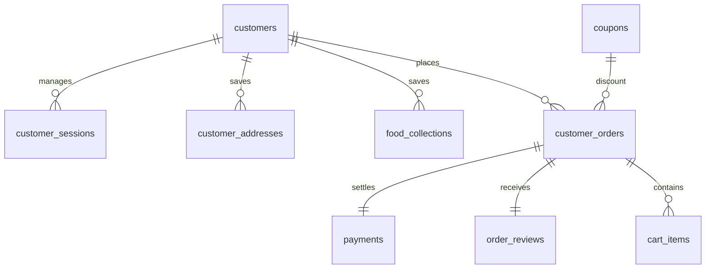
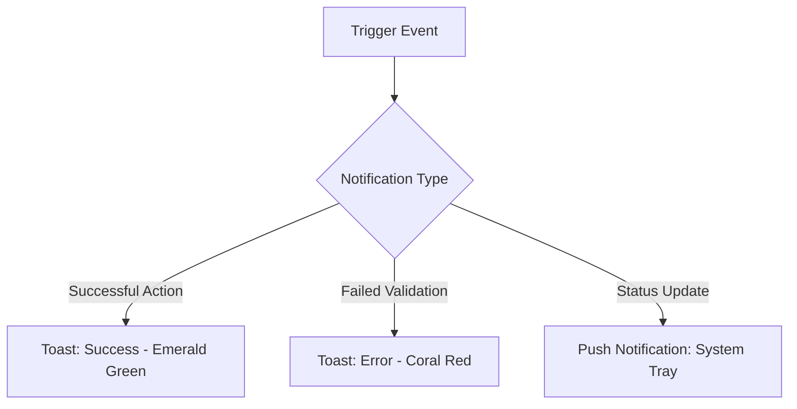

# DineOs Customer Application — Product Requirement Document (PRD) & UI/UX Specification

| Document Property | Value |
|---|---|
| **Product Name** | DineOs Restaurant Order Management System |
| **Portal/App** | Customer Application (Mobile App) |
| **Version** | 1.0.0 |
| **Status** | Approved |
| **Last Updated** | 2026-05-29 |
| **Audience** | Product Managers, Mobile Engineers (Flutter), Backend Engineers, QA Engineers, UI/UX Designers |

---

## Table of Contents

1. [Executive Summary & System Overview](#executive-summary--system-overview)
2. [Global UI/UX Design Tokens & Standards](#global-uiux-design-tokens--standards)
3. [Authentication Module (Screens 1 - 3)](#authentication-module-screens-1---3)
   - [Screen 1: Signup Screen](#screen-1-signup-screen)
   - [Screen 2: Login Screen](#screen-2-login-screen)
   - [Screen 3: Forgot Password Screen](#screen-3-forgot-password-screen)
4. [Food Ordering Module (Screens 4 - 6.3.1)](#food-ordering-module-screens-4---631)
   - [Screen 4: Home Screen](#screen-4-home-screen)
   - [Screen 5: Food Detail Screen](#screen-5-food-detail-screen)
   - [Screen 5.1: Food Customization Screen](#screen-51-food-customization-screen)
   - [Screen 6: Add To Cart Screen](#screen-6-add-to-cart-screen)
   - [Screen 6.1: Select Coupon Screen](#screen-61-select-coupon-screen)
   - [Screen 6.2: Select Payment Method Screen](#screen-62-select-payment-method-screen)
   - [Screen 6.3: Select Address Screen](#screen-63-select-address-screen)
   - [Screen 6.3.1: Add Address Screen](#screen-631-add-address-screen)
5. [Order Module (Screen 7)](#order-module-screen-7)
   - [Screen 7: Order Detail Screen](#screen-7-order-detail-screen)
6. [Profile Module (Screens 8 - 8.4.1)](#profile-module-screens-8---841)
   - [Screen 8: Profile Screen](#screen-8-profile-screen)
   - [Screen 8.1: Edit Profile Screen](#screen-81-edit-profile-screen)
   - [Screen 8.2: Food Collection Screen](#screen-82-food-collection-screen)
   - [Screen 8.3: Recent Orders Screen](#screen-83-recent-orders-screen)
   - [Screen 8.3.1: Recent Order Detail Screen](#screen-831-recent-order-detail-screen)
   - [Screen 8.4: Address Book Screen](#screen-84-address-book-screen)
   - [Screen 8.4.1: Edit Address Screen](#screen-841-edit-address-screen)
7. [System-Wide Database Table Suggestions](#system-wide-database-table-suggestions)
8. [Backend Development Notes](#backend-development-notes)
9. [Role & Permission Logic](#role--permission-logic)
10. [Reusable UI Components Required](#reusable-ui-components-required)
11. [System Edge Cases & Handling](#system-edge-cases--handling)
12. [Notifications & Toast Messages](#notifications--toast-messages)
13. [Real-Time Event Flow](#real-time-event-flow)
14. [Status Management System](#status-management-system)
15. [Payment & Refund Flows](#payment--refund-flows)
16. [Branch Allocation Logic](#branch-allocation-logic)
17. [Suggested Tech Notes](#suggested-tech-notes)

---

# Executive Summary & System Overview

DineOs is an integrated Restaurant Order Management System comprising four primary nodes:
1. **Admin Portal (Web)**: Global configurations, analytics, menu catalogs, and brand-wide operations.
2. **Restaurant Portal (Web)**: Individual branch operations, order queue management, and menu availability toggles.
3. **Customer Application (Mobile App)**: The consumer-facing mobile application (iOS/Android) enabling users to browse food, customize selections, place orders, make payments, and track live deliveries.
4. **Delivery Partner Application (Mobile App)**: The delivery agent companion app for order routing, GPS tracking, and delivery confirmations.

This document serves as the absolute specification for the **Customer Application (Mobile App)**, detailing UI layouts, validations, API structures, databases, and core system mechanics.

---

# Global UI/UX Design Tokens & Standards

To ensure premium sensory feedback and absolute layout consistency, the Customer Mobile App is designed under the following visual and operational framework:

### Design Tokens
* **Primary Color**: `#F97316` (Warm Orange) — Primary brand voice, call-to-actions, highlight text, active icons.
* **Success Color**: `#10B981` (Emerald Green) — Verification success, positive status pills, Veg icon badges.
* **Warning Color**: `#F59E0B` (Amber Orange) — Pending states, timers, notice banners.
* **Danger Color**: `#EF4444` (Coral Red) — Destructive actions, checkout failures, Non-Veg icon badges.
* **Neutral Background**: `#F8FAFC` (Light Mode Canvas), `#0F172A` (Dark Mode Canvas).
* **Card Surface**: `#FFFFFF` (Light Mode), `#1E293B` (Dark Mode).
* **Typography**: Primary font family: `Outfit` (Google Fonts); Secondary font family: `Inter` (UI elements, tabular lists).

### Micro-Animations
* **Interactive Elements**: All primary buttons must animate on press (scale down slightly by `0.96` for `100ms` using elastic curve).
* **Page Transitions**: Custom slide transition between screens (horizontal slide from right to left).
* **Cart Updates**: Dynamic badge scaling on bottom navigation icon when item count increments.

---

# Authentication Module (Screens 1 - 3)

## Screen 1: Signup Screen

### 1. Overview
Allows prospective customers to create a unique user account. Collecting verified email addresses and active mobile numbers is essential for security, order notifications, and verification.

### 2. Screen Preview
```text
┌──────────────────────────────────────────┐
│  DineOs                                  │
│                                          │
│  Create Account                          │
│  Sign up to get started                  │
│                                          │
│  [ Full Name                         ]   │
│  [ Mobile Number                     ]   │
│  [ Username                          ]   │
│  [ Email Address                     ]   │
│  [ Password                          ]   │
│  [ Confirm Password                  ]   │
│                                          │
│  [             SIGN UP               ]   │
│                                          │
│  Already have an account? Log In         │
└──────────────────────────────────────────┘
```

### 3. Screen Fields Table
| Field Name | Type | Required | Validation | Example | Notes |
|---|---|---|---|---|---|
| Full Name | Text | Yes | Alphabetic only, 3-50 chars | `John Doe` | No special characters or numbers |
| Mobile Number | Phone | Yes | Numeric, exactly 10 digits | `9876543210` | Country code (+91) prepended in database |
| Username | Text | Yes | Alphanumeric, 4-20 chars, unique | `johndoe123` | No spaces allowed |
| Email Address | Email | Yes | Valid RFC 5322 format, unique | `john@example.com` | Verified via activation email |
| Password | Password | Yes | Min 8 chars, 1 uppercase, 1 lowercase, 1 special char | `Pass@1234` | Masked by default |
| Confirm Password | Password | Yes | Must match Password exactly | `Pass@1234` | Matches check |

### 4. Validations
* Real-time regex pattern testing on inputs.
* Uniqueness checks performed asynchronously (debounced `500ms`) against backend database for `Username`, `Email Address`, and `Mobile Number`.

### 5. Dependencies
* **Backend Authentication Engine**: User verification endpoints.
* **Notification Node / Email SMTP**: Transmitting activation tokens to verify new users.

### 6. UI/UX Layout Description
* Floating form inputs with smooth underline activation color transitions (`#F97316`).
* Password fields contain a trailing visual icon (eye icon) to toggle text visibility.
* Primary "SIGN UP" button remains disabled until all fields are filled and valid.

### 7. API Requirement Suggestions
* **Endpoint**: `POST /api/v1/auth/signup`
* **Request Payload**:
  ```json
  {
    "fullName": "John Doe",
    "mobileNumber": "9876543210",
    "username": "johndoe123",
    "email": "john@example.com",
    "password": "Pass@1234",
    "confirmPassword": "Pass@1234"
  }
  ```
* **Sample Response**:
  ```json
  {
    "success": true,
    "message": "Signup initiated. Verification email dispatched to john@example.com.",
    "customerId": "cust_82839120"
  }
  ```

---

## Screen 2: Login Screen

### 1. Overview
Authenticates existing customers. Provides direct login via Username, Email Address, or verified Mobile Number.

### 2. Screen Preview
```text
┌──────────────────────────────────────────┐
│  DineOs                                  │
│                                          │
│  Welcome Back!                           │
│  Log in to your account                  │
│                                          │
│  [ Email / Username / Phone          ]   │
│  [ Password                          ]   │
│                                          │
│  [x] Remember Login    Forgot Password?  │
│                                          │
│  [              LOG IN               ]   │
│                                          │
│  Don't have an account? Sign Up          │
└──────────────────────────────────────────┘
```

### 3. Screen Fields Table
| Field Name | Type | Required | Validation | Example | Notes |
|---|---|---|---|---|---|
| Identifier | Text | Yes | Min 4 characters | `john@example.com` | Accepts email, username, or phone number |
| Password | Password | Yes | Min 8 characters | `Pass@1234` | Secure mask enabled |
| Remember Login | Checkbox | No | Boolean | `true` | Keeps JWT token saved locally |

### 4. Validations
* System verifies identifier type (email, mobile, or username) and checks database.
* Lockout policy: 5 unsuccessful consecutive login attempts results in a 15-minute credential lockout.

### 5. Dependencies
* **Backend Database**: Customer and session store tracking.

### 6. UI/UX Layout Description
* Bold typography header. Simple modern layout.
* Clear visual redirection buttons to registration and password recovery.

### 7. API Requirement Suggestions
* **Endpoint**: `POST /api/v1/auth/login`
* **Request Payload**:
  ```json
  {
    "identifier": "john@example.com",
    "password": "Pass@1234"
  }
  ```
* **Sample Response**:
  ```json
  {
    "success": true,
    "token": "jwt_header.payload.signature",
    "customer": {
      "id": "cust_82839120",
      "fullName": "John Doe",
      "email": "john@example.com"
    }
  }
  ```

---

## Screen 3: Forgot Password Screen

### 1. Overview
Initiates password recovery for users who lost access to their credentials. Dispatches a secure link/OTP to the registered email address.

### 2. Screen Preview
```text
┌──────────────────────────────────────────┐
│  DineOs                                  │
│                                          │
│  Forgot Password                         │
│  Enter your email to reset password      │
│                                          │
│  [ Email Address                     ]   │
│                                          │
│  [          SEND RESET LINK          ]   │
│                                          │
│  ‹ Back to Login                         │
└──────────────────────────────────────────┘
```

### 3. Screen Fields Table
| Field Name | Type | Required | Validation | Example | Notes |
|---|---|---|---|---|---|
| Email Address | Email | Yes | Valid email format | `john@example.com` | Recovery message endpoint |

### 4. Validations
* Form validates email syntax before dispatching transaction.
* Server-side rate limit: Max 1 reset request per email address every 5 minutes.

### 5. Dependencies
* **Email dispatch engine**: Dispatches password reset emails.

### 6. UI/UX Layout Description
* Minimalist card structure. Success toast message triggered on link generation.

### 7. API Requirement Suggestions
* **Endpoint**: `POST /api/v1/auth/forgot-password`
* **Request Payload**:
  ```json
  {
    "email": "john@example.com"
  }
  ```
* **Sample Response**:
  ```json
  {
    "success": true,
    "message": "If the email exists, a password reset link has been sent."
  }
  ```

---

# Food Ordering Module (Screens 4 - 6.3.1)

## Screen 4: Home Screen

### 1. Overview
The primary landing surface where users browse available food items, select categories, filter by food types (Veg/Non-Veg), view promotional flyers, and locate nearby branches.

### 2. Screen Preview
```text
┌──────────────────────────────────────────┐
│  📍 MG Road, Bangalore                 👤│
│  🔍 Search food...                       │
│ ┌──────────────────────────────────────┐ │
│ │  Offer Banner: 50% OFF Margherita   │ │
│ └──────────────────────────────────────┘ │
│  Categories:                             │
│  [Pizza]  [Burger]  [Sandwich]  [Drinks] │
│                                          │
│  Veg Only [o]      Non-Veg Only [ ]      │
│                                          │
│  Food Items:                             │
│  ┌────────────────────────────────────┐  │
│  │ Margherita Pizza          [Add] (♥)│  │
│  │ Fresh dough, cheese       ₹299     │  │
│  └────────────────────────────────────┘  │
│  ┌────────────────────────────────────┐  │
│  │ Chicken Burger            [Add] (♥)│  │
│  │ Spicy chicken patty       ₹189     │  │
│  └────────────────────────────────────┘  │
│                                          │
│  ┌────────────────────────────────────┐  │
│  │ 🛒 View Cart (2 Items) - ₹488      │  │
│  └────────────────────────────────────┘  │
│  ┌────────────────────────────────────┐  │
│  │ 🛵 Active Order Tracking           │  │
│  └────────────────────────────────────┘  │
│ ┌──────────────────────────────────────┐ │
│ │  [Home]   [Orders]   [Saved]  [Profile]│
│ └──────────────────────────────────────┘ │
└──────────────────────────────────────────┘
```

### 3. Screen Filters & Fields Specification

#### Screen Filters Table
| Filter Name | Type | Required | Validation | Example | Notes |
|---|---|---|---|---|---|
| Search Bar | Text | No | Max 100 characters | `Margherita` | Triggers client-side & server-side filter |
| Category Chip | Selectable | No | Valid Category ID | `Pizza` | Clicking filters food item results |
| Veg Toggle | Switch | No | Boolean | `true` | Filters for `is_veg = true` |
| Non-Veg Toggle | Switch | No | Boolean | `false` | Filters for `is_veg = false` |

#### Screen Fields Table
| Field Name | Type | Required | Validation | Example | Notes |
|---|---|---|---|---|---|
| Location Selector | Dropdown | Yes | Non-empty | `MG Road, Bangalore` | Defaults to nearest branch |
| Food Item List | Container | Read-only | Array of items mapped from branch | Food Listing Grid | Scrollable list container for food cards |
| Food Item Image | Image | Read-only | Valid image URL | `[ IMAGE ]` | Product thumbnail preview |
| Food Item Name | Label | Read-only | Min 3 characters | `Margherita Pizza` | Displays menu item name |
| Food Item Desc | Label | Read-only | Max 200 characters | `Fresh dough, cheese` | Short menu description |
| Food Item Price | Label | Read-only | Pos. Decimal currency | `₹299` | Base item selling price |
| Food Item Save Toggle | Icon Toggle | No | Boolean | `(♥)` (Saved) or `(♡)` (Unsaved) | Adds or removes item to/from collections |
| Food Item Add Button | Button | Yes | Opens customization sheet | `[Add]` | Launches Screen 5.1 customization |
| View Cart Bar | Floating Bar | No | Visible if cart items > 0 | `View Cart (2 Items) - ₹488` | Navigates to Screen 6 |
| Track Order Bar | Floating Bar | No | Visible if active order exists | `Active Order Tracking` | Navigates to Screen 7 |
| Bottom Navigation | Navigation Tab| Yes | Home, Orders, Saved, Profile | `[Home]` | Swaps active client viewports |

### 4. Validations
* Item availability is queried real-time against active branch mapping inventory.

### 5. Dependencies
* **Branch Assignment Node**: Validates nearby branches within 5 KM limit.
* **Admin Portal Config**: Fetches active banner slides and category mappings.

### 6. UI/UX Layout Description
* Carousel sliders with touch-swipe actions for promotional banners.
* Persistent bottom navigation bar.
* Floating bottom action triggers: "View Cart" (shows when items are in cart) and "Track Order" (shows when an active order is being prepared/delivered).

### 7. API Requirement Suggestions
* **Endpoint**: `GET /api/v1/food/browse`
* **Query Parameters**: `branchId=br_102&search=Margherita&isVeg=true&category=pizza`
* **Sample Response**:
  ```json
  {
    "success": true,
    "items": [
      {
        "id": "food_9921",
        "name": "Margherita Pizza",
        "price": 299.00,
        "isVeg": true,
        "imageUrl": "https://cdn.dineos.com/pizza.jpg",
        "description": "Fresh dough, cheese, and tomatoes."
      }
    ]
  }
  ```

---

## Screen 5: Food Detail Screen

### 1. Overview
Displays detailed descriptions, images, prices, and category markers for selected food items. Allows users to save/unsave items from collections and initiate additions to the cart.

### 2. Screen Preview
```text
┌──────────────────────────────────────────┐
│  [←] Food Details                     (♥)│
├──────────────────────────────────────────┤
│                                          │
│             [ FOOD IMAGE ]               │
│                                          │
│  Margherita Pizza                        │
│  Pizza | Veg                             │
│                                          │
│  Classic cheese pizza with fresh tomato  │
│  sauce and organic basil leaves.         │
│                                          │
│  Price: ₹299                             │
│                                          │
│                                          │
│                                          │
│  [             ADD TO CART            ]  │
└──────────────────────────────────────────┘
```

### 3. Screen Fields Table
| Field Name | Type | Required | Validation | Example | Notes |
|---|---|---|---|---|---|
| Back Button | Link | Yes | Navigates back to Screen 4 | `[←]` | Returns to Home Screen |
| Collection Button | Toggle | No | Boolean | `true` | Saved (`♥`) or Unsaved (`♡`) |
| Food Image | Image | Read-only | Valid image URL | `[ FOOD IMAGE ]` | Product photo |
| Food Name | Label | Read-only | Min 3 characters | `Margherita Pizza` | Product name display |
| Category Badge | Label | Read-only | Valid category tag name | `Pizza \| Veg` | Shows food classifications |
| Food Description | Label | Read-only | Text block | `Classic cheese pizza...` | Detailed description |
| Price Tag | Label | Read-only | Pos. Decimal currency format | `₹299` | Base item cost |
| Add Button | Action | Yes | — | Click action | Opens customization view (Screen 5.1) |

### 4. Validations
* Verifies item availability state in branch menu mapping (`is_available`).

### 5. Dependencies
* **Saved Collections Backend**: For managing user favorites.

### 6. UI/UX Layout Description
* Immersive parallax scrolling image header.
* Clear visual indicator for Veg (`#10B981` circle) or Non-Veg (`#EF4444` triangle).

### 7. API Requirement Suggestions
* **Endpoint**: `GET /api/v1/food/details/:foodId?customerId=cust_82839120`
* **Sample Response**:
  ```json
  {
    "success": true,
    "id": "food_9921",
    "name": "Margherita Pizza",
    "description": "Classic cheese pizza with fresh tomato sauce and organic basil leaves.",
    "price": 299.00,
    "isVeg": true,
    "isSaved": true,
    "available": true
  }
  ```

---

## Screen 5.1: Food Customization Screen

### 1. Overview
Enables customers to personalize food selections before adding them to the cart. Customization values (add-ons) add to the base item price.

### 2. Screen Preview
```text
┌──────────────────────────────────────────┐
│  [x] Customize Margherita                │
├──────────────────────────────────────────┤
│  Choose Add-ons:                         │
│  [x] Extra Cheese              +₹60      │
│  [ ] Extra Paneer              +₹50      │
│  [x] Extra Sauce               +₹20      │
│  [ ] Double Patty              +₹80      │
│                                          │
│  ──────────────────────────────────────  │
│  Quantity:  [-]  2  [+]                  │
│                                          │
│  [       ADD TO CART (₹758)      ]       │
└──────────────────────────────────────────┘
```

### 3. Screen Fields Table
| Field Name | Type | Required | Validation | Example | Notes |
|---|---|---|---|---|---|
| Add-on Checkbox | Checkbox | No | Boolean | `true` | Extra Cheese selected |
| Quantity Selector | Counter | Yes | Integer, 1 to 20 | `2` | Defaults to 1 |

### 4. Validations
* Quantity limits: Minimum 1 unit, maximum 20 units per cart item.
* Customization selections validation: Enforce constraints defined by Admin (e.g. max 3 toppings).

### 5. Dependencies
* **Menu Customization Rules**: Admin portal schema limits.

### 6. UI/UX Layout Description
* Displays as a bottom sheet modal overlay.
* Real-time calculated subtotal displayed on the primary action button.

### 7. API Requirement Suggestions
* **Price Calculation Logic**:
  $$\text{Final Price} = (\text{Base Price} + \sum \text{Customization Prices}) \times \text{Quantity}$$
* **Cart Addition API**: `POST /api/v1/cart/add`
* **Request Payload**:
  ```json
  {
    "customerId": "cust_82839120",
    "foodId": "food_9921",
    "quantity": 2,
    "customizations": [
      { "id": "addon_cheese", "name": "Extra Cheese", "price": 60.00 },
      { "id": "addon_sauce", "name": "Extra Sauce", "price": 20.00 }
    ]
  }
  ```
* **Sample Response**:
  ```json
  {
    "success": true,
    "cartTotalItems": 2,
    "cartSubtotal": 758.00
  }
  ```

---

## Screen 6: Add To Cart Screen

### 1. Overview
Manages cart items, applies promotional coupons, reviews estimated delivery times, and provides a breakdown of billing items before entering the checkout sequence.

### 2. Screen Preview
```text
┌──────────────────────────────────────────┐
│  [←] My Cart                             │
├──────────────────────────────────────────┤
│  Cart Items:                             │
│  • Margherita Pizza (2)           ₹758   │
│    [Extra Cheese, Extra Sauce]    [Delete]│
│                                          │
│  [+ Add More Items]                      │
│                                          │
│  🎁 Coupon Code: [ DINE50       ] [Apply]│
│  ⏱ Estimated Delivery: 32 mins           │
│                                          │
│  Billing Summary:                        │
│  Item Total:                      ₹758   │
│  Packaging Charges:               ₹30    │
│  Tax (5% GST):                    ₹39    │
│  Coupon Discount:                -₹100   │
│  Grand Total:                     ₹727   │
│                                          │
│  [        PROCEED TO CHECKOUT    ]       │
└──────────────────────────────────────────┘
```

### 3. Screen Fields & Billing Specification

#### Cart Items & Actions Table
| Field Name | Type | Required | Validation | Example | Notes |
|---|---|---|---|---|---|
| Back Button | Link | Yes | Navigates back to Screen 4 | `[←]` | Returns to home page |
| Cart Items List | Container | Read-only | List of active items in user session | Cart List | Dynamic array of selected food cards |
| Food Item Name | Label | Read-only | Matches menu catalog | `Margherita Pizza` | Displays selected item name |
| Food Customizations| Label | Read-only | List of active options | `[Extra Cheese, Extra Sauce]` | Chosen add-ons |
| Item Quantity | Counter | Yes | Integer >= 1 | `2` | Increments/decrements quantity in session |
| Delete Item Button | Button | Yes | Destructive click trigger | `[Delete]` | Removes item from active cart |
| Add More Items Link| Link | Yes | Navigates to Screen 4 | `[+ Add More Items]` | Redirects user to browse menu |

#### Checkout & Actions Table
| Field Name | Type | Required | Validation | Example | Notes |
|---|---|---|---|---|---|
| Coupon Code Input | Text | No | Alphanumeric, max 15 chars | `DINE50` | User input field for promo codes |
| Apply Coupon Button| Button | Yes | Valid code constraint | `[Apply]` | Triggers coupon discount check |
| Delivery ETA Display| Label | Read-only | Time duration format | `32 mins` | Approximate delivery timeline |
| Checkout Button | Button | Yes | Cart must contain >= 1 available item | `[ PROCEED TO CHECKOUT ]` | Opens checkout mapping flow |

#### Billing Summary Table
| Field Name | Type | Required | Validation | Example | Notes |
|---|---|---|---|---|---|
| Item Total | Label | Read-only | Sum of items and customizations | `₹758` | Subtotal cost |
| Packaging Charges | Label | Read-only | Fixed decimal | `₹30` | Box and preparation packaging cost |
| Tax | Label | Read-only | 5% GST value | `₹39` | Calculated government tax |
| Coupon Discount | Label | Read-only | Negative decimal | `-₹100` | Applied coupon savings |
| Grand Total | Label | Read-only | Calculated checkout total | `₹727` | Final payable balance |

### 4. Validations
* Item availability check: If any cart item is flagged as unavailable in the branch master, prompt warning banner and disable checkout action.
* **Checkout Formula**:
  $$\text{Grand Total} = \text{Item Total} + \text{Packaging Charge} + \text{Tax} - \text{Coupon Discount}$$

### 5. Dependencies
* **Branch Database Inventory**: Verifies active food mappings.
* **Coupon Validation Engine**: Validates discount active date range and usage counts.

### 6. UI/UX Layout Description
* Scrollable listing area with fixed bottom billing card summary.
* Interactive red delete buttons for fast item removal.

### 7. API Requirement Suggestions
* **Endpoint**: `GET /api/v1/cart/:customerId`
* **Sample Response**:
  ```json
  {
    "success": true,
    "items": [
      {
        "foodId": "food_9921",
        "name": "Margherita Pizza",
        "quantity": 2,
        "customizations": ["Extra Cheese", "Extra Sauce"],
        "price": 379.00
      }
    ],
    "billing": {
      "itemTotal": 758.00,
      "packagingCharge": 30.00,
      "tax": 39.40,
      "couponDiscount": 100.00,
      "grandTotal": 727.40
    }
  }
  ```

---

## Screen 6.1: Select Coupon Screen

### 1. Overview
Displays available promotional discount coupons, showing criteria like expiration date, min order value, and terms of service.

### 2. Screen Preview
```text
┌──────────────────────────────────────────┐
│  [←] Select Coupon                       │
├──────────────────────────────────────────┤
│  🔍 Enter Coupon Code         [Apply]    │
│                                          │
│  Available Coupons:                      │
│  ┌────────────────────────────────────┐  │
│  │ DINE50                             │  │
│  │ Save ₹100 on orders above ₹400     │  │
│  │ Expiry: 2026-06-30                 │  │
│  │ [APPLY]                            │  │
│  └────────────────────────────────────┘  │
│  ┌────────────────────────────────────┐  │
│  │ WELCOME150                         │  │
│  │ Save ₹150 on first order           │  │
│  │ Expiry: 2026-12-31                 │  │
│  │ [APPLY]                            │  │
│  └────────────────────────────────────┘  │
└──────────────────────────────────────────┘
```

### 3. Screen Fields Table
| Field Name | Type | Required | Validation | Example | Notes |
|---|---|---|---|---|---|
| Custom Coupon Code | Text | No | Uppercase alphanumeric | `WELCOME150` | Inputted code field |

### 4. Validations
* Checks against minimum cart value constraints.
* Checks against user eligibility (e.g., first-time user only coupon).

### 5. Dependencies
* **Active Coupons Master Database**: To list valid configurations.

### 6. UI/UX Layout Description
* Visual cards outlining coupon code rules. Includes terms & conditions drop-down tabs on cards.

### 7. API Requirement Suggestions
* **Endpoint**: `GET /api/v1/coupons/applicable?customerId=cust_82839120&cartValue=758.00`
* **Sample Response**:
  ```json
  {
    "success": true,
    "coupons": [
      {
        "code": "DINE50",
        "discountValue": 100.00,
        "description": "Save ₹100 on orders above ₹400",
        "expiryDate": "2026-06-30"
      }
    ]
  }
  ```

---

## Screen 6.2: Select Payment Method Screen

### 1. Overview
Allows the customer to select their preferred payment option. Supported configurations cover UPI, Credit/Debit cards, Net Banking, and Cash On Delivery (COD).

### 2. Screen Preview
```text
┌──────────────────────────────────────────┐
│  [←] Select Payment Method               │
├──────────────────────────────────────────┤
│  Payable Amount: ₹727                    │
│                                          │
│  Online Payment:                         │
│  ( ) UPI (Google Pay, PhonePe)           │
│  ( ) Credit / Debit Card                 │
│  ( ) Net Banking                         │
│  ( ) Mobile Wallets                      │
│                                          │
│  Pay on Delivery:                        │
│  (x) Cash On Delivery (COD)              │
│                                          │
│  [           PLACE ORDER (₹727)      ]   │
└──────────────────────────────────────────┘
```

### 3. Screen Fields Table
| Field Name | Type | Required | Validation | Example | Notes |
|---|---|---|---|---|---|
| Back Button | Link | Yes | Navigates back to Screen 6 | `[←]` | Returns to cart view |
| Payable Amount | Label | Read-only | Decimal currency | `₹727` | Grand total charge display |
| Payment Method Radio | Radio | Yes | Must match UPI, Card, Net Banking, Wallet, COD | `COD` | Selects primary checkout mechanism |
| Place Order Button | Button | Yes | Requires active payment config | `[ PLACE ORDER (₹727) ]` | Initiates checkout logic |

### 4. Validations
* For COD: Restrict placement if customer has a historical COD rejection rate > 20%.
* For Online Payment: Verify handshake with third-party payment provider before processing.

### 5. Dependencies
* **Payment Gateway SDK**: Razorpay / Stripe integration.

### 6. UI/UX Layout Description
* Payment options grouped by categorization. Selected options visually highlighted (`#F97316` radio state).

### 7. API Requirement Suggestions
* **Endpoint**: `POST /api/v1/orders/checkout`
* **Request Payload**:
  ```json
  {
    "customerId": "cust_82839120",
    "cartId": "cart_0029",
    "paymentMethod": "COD",
    "deliveryAddressId": "addr_99120"
  }
  ```
* **Sample Response**:
  ```json
  {
    "success": true,
    "orderId": "order_5521",
    "paymentStatus": "PENDING_COD",
    "message": "Order successfully routed to branch."
  }
  ```

---

## Screen 6.3: Select Address Screen

### 1. Overview
Enables customers to select an active delivery address from their saved address book, or add a new delivery point.

### 2. Screen Preview
```text
┌──────────────────────────────────────────┐
│  [←] Select Address                      │
├──────────────────────────────────────────┤
│  Saved Addresses:                        │
│                                          │
│  (x) Home [Default]                      │
│      Flat 101, Oakwood Apartments,       │
│      MG Road, Bangalore, 560001          │
│                                          │
│  ( ) Office                              │
│      Floor 4, Tech Hub,                  │
│      Indiranagar, Bangalore, 560038      │
│                                          │
│  [+ Add New Address]                     │
│                                          │
│  [         CONFIRM ADDRESS           ]   │
└──────────────────────────────────────────┘
```

### 3. Screen Fields Table
| Field Name | Type | Required | Validation | Example | Notes |
|---|---|---|---|---|---|
| Back Button | Link | Yes | Navigates back to Screen 6 | `[←]` | Returns to cart view |
| Address Selector | Radio | Yes | Active address ID | `addr_99120` | Radio list items mapped from addresses database |
| Add New Address Link | Link | Yes | Navigates to Screen 6.3.1 | `[+ Add New Address]` | Opens new address mapping |
| Confirm Address Button | Button | Yes | Requires active selection | `[ CONFIRM ADDRESS ]` | Selects destination point and returns to cart |

### 4. Validations
* Chosen address must lie within the 5 KM delivery radius of at least one operational branch.

### 5. Dependencies
* **Maps API**: Calculates distance between branch coordinates and customer address coordinates.

### 6. UI/UX Layout Description
* Clean card-based listing. Visual "Default" label for key primary address.

### 7. API Requirement Suggestions
* **Endpoint**: `GET /api/v1/addresses/:customerId`
* **Sample Response**:
  ```json
  {
    "success": true,
    "addresses": [
      {
        "id": "addr_99120",
        "tag": "Home",
        "isDefault": true,
        "detail": "Flat 101, Oakwood Apartments, MG Road, Bangalore, 560001",
        "latitude": 12.9716,
        "longitude": 77.5946
      }
    ]
  }
  ```

---

## Screen 6.3.1: Add Address Screen

### 1. Overview
Allows the customer to add a new address to their address book. Integrates GPS geo-location to resolve user locations accurately.

### 2. Screen Preview
```text
┌──────────────────────────────────────────┐
│  [←] Add Delivery Address                │
├──────────────────────────────────────────┤
│      [ MAP SHOWING CURRENT GPS LOCATION ] │
│                                          │
│  [x] Use Current Location                │
│                                          │
│  [ Flat / House / Office Number      ]   │
│  [ Building Name / Tower             ]   │
│  [ Nearby Landmark                   ]   │
│  [ Road Name / Area                  ]   │
│  [ Pincode                           ]   │
│  [ City                              ]   │
│  [ State                             ]   │
│                                          │
│  [            SAVE ADDRESS           ]   │
└──────────────────────────────────────────┘
```

### 3. Screen Fields Table
| Field Name | Type | Required | Validation | Example | Notes |
|---|---|---|---|---|---|
| GPS Coordinates | Geopoint | Yes | Lat/Lng valid bounds | `(12.9716, 77.5946)` | Sourced from map widget |
| House Number | Text | Yes | Min 1 character | `Flat 101` | Flat or unit code |
| Building Name | Text | Yes | Min 3 characters | `Oakwood Apartments` | Building identifier |
| Landmark | Text | No | Max 100 characters | `Opposite Central Mall` | Navigation aid |
| Road Name | Text | Yes | Min 5 characters | `MG Road` | Street line |
| Pincode | Text | Yes | Exactly 6 digits | `560001` | Postal routing code |
| City | Text | Yes | Min 2 characters | `Bangalore` | Match database supported list |
| State | Text | Yes | Min 2 characters | `Karnataka` | Regional boundary |

### 4. Validations
* Pincode format validation: Regex `^[1-9][0-9]{5}$`.
* GPS radius validation: Target address must resolve to coordinates within serving territory bounds.

### 5. Dependencies
* **Google Maps SDK**: Interactive map pin selection and auto-complete address resolution.

### 6. UI/UX Layout Description
* Displays small map view at the top of the form with draggable pin.
* Quick-fill button: "Use Current Location" fills pincode, city, state and road name automatically using reverse-geocoding.

### 7. API Requirement Suggestions
* **Endpoint**: `POST /api/v1/addresses/add`
* **Request Payload**:
  ```json
  {
    "customerId": "cust_82839120",
    "flatNo": "Flat 101",
    "buildingName": "Oakwood Apartments",
    "landmark": "Opposite Central Mall",
    "roadName": "MG Road",
    "pincode": "560001",
    "city": "Bangalore",
    "state": "Karnataka",
    "latitude": 12.9716,
    "longitude": 77.5946
  }
  ```
* **Sample Response**:
  ```json
  {
    "success": true,
    "addressId": "addr_99120",
    "message": "Address added successfully."
  }
  ```

---

# Order Module (Screen 7)

## Screen 7: Order Detail Screen

### 1. Overview
The primary interface for monitoring live orders. Displays real-time preparation status changes, delivery partner details (when assigned), and a live tracking map showing coordinates of the delivery agent when active.

### 2. Screen Preview
```text
┌──────────────────────────────────────────┐
│  [←] Order Details            ID: #5521  │
├──────────────────────────────────────────┤
│  [          MAP AREA SHOWING LIVE        ] │
│  [          DELIVERY PARTNER POSITION    ] │
│                                          │
│  Status: Out For Delivery (ETA: 8 mins)  │
│  ──────────────────────────────────────  │
│  Order Status Track:                     │
│  (✓) Pending (✓) Accepted (✓) Preparing  │
│  (✓) Ready   (●) Out For Delivery ( ) Del│
│                                          │
│  Delivery Partner Details:               │
│  Name: Rajesh Kumar                      │
│  Phone: 9988776655            [Call Driver]│
│                                          │
│  [           CANCEL ORDER            ]   │
└──────────────────────────────────────────┘
```

### 3. Screen Fields Table
| Field Name | Type | Required | Validation | Example | Notes |
|---|---|---|---|---|---|
| Back Button | Link | Yes | Navigates to Screen 8.3 | `[←]` | Returns to profile orders list |
| Order ID Label | Label | Read-only | Alphanumeric code | `#5521` | Unique order identifier |
| Live Map View | Map | Read-only | Render map object coordinates | `[ MAP AREA ]` | Shows driver location and path route |
| Status Header | Label | Read-only | Valid status tag name | `Status: Out For Delivery` | Shows current order lifecycle status |
| Status Progress Track | Progress | Read-only | Array of status nodes | `Pending -> Accepted -> ...` | Visual sequence marker |
| Driver Name | Label | Read-only | Text characters | `Rajesh Kumar` | Delivery partner name |
| Driver Contact | Label | Read-only | Verified 10 digit number | `9988776655` | Contact channel |
| Call Driver Button | Button | Yes | Initiates dialer intent | `[Call Driver]` | Triggers device phone dialer |
| Cancel Order Button | Button | No | Allowed state checks | `[ CANCEL ORDER ]` | Cancels order (disabled if Ready/Out/Delivered) |

### 4. Validations
* **Order Cancellation Rules**: Cancellation is allowed only if order status is `Pending`, `Accepted`, or `Preparing`. The cancellation action is disabled on the client side and blocked on the server side if status is `Ready For Pickup`, `Out For Delivery`, or `Delivered`.

### 5. Dependencies
* **Delivery Partner App**: Sourced location coordinate feeds.
* **Google Maps API**: Renders vehicle routes.
* **WebSocket Server**: Delivers real-time status updates to client devices.

### 6. UI/UX Layout Description
* Live map viewport with customized vehicle icon marker.
* Horizontal status progress track showing dynamic color codes matching status changes.
* Cancellation action button hidden automatically when criteria is exceeded.

### 7. API Requirement Suggestions
* **WebSocket Event Feed**: `ws://api.dineos.com/orders/track?orderId=order_5521`
* **WebSocket Message Payload**:
  ```json
  {
    "orderId": "order_5521",
    "status": "OUT_FOR_DELIVERY",
    "deliveryPartner": {
      "name": "Rajesh Kumar",
      "latitude": 12.9740,
      "longitude": 77.5960,
      "phone": "9988776655"
    },
    "etaMinutes": 8
  }
  ```

---

# Profile Module (Screens 8 - 8.4.1)

## Screen 8: Profile Screen

### 1. Overview
The primary landing screen for account operations, enabling users to edit details, manage saved food items, view order histories, review address lists, and log out.

### 2. Screen Preview
```text
┌──────────────────────────────────────────┐
│  My Profile                              │
├──────────────────────────────────────────┤
│  👤 John Doe                             │
│     john@example.com | 9876543210        │
│                                          │
│  Profile Settings:                       │
│  [ Edit Profile                      ] › │
│  [ Food Collection (Saved Foods)     ] › │
│  [ Recent Orders History             ] › │
│  [ Saved Address Book                ] › │
│                                          │
│  [               LOGOUT              ]   │
└──────────────────────────────────────────┘
```

### 3. Screen Fields Table
| Field Name | Type | Required | Validation | Example | Notes |
|---|---|---|---|---|---|
| User Avatar | Image | Read-only | Valid asset/URL path | `👤 John Doe` | Visual avatar placeholder |
| Customer Name | Label | Read-only | Min 3 characters | `John Doe` | Displays customer's full name |
| Customer Contact Details | Label | Read-only | Combined email and mobile format | `john@example.com \| 9876543210` | Displays email and phone number |
| Edit Profile Link | Link | Yes | Navigates to Screen 8.1 | `[ Edit Profile ]` | Trigger for profile editing |
| Food Collection Link | Link | Yes | Navigates to Screen 8.2 | `[ Food Collection ]` | Trigger for saved foods |
| Recent Orders History Link | Link | Yes | Navigates to Screen 8.3 | `[ Recent Orders History ]` | Trigger for order history |
| Saved Address Book Link | Link | Yes | Navigates to Screen 8.4 | `[ Saved Address Book ]` | Trigger for address list |
| Logout Button | Button | Yes | Destructive click trigger | `[ LOGOUT ]` | Invalidates auth token and resets session |

### 4. Validations
* Session check: Redirect to Login Screen if auth token is invalid or expired.

### 5. Dependencies
* **Authentication State**: Handles local token storage validation.

### 6. UI/UX Layout Description
* Modern list view containing chevron navigation icons (`›`).
* Accent colored logout button (`#EF4444`).

### 7. API Requirement Suggestions
* **Logout API**: `POST /api/v1/auth/logout`
* **Payload**: `{"customerId": "cust_82839120"}`
* **Response**: `{"success": true, "message": "Session invalidated."}`

---

## Screen 8.1: Edit Profile Screen

### 1. Overview
Allows registered users to modify details like name, email address, mobile number, and date of birth.

### 2. Screen Preview
```text
┌──────────────────────────────────────────┐
│  [←] Edit Profile                        │
├──────────────────────────────────────────┤
│                                          │
│  [ Full Name                         ]   │
│  [ Username (Locked)                 ]   │
│  [ Email Address                     ]   │
│  [ Mobile Number                     ]   │
│  [ Date of Birth (YYYY-MM-DD)        ]   │
│                                          │
│  [           UPDATE PROFILE          ]   │
└──────────────────────────────────────────┘
```

### 3. Screen Fields Table
| Field Name | Type | Required | Validation | Example | Notes |
|---|---|---|---|---|---|
| Full Name | Text | Yes | Alphabetic only, 3-50 chars | `John Doe` | Editable |
| Username | Text | — | Locked read-only | `johndoe123` | Permanent identifier |
| Email Address | Email | Yes | Valid format | `john@example.com` | Re-verification triggered on change |
| Mobile Number | Phone | Yes | Exactly 10 digits | `9876543210` | Unique contact number |
| Date of Birth | Date | No | Must be in past, YYYY-MM-DD | `1995-08-15` | Optional field |

### 4. Validations
* Checking uniqueness of new Email Address or Mobile Number.

### 5. Dependencies
* **Customer Profile DB Table**: Updates fields records.

### 6. UI/UX Layout Description
* Username input field greyed out to denote read-only constraint.
* Real-time update success feedback.

### 7. API Requirement Suggestions
* **Endpoint**: `PUT /api/v1/profile/update`
* **Request Payload**:
  ```json
  {
    "customerId": "cust_82839120",
    "fullName": "John Doe",
    "email": "john@example.com",
    "mobileNumber": "9876543210",
    "dob": "1995-08-15"
  }
  ```
* **Sample Response**:
  ```json
  {
    "success": true,
    "message": "Profile updated successfully."
  }
  ```

---

## Screen 8.2: Food Collection Screen

### 1. Overview
Displays food items saved by the customer. Allows quick access to food detail views and direct item removals.

### 2. Screen Preview
```text
┌──────────────────────────────────────────┐
│  [←] My Saved Foods                      │
├──────────────────────────────────────────┤
│  Saved Items:                            │
│                                          │
│  ┌────────────────────────────────────┐  │
│  │ Margherita Pizza              (♥)  │  │
│  │ Pizza | Veg | ₹299                 │  │
│  │ [ Remove ]             [View Details]│  │
│  └────────────────────────────────────┘  │
│  ┌────────────────────────────────────┐  │
│  │ Garlic Bread                  (♥)  │  │
│  │ Sides | Veg | ₹149                 │  │
│  │ [ Remove ]             [View Details]│  │
│  └────────────────────────────────────┘  │
└──────────────────────────────────────────┘
```

### 3. Screen Fields Table
| Field Name | Type | Required | Validation | Example | Notes |
|---|---|---|---|---|---|
| Back Button | Link | Yes | Navigates back to Screen 8 | `[←]` | Returns to main profile |
| Food Card Details | Container | Read-only | Valid mapping to food catalog item | Margherita Pizza Card | Contains name, category, price, and image |
| Saved Toggle Heart | Icon Toggle | Yes | Boolean (active/inactive state) | `♥` (Active heart) | Tapping sets to unchecked and triggers removal |
| Remove Action | Button | Yes | API delete mapping | `[ Remove ]` | Removes item from user collections database |
| View Details Action | Button | Yes | Navigates to Screen 5 | `[View Details]` | Opens details panel for the food item |

### 4. Validations
* Item availability status checks are updated when details are loaded.

### 5. Dependencies
* **Food Management Module**: Syncs item status updates.

### 6. UI/UX Layout Description
* Multi-column lists with item photos. Clicking the filled heart icon (`♥`) triggers dynamic fade-out animation as the item is removed.

### 7. API Requirement Suggestions
* **Endpoint**: `DELETE /api/v1/collections/remove`
* **Request Payload**: `{"customerId": "cust_82839120", "foodId": "food_9921"}`
* **Sample Response**: `{"success": true, "message": "Item removed from collection."}`

---

## Screen 8.3: Recent Orders Screen

### 1. Overview
Lists the customer's order history, filtered by order status (Delivered, Cancelled). Displays the 10 most recent orders.

### 2. Screen Preview
```text
┌──────────────────────────────────────────┐
│  [←] Order History                       │
├──────────────────────────────────────────┤
│  Filters:  [All]  [Delivered]  [Cancelled]│
│                                          │
│  Recent Orders:                          │
│  ┌────────────────────────────────────┐  │
│  │ Order #5521               ₹727     │  │
│  │ Date: 2026-05-29 | Items: Pizza (2)│  │
│  │ Status: Delivered                  │  │
│  │ [View Order Details]               │  │
│  └────────────────────────────────────┘  │
│  ┌────────────────────────────────────┐  │
│  │ Order #5102               ₹340     │  │
│  │ Date: 2026-05-12 | Items: Burger(1)│  │
│  │ Status: Cancelled                  │  │
│  │ [View Order Details]               │  │
│  └────────────────────────────────────┘  │
└──────────────────────────────────────────┘
```

### 3. Screen Fields Table
| Field Name | Type | Required | Validation | Example | Notes |
|---|---|---|---|---|---|
| Back Button | Link | Yes | Navigates back to Screen 8 | `[←]` | Returns to main profile screen |
| Status Filter Toggle | Selector | Yes | Must be ALL, DELIVERED, or CANCELLED | `Delivered` | Filters recent order history records |
| Order Item Row | Container | Read-only | Valid matching past order data | Order card showing #5521 details | Holds ID, price, date, summary, and action link |
| View Order Details Link| Link | Yes | Navigates to Screen 8.3.1 | `[View Order Details]` | Opens completed detail receipt panel |

### 4. Validations
* Query constraint: Limit history load payload to exactly 10 records per request page.

### 5. Dependencies
* **Order Engine Database**: Retrieves customer order history records.

### 6. UI/UX Layout Description
* Top filter bar layout. List items show clean border indicators representing status (green for completed, red for cancelled).

### 7. API Requirement Suggestions
* **Endpoint**: `GET /api/v1/orders/history`
* **Query Parameters**: `customerId=cust_82839120&filter=DELIVERED&limit=10&page=1`
* **Sample Response**:
  ```json
  {
    "success": true,
    "orders": [
      {
        "id": "order_5521",
        "date": "2026-05-29T16:20:00Z",
        "grandTotal": 727.40,
        "status": "DELIVERED",
        "itemSummary": "Margherita Pizza (2)"
      }
    ]
  }
  ```

---

## Screen 8.3.1: Recent Order Detail Screen

### 1. Overview
Displays detailed receipts for completed orders, providing total cost breakdowns, delivery address records, and a rating module.

### 2. Screen Preview
```text
┌──────────────────────────────────────────┐
│  [←] Order #5521 Details                 │
├──────────────────────────────────────────┤
│  Delivered to:                           │
│  Flat 101, Oakwood Apartments, MG Road   │
│                                          │
│  Receipt Breakdown:                      │
│  • Margherita Pizza (2)           ₹758   │
│  • Packaging / GST / Coupons      -₹31   │
│  Grand Total Paid:                ₹727   │
│  Payment Method: COD                     │
│                                          │
│  ──────────────────────────────────────  │
│  Rate Your Experience:                   │
│  [ ★ ★ ★ ★ ★ ]                           │
│                                          │
│  [            REVIEW ORDER           ]   │
└──────────────────────────────────────────┘
```

### 3. Screen Fields Table
#### Base Screen Fields
| Field Name | Type | Required | Validation | Example | Notes |
|---|---|---|---|---|---|
| Back Button | Link | Yes | Navigates to Screen 8.3 | `[←]` | Returns to list history view |
| Order ID Header | Label | Read-only | Unique alphanumeric code | `Order #5521 Details` | Top bar title details |
| Delivery Address Text | Label | Read-only | Multi-line text | `Flat 101, Oakwood Apartments...` | Destination address |
| Receipt Item Row | Label | Read-only | Text list | `• Margherita Pizza (2) - ₹758` | Item names and billing values |
| Billing Adjustment Line| Label | Read-only | Text and decimal details | `• Packaging / GST / Coupons - -₹31` | Surcharges and discounts |
| Grand Total Display | Label | Read-only | Decimal currency format | `₹727` | Total amount paid |
| Payment Method Display | Label | Read-only | UPI / Card / COD / Wallet | `Payment Method: COD` | Settled payment channel |
| Rate Experience Star | Icon Selector | Yes | Integer between 1 and 5 stars | `★ ★ ★ ★ ★` | Rating star touch trigger |
| Review Order Trigger | Button | Yes | Opens review modal popup | `[ REVIEW ORDER ]` | Launches rating dialog |

#### Review Modal Overlay Fields
| Field Name | Type | Required | Validation | Example | Notes |
|---|---|---|---|---|---|
| Rating Score | Number | Yes | Integer between 1 and 5 | `5` | Graphical star selection |
| Review Notes | Text | No | Max 500 characters | `Great pizza, very hot!` | Optional comments |

### 4. Validations
* Rating score validation: Range `[1, 5]`. Review submission is allowed only once per completed order.

### 5. Dependencies
* **Restaurant Portal Reviews Feed**: Received comments are forwarded to individual branches.

### 6. UI/UX Layout Description
* Star ratings display using dynamic yellow fill states (`★`). Reviews submit via popup overlays.

### 7. API Requirement Suggestions
* **Endpoint**: `POST /api/v1/reviews/submit`
* **Request Payload**:
  ```json
  {
    "orderId": "order_5521",
    "customerId": "cust_82839120",
    "branchId": "br_102",
    "rating": 5,
    "reviewText": "Great pizza, very hot!"
  }
  ```
* **Sample Response**:
  ```json
  {
    "success": true,
    "message": "Review registered and sent to restaurant portal."
  }
  ```

---

## Screen 8.4: Address Book Screen

### 1. Overview
Lists saved delivery locations. Allows setting default locations, triggering modifications, and deleting unused addresses.

### 2. Screen Preview
```text
┌──────────────────────────────────────────┐
│  [←] Address Book                        │
├──────────────────────────────────────────┤
│  Saved Address Entries:                  │
│                                          │
│  • Home [Default]                        │
│    Flat 101, Oakwood Apartments, MG Road │
│    [ Edit ]  [ Delete ]                  │
│                                          │
│  • Office                                │
│    Floor 4, Tech Hub, Indiranagar        │
│    [ Edit ]  [ Delete ]                  │
│                                          │
│  [+ Add New Address]                     │
└──────────────────────────────────────────┘
```

### 3. Screen Fields Table
| Field Name | Type | Required | Validation | Example | Notes |
|---|---|---|---|---|---|
| Back Button | Link | Yes | Navigates back to Screen 8 | `[←]` | Returns to main profile |
| Address Tag Label | Label | Read-only | Alphanumeric, max 20 chars | `Home` | Shows tag label (e.g. Home, Office) |
| Default Address Badge | Label | Read-only | Combined display element | `[Default]` | Shown on user's priority delivery address |
| Address Text Detail | Label | Read-only | Multi-line address summary | `Flat 101, Oakwood Apartments, MG Road...` | Shows full structured street text |
| Edit Address Button | Button | Yes | Navigates to Screen 8.4.1 | `[ Edit ]` | Starts edit flow for the selected address ID |
| Delete Address Button | Button | Yes | Destructive action confirmation | `[ Delete ]` | Removes location from DB with warning prompt |
| Add New Address Button | Button | Yes | Navigates to Screen 6.3.1 | `[+ Add New Address]` | Opens creation wizard |

### 4. Validations
* Address deletion confirmation required via a prompt alert check.

### 5. Dependencies
* **Customer Address DB Table**: Syncs changes.

### 6. UI/UX Layout Description
* Compact list layout. Active buttons for edit/delete functions.

### 7. API Requirement Suggestions
* **Endpoint**: `DELETE /api/v1/addresses/delete/:addressId`
* **Sample Response**: `{"success": true, "message": "Address deleted."}`

---

## Screen 8.4.1: Edit Address Screen

### 1. Overview
Allows modifications to existing saved addresses.

### 2. Screen Preview
```text
┌──────────────────────────────────────────┐
│  [←] Edit Address                        │
├──────────────────────────────────────────┤
│  Tag Label: [ Home ]                     │
│                                          │
│  [ Flat / House / Office Number      ]   │
│  [ Building Name / Tower             ]   │
│  [ Nearby Landmark                   ]   │
│  [ Road Name / Area                  ]   │
│  [ Pincode                           ]   │
│  [ City                              ]   │
│  [ State                             ]   │
│                                          │
│  [          SAVE CHANGES             ]   │
└──────────────────────────────────────────┘
```

### 3. Screen Fields Table
| Field Name | Type | Required | Validation | Example | Notes |
|---|---|---|---|---|---|
| Tag Label | Text | Yes | Min 2 characters | `Home` | e.g., Home, Office |
| House Number | Text | Yes | Min 1 character | `Flat 101` | House or flat |
| Building Name | Text | Yes | Min 3 characters | `Oakwood Apartments` | Building identifier |
| Landmark | Text | No | Max 100 characters | `Opposite Central Mall` | Location description |
| Road Name | Text | Yes | Min 5 characters | `MG Road` | Street line |
| Pincode | Text | Yes | Exactly 6 digits | `560001` | Postal code |
| City | Text | Yes | Min 2 characters | `Bangalore` | City list verification |
| State | Text | Yes | Min 2 characters | `Karnataka` | State list verification |

### 4. Validations
* Form validation rules match the Add Address Screen.

### 5. Dependencies
* **Customer Addresses Database Database**: Updates location records.

### 6. UI/UX Layout Description
* Form pre-filled with existing data records. Highlights changed fields.

### 7. API Requirement Suggestions
* **Endpoint**: `PUT /api/v1/addresses/update/:addressId`
* **Request Payload**:
  ```json
  {
    "tag": "Home",
    "flatNo": "Flat 101",
    "buildingName": "Oakwood Apartments",
    "landmark": "Opposite Central Mall",
    "roadName": "MG Road",
    "pincode": "560001",
    "city": "Bangalore",
    "state": "Karnataka"
  }
  ```
* **Sample Response**: `{"success": true, "message": "Address updated."}`

---

# System-Wide Database Table Suggestions

To support the Customer Mobile App, the backend database (PostgreSQL structure suggested) should implement the following tables:



### 1. Table: `customers`
Stores user profile information.
* `id` (VARCHAR(50), PK): Unique customer identifier.
* `full_name` (VARCHAR(100)): Full name.
* `mobile_number` (VARCHAR(15), Unique): Verified phone number.
* `username` (VARCHAR(50), Unique): Alphanumeric login credential.
* `email` (VARCHAR(100), Unique): Verified email address.
* `password_hash` (VARCHAR(255)): Salted bcrypt password hash.
* `is_verified` (BOOLEAN): Email verification status check.
* `dob` (DATE, Nullable): Date of birth.
* `created_at` (TIMESTAMP): Date created.

### 2. Table: `customer_sessions`
Tracks active device tokens and logins.
* `id` (VARCHAR(50), PK): Unique session ID.
* `customer_id` (VARCHAR(50), FK): Reference to `customers.id`.
* `token` (TEXT): Encrypted JWT session token.
* `device_type` (VARCHAR(20)): iOS, Android, or Web client.
* `expiry` (TIMESTAMP): Token expiration time.

### 3. Table: `customer_addresses`
Stores user delivery locations.
* `id` (VARCHAR(50), PK): Unique address ID.
* `customer_id` (VARCHAR(50), FK): Reference to `customers.id`.
* `tag` (VARCHAR(20)): Label (e.g., Home, Office).
* `flat_no` (VARCHAR(50)): House or apartment number.
* `building_name` (VARCHAR(100)): Apartment/building name.
* `landmark` (VARCHAR(100), Nullable): Landmarks.
* `road_name` (VARCHAR(150)): Street line.
* `pincode` (VARCHAR(10)): Postal code.
* `city` (VARCHAR(50)): City name.
* `state` (VARCHAR(50)): State name.
* `latitude` (DECIMAL(10, 8)): Latitude coordinate.
* `longitude` (DECIMAL(11, 8)): Longitude coordinate.
* `is_default` (BOOLEAN): Priority location selector.

### 4. Table: `food_collections`
Tracks saved favorites.
* `id` (VARCHAR(50), PK): Unique collection item entry.
* `customer_id` (VARCHAR(50), FK): Reference to `customers.id`.
* `food_id` (VARCHAR(50)): Reference to food item code.

### 5. Table: `cart_items`
Tracks transient shopping cart state.
* `id` (VARCHAR(50), PK): Unique cart entry.
* `customer_id` (VARCHAR(50), FK): Reference to `customers.id`.
* `food_id` (VARCHAR(50)): Target item.
* `quantity` (INT): Selection scale.
* `customizations` (JSONB): Array list of chosen add-ons (options/prices).

### 6. Table: `coupons`
Stores promotional discount rules.
* `code` (VARCHAR(20), PK): Promo code string.
* `discount_value` (DECIMAL(10, 2)): Discount amount.
* `min_order_value` (DECIMAL(10, 2)): Minimum spend required.
* `expiry_date` (TIMESTAMP): Expiration timestamp.
* `usage_limit` (INT): Max uses globally.
* `status` (VARCHAR(20)): Active/Inactive/Expired.

### 7. Table: `customer_orders`
Stores order details and tracking states.
* `id` (VARCHAR(50), PK): Unique Order ID.
* `customer_id` (VARCHAR(50), FK): Reference to `customers.id`.
* `branch_id` (VARCHAR(50)): Target branch assigned.
* `address_id` (VARCHAR(50), FK): Reference to `customer_addresses.id`.
* `item_total` (DECIMAL(10,2)): Sum of items.
* `tax` (DECIMAL(10,2)): Tax.
* `packaging_charge` (DECIMAL(10,2)): Packaging.
* `discount` (DECIMAL(10,2)): Promo code discount.
* `grand_total` (DECIMAL(10,2)): Final amount.
* `payment_method` (VARCHAR(20)): COD, UPI, Card.
* `status` (VARCHAR(30)): PENDING, PREPARING, etc.
* `delivery_partner_id` (VARCHAR(50), Nullable): Assigned delivery agent.
* `created_at` (TIMESTAMP): Creation time.

### 8. Table: `order_reviews`
Stores feedback on completed orders.
* `id` (VARCHAR(50), PK): Unique review ID.
* `order_id` (VARCHAR(50), FK): Reference to `customer_orders.id`.
* `customer_id` (VARCHAR(50), FK): Reference to `customers.id`.
* `branch_id` (VARCHAR(50)): Rated branch identifier.
* `rating` (INT): 1 to 5 stars.
* `review_text` (TEXT, Nullable): Feedback comments.

### 9. Table: `payments`
Tracks transaction status.
* `id` (VARCHAR(50), PK): Transaction ID.
* `order_id` (VARCHAR(50), FK): Reference to `customer_orders.id`.
* `gateway_transaction_id` (VARCHAR(100)): External ID.
* `amount` (DECIMAL(10,2)): Charge total.
* `status` (VARCHAR(20)): SUCCESS, FAILED, REFUNDED.
* `refund_initiated_at` (TIMESTAMP, Nullable): Refund timestamp.

---

# Backend Development Notes

### 1. Authentication & Security
* Passwords must be hashed using `bcrypt` (work factor 12) before database insertion.
* API communications require valid JWT authorization headers, excluding sign-up, login, and verification endpoints.

### 2. Email Verification Workflow
```text
Customer Signup -> Generate Secure UUID Token -> Save to DB (1-hour expiry) 
                -> Dispatch Email with Verification Link 
                -> Customer Clicks Link -> Update is_verified = TRUE
```

### 3. Cart Management
* Cart items should be persisted in the DB (`cart_items` table) to support multi-device synchronization (e.g., shopping on tablet, checking out on phone).

### 4. Branch Assignment Logic
```text
On Checkout Request -> Fetch Latitude and Longitude of Target Address 
                   -> Query Active Branches 
                   -> Find Nearest Branch by Haversine Distance Formula 
                   -> If Distance <= 5 KM & Branch has all cart items in stock:
                          Assign Order to Branch
                      Else:
                          Scan fallback branches (distance <= 5 KM) 
                          Route to nearest branch with inventory availability
                          If none: Return error "Branch unavailable"
```

### 5. Refund Processing Algorithm
* If an online payment order is cancelled before preparation, initiate a refund.
* Refund payload dispatched via payment gateway SDK (Stripe/Razorpay API).
* DB transaction updates payment status to `REFUNDED` and writes log to audit trail.
* Estimated settlement time: 2-3 business days.

---

# Role & Permission Logic

The Customer Application operates with two primary roles to manage screen access and security:

```text
[ Guest User ]       --> Browse Menu, Search, View Food Details
[ Registered User ]  --> Customization, Add to Cart, Select Coupon, Place Orders, Profile Management
```

### 1. Guest User
* **Allowed Actions**: App installation, menu browsing (Screen 4), searching (Screen 4), and food detail views (Screen 5).
* **Blocked Actions**: Customizing items (triggers Sign Up prompt), adding items to cart, checking out, and accessing profile/order histories.

### 2. Registered User
* **Allowed Actions**: Complete access to all application screens and features.
* **Access Rules**: Authorized via JWT token verification on every API request. Session token expiration is set to 30 days.

---

# Reusable UI Components Required

To ensure consistency and maintainable code in Flutter, developers must implement the following reusable UI widgets:

1. **Food Card**: Displays food name, type icon (Veg/Non-Veg), price, and the primary [Add] button.
2. **Category Chip**: Rounded chip widget with active color highlights (`#F97316`) for screen categorization.
3. **Quantity Selector**: Dual-button counter component (`[-] 1 [+]`) with input validation.
4. **Address Card**: Card container showing address details, tag tags (Home/Office), and edit controls.
5. **Coupon Card**: Card displaying promo codes, terms of service, and action toggle buttons.
6. **Payment Method Card**: Row selector showing payment icon labels and radio selectors.
7. **Review Modal**: Interactive rating sheet overlay featuring star icons (`★`) and comment input boxes.
8. **Order Tracking Widget**: Progress track line displaying real-time delivery checkpoints.

---

# System Edge Cases & Handling

### 1. Item Becomes Unavailable in Cart
* **Scenario**: A food item is added to the cart, but is subsequently disabled or sold out at the assigned branch before checkout.
* **Resolution**: On checkout page load, run real-time availability check. If any item is marked unavailable, show warning banner, highlight the affected item in red, and disable the "Proceed to Payment" action until the item is removed.

### 2. Coupon Expiration During Selection
* **Scenario**: A user selects a coupon code, but it expires or reaches its usage limit before checkout is completed.
* **Resolution**: The checkout API validates the coupon. If validation fails, abort checkout, return message: `"Coupon no longer valid"`, clear coupon discount, and prompt user to choose a different payment option.

### 3. Payment Gateway Timeout/Failure
* **Scenario**: Third-party payment gateway transaction times out or fails during online checkout.
* **Resolution**: Show a payment failure screen with retry options. Return items to cart state, prevent double-deductions, and log transaction status as `FAILED` in the database.

### 4. Branch Allocation Out-of-Range
* **Scenario**: The customer's selected address is outside the 5 KM delivery radius of all operational branches.
* **Resolution**: Display warning message: `"Delivery Unavailable: Address outside service area"`, block order placement, and direct the user to choose another address.

### 5. Delivery Partner Disconnect
* **Scenario**: Active tracking coordinates drop out or delivery partner closes their companion app during transit.
* **Resolution**: Renders last cached GPS coordinates on tracking map, displays warning banner: `"Reconnecting to driver location..."`, and updates status based on manual merchant logs if WebSocket fails.

---

# Notifications & Toast Messages

The system uses three primary alert categories to communicate status changes:



### 1. Toast Alerts
* **Success (Emerald Green `#10B981`)**: *"Address Saved Successfully"*, *"Coupon Applied!"*, *"Profile Updated"*.
* **Error (Coral Red `#EF4444`)**: *"Invalid Coupon Code"*, *"Payment Transaction Failed"*, *"Pincode Must Be 6 Digits"*.
* **Warning (Amber Orange `#F59E0B`)**: *"Branch closing in 15 mins"*, *"Order cannot be cancelled at this stage"*.

### 2. Push Notifications
* **Order Accepted**: *"Your order has been accepted by the kitchen and is being prepared!"*
* **Driver Assigned**: *"Rajesh Kumar has been assigned to deliver your order."*
* **Out for Delivery**: *"Your hot meal is out for delivery! Track Rajesh live on the map."*
* **Refund Settled**: *"Refund of ₹727 initiated for Order #5521. Settlement in 2-3 days."*

---

# Real-Time Event Flow

Real-time updates are driven by a WebSocket messaging protocol:

```text
[Customer App] <=== WebSocket Session ===> [ROMS Broker Node] <=== WebSocket Session ===> [Delivery App]
```

1. **State Update Feed**: The customer's order screen subscribes to the broker using channel `orders:customer:{customerId}`.
2. **Kitchen Feeds**: Individual branch actions in the Restaurant Portal dispatch status change events (Accepted -> Preparing -> Ready) to the broker, which forwards them directly to the customer client.
3. **GPS Routing**: The delivery partner's app publishes GPS updates to channel `orders:route:{orderId}` every 10 seconds. The broker calculates the remaining distance and ETA, updating the customer's tracking map in real time.

---

# Status Management System

The lifecycle of an order is managed through the following state transitions:

| Status | Color Tag | Description | Next Allowed State |
|---|---|---|---|
| `PENDING` | Grey | Order placed by customer, pending branch approval | `ACCEPTED` or `CANCELLED` |
| `ACCEPTED` | Blue | Branch accepts order, routes preparation queue | `PREPARING` or `CANCELLED` |
| `PREPARING` | Orange | Kitchen is preparing order | `READY_FOR_PICKUP` or `CANCELLED` |
| `READY_FOR_PICKUP` | Yellow | Order prepared, packaged, and waiting for driver | `OUT_FOR_DELIVERY` |
| `OUT_FOR_DELIVERY` | Purple | Driver picked up order, heading to customer | `ARRIVED` |
| `ARRIVED` | Light Green | Driver is within 250m radius of customer | `DELIVERED` |
| `DELIVERED` | Green | Order handed over, transaction finalized | — |
| `CANCELLED` | Red | Order aborted by customer or branch | — |

---

# Payment & Refund Flows

### 1. COD (Cash On Delivery) Flow
```text
Order Checkout -> Check COD Limit Eligibility -> Place Order (Status: PENDING) 
               -> Kitchen Preparation -> Delivery Handover 
               -> Collect Cash/Digital Payment at Door -> Mark Status: DELIVERED
```

### 2. Online Payment Flow
```text
Checkout Request -> Generate Gateway Session -> Customer Pays -> Gateway Callback 
                 -> Match Signature -> Place Order (Status: PENDING) 
                 -> If Gateway Fail: Return to Cart & Show Error
```

### 3. Refund Flow
```text
Cancel Request (Allowed Status) -> Terminate Order Lifecycle -> Set Status: CANCELLED 
                                 -> Send Gateway Refund Command -> Acknowledge Success 
                                 -> Notify Customer -> DB Update: REFUND_INITIATED
```

---

# Branch Allocation Logic

The branch assignment algorithm runs immediately after the checkout action is triggered:

```text
Step 1: Get customer coordinates (Lat_C, Lng_C).
Step 2: Filter active branches database records.
Step 3: For each branch, calculate Haversine distance D:
        D = 2 * R * arcsin(sqrt(sin²(Δlat/2) + cos(lat1)*cos(lat2)*sin²(Δlng/2)))
Step 4: Sort branches by D ascending.
Step 5: Pick branch B where D <= 5.0 KM.
Step 6: Verify branch B has all ordered menu items in stock (is_available = true).
        If yes: Assign order_id -> B. Stop.
        If no: Loop to next nearest branch within 5.0 KM.
Step 7: If no branches meet criteria: Abort checkout, return "No branches available".
```

---

# Suggested Tech Notes

### 1. Flutter Architecture (Mobile Client)
* **State Management**: BLoC (Business Logic Component) pattern for clear state separation.
* **Network Client**: Dio library with interceptors to inject JWT headers and handle token renewals.
* **Map Renders**: `google_maps_flutter` package with vector asset markers for active driver locations.

### 2. Backend Infrastructure
* **Engine**: Node.js (NestJS) or Go (Golang) microservice architecture.
* **Database**: PostgreSQL for transactional consistency; Redis for fast cart storage.
* **WebSockets**: Socket.io server clustering backed by Redis adapter to handle real-time connection scales.
* **Security**: SSL encryption on all routes, API rate limits, and SQL injection sanitizers on query parameters.
