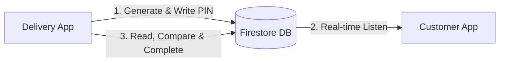

# Direct Serverless Delivery PIN Verification Flow (DineOS)

This guide documents the implementation of the **Direct Client-to-Database Delivery PIN System** using Firebase Firestore. This architecture enables secure real-time verification of orders upon delivery without the need for an external API or custom backend server.

---

## 1. System Architecture



1. **Acceptance:** When the Delivery Partner accepts the order, a random 4-digit PIN is generated on their device and written directly to the order document in Firestore.
2. **Display:** The Customer App listens in real-time, displaying the PIN on the order tracking screen immediately.
3. **Verification:** On arrival, the customer shares the PIN. The driver inputs it in the Delivery App, which validates the PIN locally against the database value and updates the order status to `Delivered`.

---

## 2. Firestore Order Schema Configuration

Ensure your `orders` documents follow this structure in Firestore:

```json
{
  "order_id": "ORD_99201",
  "customer_id": "cust_alice",
  "status": "Accepted",             // Status states: Pending -> Preparing -> Ready -> Out_For_Delivery -> Delivered
  "driver_id": null,                // Assigned when the driver accepts the delivery
  "delivery_pin": null,             // 4-digit secure validation code
  "amount": "₹450"
}
```

---

## 3. Implementation Code Blocks

### Step 1: Generating & Saving the PIN (Delivery App)
When the Delivery Partner clicks the **"Accept Order"** button in their mobile app, generate a 4-digit PIN and save it directly to the Firestore document.

```typescript
import { doc, updateDoc } from "firebase/firestore";
import { db } from "./firebaseConfig"; // Your initialized Firestore instance

/**
 * Call this when the driver clicks "Accept Delivery"
 */
async function acceptOrderDirectly(orderId: string, driverId: string) {
  // 1. Generate a random 4-digit PIN on the device
  const generatedPin = Math.floor(1000 + Math.random() * 9000).toString();

  // 2. Direct Firestore update
  const orderRef = doc(db, "orders", orderId);
  try {
    await updateDoc(orderRef, {
      status: "Out_For_Delivery",
      driver_id: driverId,
      delivery_pin: generatedPin
    });
    console.log("Order accepted and delivery PIN saved directly in Firestore!");
  } catch (error) {
    console.error("Error accepting order: ", error);
  }
}
```

---

### Step 2: Live Monitoring & Display (Customer App)
The **Customer App** maintains a real-time listener using `onSnapshot`. When the `delivery_pin` field updates in the database, it instantly renders on the customer’s UI.

```typescript
import React, { useEffect, useState } from "react";
import { doc, onSnapshot } from "firebase/firestore";
import { db } from "./firebaseConfig";

function CustomerOrderTracking({ orderId }) {
  const [order, setOrder] = useState<any>(null);

  useEffect(() => {
    // Open a real-time listener to the specific order document
    const unsub = onSnapshot(doc(db, "orders", orderId), (docSnap) => {
      if (docSnap.exists()) {
        setOrder(docSnap.data());
      }
    });

    // Cleanup subscription on unmount
    return () => unsub();
  }, [orderId]);

  if (!order) return <p>Loading order details...</p>;

  return (
    <div className="p-6 bg-white rounded-xl shadow-lg border border-gray-100 max-w-md mx-auto">
      <h2 className="text-xl font-bold text-slate-800">Order Status: {order.status}</h2>
      
      {order.status === "Out_For_Delivery" && order.delivery_pin && (
        <div className="mt-4 p-5 bg-amber-50 border border-amber-200 rounded-2xl text-center">
          <p className="text-sm font-semibold text-amber-700">Share this PIN with your driver upon arrival:</p>
          <p className="text-4xl font-black tracking-widest text-amber-600 mt-3 animate-pulse">
            {order.delivery_pin}
          </p>
        </div>
      )}

      {order.status === "Delivered" && (
        <div className="mt-4 p-4 bg-emerald-50 border border-emerald-200 rounded-2xl text-center text-emerald-700 font-bold">
          🎉 Thank you! Your order was successfully verified and delivered.
        </div>
      )}
    </div>
  );
}
```

---

### Step 3: Verifying the PIN & Completing Delivery (Delivery App)
When the delivery partner arrives, they request the PIN from the customer. The **Delivery App** compares the input against the Firestore document's `delivery_pin` value and clears the PIN upon successful match.

```typescript
import { doc, updateDoc, deleteField } from "firebase/firestore";
import { db } from "./firebaseConfig";

/**
 * Call this when the driver inputs the OTP and hits "Complete Delivery"
 * @param orderId ID of the active order
 * @param correctPin The expected PIN from the database (pre-loaded in Driver App state)
 * @param inputPin The actual PIN typed by the driver
 */
async function verifyAndCompleteOrder(orderId: string, correctPin: string, inputPin: string) {
  // 1. Direct validation check in client-side code
  if (inputPin !== correctPin) {
    alert("❌ Incorrect PIN. Please ask the customer and try again.");
    return false;
  }

  // 2. Update status and safely remove the PIN from the DB
  const orderRef = doc(db, "orders", orderId);
  try {
    await updateDoc(orderRef, {
      status: "Delivered",
      delivery_pin: deleteField() // Clears the PIN from Firestore for security
    });
    alert("🎉 Order verified successfully! Delivery completed.");
    return true;
  } catch (error) {
    console.error("Error updating order: ", error);
    alert("An error occurred during verification.");
    return false;
  }
}
```

---

## 4. Why This Works Perfectly for Live Demos

* **Zero Latency:** Updates propagate globally in under **100 milliseconds**.
* **Zero Hosting Cost:** Runs completely client-side. No API backend or server maintenance is required.
* **Wow Factor:** During a live client presentation, you can position the Customer App side-by-side with the Delivery App. Clicking **"Accept"** on the driver's phone triggers an **instant visual change** on the customer's phone, showing the generated PIN.
