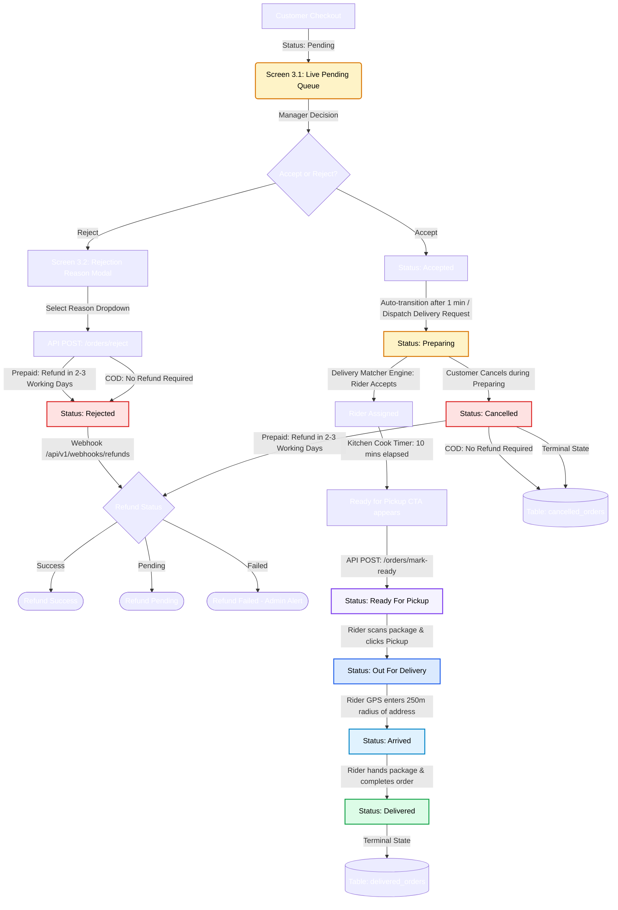

# DineOs — Restaurant Portal (Web)

## Product Requirement Document (PRD) + UI/UX Specification + Backend Handover Document

| Document Property | Value |
|---|---|
| **Product Name** | DineOs Restaurant Order Management System |
| **Portal / Client** | Restaurant Portal (Web Dashboard) |
| **Version** | 1.0.0 |
| **Status** | Approved for Execution |
| **Last Updated** | 2026-05-27 |
| **Audience** | Branch Managers, Frontend Web Engineers, Backend Engineers, UI/UX Designers, QA Engineers |

---

## Table of Contents
1. [Executive Summary & Global Portal Standards](#executive-summary--global-portal-standards)
2. [Module 1 — Home & Analytics](#module-1--home--analytics)
   - [Screen 1.1: Branch Dashboard (Home)](#screen-11-branch-dashboard-home)
3. [Module 2 — Menu Module](#module-2--menu-module)
   - [Screen 2.1: Menu Availability (List View)](#screen-21-menu-availability-list-view)
   - [Screen 2.2: View Food Screen](#screen-22-view-food-screen)
4. [Module 3 — Order Management Module](#module-3--order-management-module)
   - [Screen 3.1: Order Queue Screen (Live Pending Queue)](#screen-31-order-queue-screen-live-pending-queue)
   - [Screen 3.2: Rejection Reason Dialog (Reject Flow Modal)](#screen-32-rejection-reason-dialog-reject-flow-modal)
   - [Screen 3.3: Order List Screen (Tabs: Accept, Reject, Delivered, Cancel)](#screen-33-order-list-screen-tabs-accept-reject-delivered-cancel)
5. [Module 4 — Order Review Module](#module-4--order-review-module)
   - [Screen 4.1: Reviews & Ratings Dashboard](#screen-41-reviews--ratings-dashboard)
6. [Module 5 — Profile Module](#module-5--profile-module)
   - [Screen 5.1: Branch Profile Screen (Tabbed)](#screen-51-branch-profile-screen-tabbed)
   - [Screen 5.2: View Employee Detail Screen](#screen-52-view-employee-detail-screen)

---

## Executive Summary & Global Portal Standards

### Project Goals
The **DineOs Restaurant Portal** is a web-based operational system designed specifically for branch management and kitchen operators. While the global Admin Portal defines pricing and catalogs, this portal executes localized shift controls, processes order workflows in real time, manages local inventory availability, and tracks customer feedback.

### Global Web UI/UX Standards
*   **Design Palette**:
    *   *Primary Accent*: `#2563EB` (Blue 600) — Main CTA, active sidebar items, visual headers.
    *   *Success Color*: `#16A34A` (Green 600) — Order approvals, final delivery, active menu items.
    *   *Warning Color*: `#F59E0B` (Amber 500) — Preparing states, driver search, pending refunds.
    *   *Danger Color*: `#DC2626` (Red 600) — Reject actions, cancellation alerts, stock-outs.
    *   *Backgrounds*: Slate 50 (`#F8FAFC`) canvas color, pure white (`#FFFFFF`) card components.
*   **Interaction Rules**:
    *   *Audible Pings*: Incoming pending orders trigger a looping alert sound until acted upon.
    *   *Optimistic States*: Availability toggles update instantly on screen, roll back on API error.
    *   *Kitchen Usability*: Typography is set to high contrast (minimum `16px` for text) to ensure legibility from wall-mounted screens in hot environments.

---

## Module 1 — Home & Analytics

### Screen 1.1: Branch Dashboard (Home)

#### 1. Overview
*   **Screen Purpose**: Serves as the operational control panel for the branch, presenting aggregated financial, volume, and service KPIs for daily shifts.
*   **Business Objective**: Enable branch managers to monitor live operational throughput, watch cancellation metrics, and capture top menu insights to prevent bottlenecks.
*   **User Workflow**: Log in ➔ View metrics ➔ Filter by date range ➔ Select day/week/month chart granularity.
*   **Main Functionality**: Global KPIs summary cards, live charts rendering, recent logs feed, top menu ranking.

#### 2. Screen Preview (Text Wireframe)
```text
┌────────────────────────────────────────────────────────────────────────┐
│ [🍽 DineOs]   Branch: MG Road Branch  | 12:45 PM           🔔 (3)  👤 ▼ │
├──────────────┬─────────────────────────────────────────────────────────┤
│ ▶ Dashboard  │  Branch Operations Analytics                            │
│ ○ Menu       │  📅 [ May 1 - May 27, 2026 ]      Period Granularity: [D|W|M]│
│ ○ Orders     │ ┌──────────────┐ ┌──────────────┐ ┌──────────────┐      │
│ ○ Reviews    │ │ 💰 Revenue   │ │ 📦 Orders    │ │ ❌ Rejections│      │
│ ○ Profile    │ │ ₹1,45,200    │ │ 342          │ │ 8 (2.3%)     │      │
│              │ └──────────────┘ └──────────────┘ └──────────────┘      │
│              │ ┌─────────────────────────────────────────────────────┐ │
│              │ │  Hourly Revenue & Order Volume Trends (Line Chart)  │ │
│              │ │  ₹ |       _/\_                                     │ │
│              │ │  0 |______/____\__________________________________  │ │
│              │ └─────────────────────────────────────────────────────┘ │
│              │ ┌──────────────────────────┐ ┌────────────────────────┐ │
│              │ │ Top Selling Items        │ │ Recent Orders          │ │
│              │ │ 1. Veg Pizza (124 units) │ │ #ORD-9801 - ₹420 (Del) │ │
│              │ │ 2. Garlic Bread (80 un)  │ │ #ORD-9800 - ₹120 (Rej) │ │
│              │ └──────────────────────────┘ └────────────────────────┘ │
└──────────────┴─────────────────────────────────────────────────────────┘
```

#### 3. UI/UX Layout Description
*   **Sidebar**: Left aligned, Blue 600 accent highlighting active "Dashboard" button. Collapsible for smaller screens.
*   **Header**: Location tracking dropdown indicator, real-time clock, WebSocket connection status pulse, and staff profile avatar with logout dropdown.
*   **Tables & Cards**: KPI blocks using shadow wrappers. Tables render item rankings and order summaries with clear borders.
*   **Filters**: Horizontal segment filters for date selectors and charts (Daily / Weekly / Monthly).
*   **Charts**: Interlocking line-chart representing revenue overlaying total orders count. Rendered via responsive canvas containers.
*   **Loading & Empty States**: Metric blocks display grey skeleton card sweep animations during fetch actions. Charts show "No data found for selected range" overlay if returns are empty.

#### 4. Screen Fields & Components Specification

##### A. Global Dashboard Filters & Controls
| Field Name | Type | Required | Validation | Example | Notes |
|---|---|---|---|---|---|
| Date Filter Start | Date Selector | Yes | Must be <= today; Cannot exceed End Date | `2026-05-01` | Defaults to today |
| Date Filter End | Date Selector | Yes | Must be >= Start Date; Cannot exceed today | `2026-05-27` | Defaults to today |
| Period Granularity | Radio Toggle | Yes | Value must be 'D' (Daily), 'W' (Weekly), or 'M' (Monthly) | `D` | Controls data aggregation ticks for line chart |

##### B. Key Performance Indicators (KPI Cards)
| KPI Card | Type | Required | Validation | Example | Notes |
|---|---|---|---|---|---|
| Metric: Revenue | Currency | Read-only | Positive decimal | `₹1,45,200` | Total revenue of completed orders with dynamic trend indicator percentage |
| Metric: Orders | Number | Read-only | Integer >= 0 | `342` | Total orders count for selected period with dynamic trend indicator percentage |
| Metric: Rejections | Number & Perc. | Read-only | String format `{count} ({perc}%)` | `8 (2.3%)` | Count of rejected orders with rejection percentage rate |
| Metric: Cancellations | Number & Perc. | Read-only | String format `{count} ({perc}%)` | `2 (0.6%)` | Count of cancelled orders with cancellation percentage rate |

##### C. Hourly Revenue & Order Volume Trends Chart
| Chart Element | Type | Required | Validation | Example | Notes |
|---|---|---|---|---|---|
| Chart Container | Line Chart Widget | Yes | Double Y-Axis (Left: Revenue, Right: Orders Count) | - | Rendered via Chart.js or Recharts |
| X-Axis (Timeline Ticks) | Date Category Axis | Yes | Matches granularity period | `May 26` | Timeline ticks showing dates or times |
| Y-Axis Left (Revenue scale) | Numeric Axis | Yes | Scale defaults to max data point | `₹10,000` | Currency scale indicators |
| Y-Axis Right (Orders scale) | Numeric Axis | Yes | Scale defaults to max count point | `30` | Integer scale indicators |
| Data Series 1: Revenue Line | Decimal Array | Yes | Non-negative decimal points | `[8200, 4500, ...]` | Points plotted along Left Y-Axis scale |
| Data Series 2: Volume Line | Integer Array | Yes | Non-negative integer points | `[24, 12, ...]` | Points plotted along Right Y-Axis scale |

##### D. Top Selling Items Grid Table
| Table Column | Type | Required | Validation | Example | Notes |
|---|---|---|---|---|---|
| Rank | Number | Read-only | Integer >= 1 | `1` | Ranking of item by order volume |
| Food Name | Text | Read-only | Min 3 characters | `Veg Pizza` | Mapped food item title |
| Category | Badge | Read-only | Must exist in categories catalog | `Pizza` | Food item category classification |
| Units Sold | Number | Read-only | Integer >= 0 | `124 units` | Number of units sold at this branch |
| Revenue Contribution | Currency | Read-only | Positive decimal | `₹37,076.00` | Sum of revenue contributed by the food item |

##### E. Recent Orders Grid Table
| Table Column | Type | Required | Validation | Example | Notes |
|---|---|---|---|---|---|
| Order ID | Text Link | Read-only | Format `#ORD-XXXXX` | `#ORD-9801` | Clickable link opens order details drawer |
| Timestamp | DateTime | Read-only | Valid timestamp | `12:44 PM` | Order creation timestamp |
| Food Items | Text | Read-only | List of food items and quantities | `1x Veg Pizza` | String summary of items ordered |
| Total Value | Currency | Read-only | Positive decimal | `₹420` | Grand billing total of order |
| Payment Method | Badge | Read-only | COD or Online | `Online` | Mode of payment |
| Status | Badge | Read-only | Delivered, Rejected, Cancelled | `Delivered` | Order lifecycle status badge |


#### 5. Validations
*   **Date Threshold**: Range queries cannot exceed 90 calendar days on branch level to maintain UI caching speeds.
*   **Authentication Check**: Ensure the logged-in branch employee token contains the authorization parameter matching the selected `branch_id`.

#### 6. Dependencies
*   **Customer App checkout logs**: Drives revenue, order metrics, and sales values.
*   **WebSocket Engine**: Feeds dashboard cards to update metrics immediately on order completion.

#### 7. API Requirement Suggestions
*   **GET** `/api/v1/restaurant/analytics/kpis?branch_id=br_mg_road&start_date=2026-05-01&end_date=2026-05-27`
    *   *Response*: `{"status": "success", "data": {"revenue": 145200.00, "total_orders": 342, "rejected": 8, "cancelled": 2}}`
*   **GET** `/api/v1/restaurant/analytics/charts?branch_id=br_mg_road&granularity=D`
    *   *Response*: `{"status": "success", "chart_points": [{"label": "May 26", "revenue": 8200, "orders": 24}]}`

#### 8. Database Table Suggestions
No new analytics tables are created. Runs optimized aggregate queries over the orders database.

#### 9. Backend Development Notes
*   **Indexing Optimization**: Ensure database composite indexes are mapped on `customer_orders(branch_id, status, created_at)`.
*   **Data Aggregation caching**: Daily sales aggregates are written into a cron-managed cache table `daily_branch_metrics` to avoid parsing raw order rows repeatedly.

#### 10. Role & Permission Logic
*   **Branch Manager**: Allowed to view all operations metrics, exports, and financial history.
*   **Restaurant Staff**: Allowed only to view active counts (Orders, Active, Delivered) on the dashboard header, restricting access to revenue charts.

#### 11. UI Components Required
*   Date Picker, KPI Card, Reusable Chart Widget (Chart.js/Recharts integration), Sidebar Navigation, Table Row.

#### 12. Edge Cases
*   **Zero Sales Metrics**: Ensure divisions in calculations (e.g. cancellation ratios) handle division-by-zero check variables to prevent frontend page crash.
*   **Network Loss**: Socket disconnect freezes metrics and changes header status indicator to a Red "Reconnecting" icon.

#### 13. Notifications & Toast Messages
*   *Warning Alert*: "Dashboard data disconnected. Retrying connection..."

#### 14. Real-Time Event Flow
*   On new order completion: `/analytics` namespace pushes event `daily_metric_refresh` containing latest numbers.

#### 15. Status Management System
*   *Not applicable to analytics screen directly.*

#### 16. Analytics Logic
$$\text{Rejection Rate \%} = \left( \frac{\text{Total Rejected Orders}}{\text{Total Orders Received}} \right) \times 100$$
$$\text{Cancellation Rate \%} = \left( \frac{\text{Total Cancelled Orders}}{\text{Total Orders Received}} \right) \times 100$$

#### 17. Suggested Tech Notes
*   Use Next.js SSR for page landing framework. Implement swr/React Query caching libraries for REST endpoint metrics.

---

## Module 2 — Menu Module

### Screen 2.1: Menu Availability (List View)

#### 1. Overview
*   **Screen Purpose**: Provide immediate controls to toggle the availability state of menu items.
*   **Business Objective**: Prevent customer friction caused by ordering out-of-stock items, keeping branch menu maps synchronized with active kitchen inventory.
*   **User Workflow**: View list ➔ Search item ➔ Toggle availability switch.
*   **Main Functionality**: Paginated food catalog display, search/category filtering, dynamic switch toggle status.

#### 2. Screen Preview (Text Wireframe)
```text
┌────────────────────────────────────────────────────────────────────────┐
│ [🍽 DineOs]   Menu Availability Manager                                │
├──────────────┬─────────────────────────────────────────────────────────┤
│ ○ Dashboard  │  🔍 [ Search food item...   ]   Category: [ All Categories ▼ ]   Status: [ All Statuses ▼ ]│
│ ▶ Menu       │                                                         │
│ ○ Orders     │ ┌────────┬──────────────┬──────┬────────┬─────────┬────────┐ │
│ ○ Reviews    │ │ Item ID│ Food Name    │ Price│ Status │ Category│ Action │ │
│ ○ Profile    │ ├────────┼──────────────┼──────┼────────┼─────────┼────────┤ │
│              │ │food_101│ Veg Pizza    │ ₹299 │ [o] On │ Pizza   │ [View] │ │
│              │ │food_102│ Garlic Bread │ ₹120 │ [x] Off│ Sides   │ [View] │ │
│              │ └────────┴──────────────┴──────┴────────┴─────────┴────────┘ │
│              │ Showing 1-10 of 84 items             [<] [1] [2] [3] [>]│
└──────────────┴─────────────────────────────────────────────────────────┘
```

#### 3. UI/UX Layout Description
*   **Main Grid**: Multi-column list with unique food ID, name, locked master prices, Green/Red availability status, category labels, and row actions.
*   **Search & Filters**: Persistent header bar containing search queries, a dropdown selection list to group items by category, and a dropdown selection list to filter by availability status (All, Available, Unavailable).
*   **Modals**: Confirmation modal displays if toggle is turned off: "Disable this item? This will instantly remove it from the Customer App."

#### 4. Screen Fields Table

##### Search & Filter Fields
| Field Name | Type | Required | Validation | Example | Notes |
|---|---|---|---|---|---|
| Search Query | Input Text | No | Max 100 characters, sanitizes inputs | `Pizza` | Filters list dynamically |
| Category Dropdown| Selector | No | Must exist in categories catalog | `Pizza` | Filter grouping |
| Status Dropdown | Selector | No | Must match 'All', 'Available', or 'Unavailable' | `Available` | Filters items by status |

##### Menu List Table
| Field Name | Type | Required | Validation | Example | Notes |
|---|---|---|---|---|---|
| Table Column: ID | Text | Read-only | Unique alphanumeric code | `food_101` | Unique food item identifier |
| Table Column: Name | Text | Read-only | Min 3 characters | `Veg Pizza` | Display name of the food item |
| Table Column: Price | Currency | Read-only | Positive decimal | `₹299` | Branch selling price |
| Table Column: Status | Toggle Switch | Yes | Boolean (true/false) | `true` | Changes availability state |
| Table Column: Category | Text | Read-only | Must exist in categories catalog | `Pizza` | Food item category label |
| Table Column: Action | Link / Action | Yes | — | `[View]` | Opens the Detailed View Food Screen (Screen 2.2) |

#### 5. Validations
*   **Optimistic UI Rollback**: If menu toggle status change API returns a network error, the toggle must slide back to its previous status and prompt warning toast.

#### 6. Dependencies
*   **Admin Portal Catalog**: Feeds the items master records, descriptions, and pricing structure.
*   **Customer App Menu View**: Synchronously pulls branch mapping data to refresh ordering menus.

#### 7. API Requirement Suggestions
*   **GET** `/api/v1/restaurant/menu?branch_id=br_mg_road&page=1&search=Veg&category=Pizza&status=Available`
    *   *Response*: `{"status": "success", "items": [{"id": "food_101", "name": "Veg Pizza", "category": "Pizza", "price": 299.00, "is_available": true}]}`
*   **POST** `/api/v1/restaurant/menu/toggle`
    *   *Payload*: `{"branch_id": "br_mg_road", "food_item_id": "food_101", "is_available": false}`
    *   *Response*: `{"status": "success", "updated_status": false}`

#### 8. Database Table Suggestions
```sql
CREATE TABLE branch_food_mapping (
    branch_id UUID REFERENCES branches(id) ON DELETE CASCADE,
    food_item_id UUID NOT NULL,
    is_available BOOLEAN DEFAULT TRUE,
    updated_at TIMESTAMP WITH TIME ZONE DEFAULT CURRENT_TIMESTAMP,
    PRIMARY KEY (branch_id, food_item_id)
);
```

#### 9. Backend Development Notes
*   **Cache Invalidation**: On availability update, trigger an invalidate command for the customer cache key `branch:br_mg_road:menu` to force immediate synchronization.

#### 10. Role & Permission Logic
*   **Branch Manager**: Allowed to toggle all food mappings.
*   **Restaurant Staff**: Allowed to toggle availability.

#### 11. UI Components Required
*   Toggle Switch, Table Row Card, Category Badge, Search Bar.

#### 12. Edge Cases
*   **Conflict Toggling**: Two operators toggle the same item simultaneously. Backend processes using optimistic locks, sending a sync update message to the slower client page.

#### 13. Notifications & Toast Messages
*   *Success Toast*: "Veg Pizza availability set to unavailable."
*   *Error Toast*: "Failed to synchronize menu changes. Check internet connection."

#### 14. Real-Time Event Flow
*   On toggle submit: Backend broadcasts socket event `menu_availability_changed` to `/customers` channels.

#### 15. Status Management System
| Status | Color | Description | Next Allowed Status |
|---|---|---|---|
| `Available` | Green | Active ordering item | `Unavailable` |
| `Unavailable`| Red | Hidden from checkout catalog | `Available` |

#### 16. Analytics Logic
*   Logs cumulative unavailable duration to determine high-cancellation or inventory deficit menu items.

#### 17. Suggested Tech Notes
*   Store mapping database records in Redis hash fields for sub-millisecond retrieval on customer app queries.

---

## Screen 2.2: View Food Screen

### 1. Overview
*   **Screen Purpose**: Displays full item configuration details (such as image, description, category, base price, and customization options) mapped from the master catalog, along with branch-level status settings.
*   **Business Objective**: Allow branch operators to inspect the details and customization configurations of catalog items, and manage branch-level availability state settings.
*   **User Workflow**: Click `[View]` on Menu Availability list (Screen 2.1) ➔ Inspect details and admin-configured customizations ➔ Toggle availability or click `[← Back]` to return.

### 2. Screen Preview (Text Wireframe)
```text
┌────────────────────────────────────────────────────────────────────────┐
│ [🍽 DineOs]   View Food Item Details                             [←]   │
├──────────────┬─────────────────────────────────────────────────────────┤
│ ○ Dashboard  │  Food Details: Paneer Tikka (ID: food_204)              │
│ ▶ Menu       │                                                         │
│ ○ Orders     │  ┌────────────────────────┬───────────────────────────┐ │
│ ○ Reviews    │  │ [ IMAGE PREVIEW ]      │ Status: [● Available]     │ │
│ ○ Profile    │  │                        │ Base Price: ₹249.00       │ │
│              │  │ paneer_tikka.png       │ Category: Starters        │ │
│              │  └────────────────────────┴───────────────────────────┘ │
│              │  Description:                                           │
│              │  Spiced cottage cheese cubes grilled in tandoor.        │
│              │                                                         │
│              │  Customization Options & Prices:                        │
│              │  ┌──────────────────────────────────────┬─────────────┐ │
│              │  │ Option Label                         │ Price (₹)   │ │
│              │  ├──────────────────────────────────────┼─────────────┤ │
│              │  │ Add Cheese                           │ +₹30.00     │ │
│              │  │ Add Mushrooms                        │ +₹25.00     │ │
│              │  │ Add Olives                           │ +₹20.00     │ │
│              │  └──────────────────────────────────────┴─────────────┘ │
│              │  [ Toggle Availability ]                                │
│              │                                                         │
│              │  [← Back to Menu Manager]                               │
│              └─────────────────────────────────────────────────────────┘
└──────────────┴─────────────────────────────────────────────────────────┘
```

### 3. UI/UX Layout Description
*   **Split Info Block**: Top section splits into a product image box (left) and key identifiers/status details (right).
*   **Customizations Table**: Lists all options configured by the admin, highlighting option labels and prices.
*   **Availability Toggle**: Brightly colored action button (Green `#16A34A` for Available state, Red `#DC2626` for Unavailable state).
*   **Navigation Actions**: Top-right dismiss/back arrow button (`[←]`) and footer text link (`[← Back to Menu Manager]`).

### 4. Screen Fields Table
| Field Name | Type | Required | Validation | Example | Notes |
|---|---|---|---|---|---|
| Back Button | Link / Icon | Yes | Navigates back to Screen 2.1 | `[←]` | Pinned to top-right corner. |
| Item ID Display | Label | Yes | Unique alphanumeric code | `food_204` | Displayed in title area. |
| Food Item Name | Label | Yes | Min 3 characters | `Paneer Tikka` | Displays master item name. |
| Item Image | Image | Yes | Valid asset/URL path | `paneer_tikka.png` | Product photo display. |
| Availability Status | Badge | Yes | 'Available' or 'Unavailable' | `● Available` | Shows the active status badge. |
| Base Price | Label | Yes | Positive decimal currency | `₹249.00` | Item's default base selling price. |
| Category Label | Label | Yes | Valid category name | `Starters` | Item category name. |
| Description | Text block | No | Max 500 characters | `Spiced cottage cheese...` | Detailed product text. |
| Customization Options Table | Table | No | Renders array of options | Renders option rows | Shows option labels and price additions. |
| Table Column: Option Label | Label | Yes | Min 1 characters | `Add Cheese` | Name of configured add-on. |
| Table Column: Price Add-on | Label | Yes | Currency (decimal) | `+₹30.00` | Sourced price adder. |
| Toggle Availability Button | Button | Yes | Requires active auth token | `[ Toggle Availability ]` | Toggles availability state. |
| Back Text Link | Link | Yes | Navigates back to Screen 2.1 | `[← Back to Menu Manager]` | Returns to list view. |

### 5. Validations
*   **Optimistic UI Updates**: Toggling availability state changes state on client instantly; rolls back and displays warning toast if database API responds with an error.
*   **Customizations Read-Only**: Branch operators cannot edit customization names or prices. These fields are strictly read-only and sourced from the admin master menu configuration.

### 6. Dependencies
*   **Admin Portal Catalog Configurations**: Sourced to display master item description, price, and customization options setup (defined in `admin.md` Screen 5.2/5.3).
*   **Branch Menu Mapping Database**: Sourced to retrieve the branch-specific `is_available` state.

### 7. API Requirement Suggestions
*   **GET** `/api/v1/restaurant/menu/details?branch_id=br_mg_road&food_item_id=food_204`
    *   *Response*:
        ```json
        {
          "status": "success",
          "data": {
            "id": "food_204",
            "name": "Paneer Tikka",
            "category": "Starters",
            "base_price": 249.00,
            "is_available": true,
            "image_url": "https://cdn.dineos.com/paneer_tikka.png",
            "description": "Spiced cottage cheese cubes grilled in tandoor.",
            "customizations": [
              { "label": "Add Cheese", "price": 30.00 },
              { "label": "Add Mushrooms", "price": 25.00 },
              { "label": "Add Olives", "price": 20.00 }
            ]
          }
        }
        ```
*   **POST** `/api/v1/restaurant/menu/toggle`
    *   *Payload*: `{"branch_id": "br_mg_road", "food_item_id": "food_204", "is_available": false}`
    *   *Response*: `{"status": "success", "updated_status": false}`

---

## Module 3 — Order Management Module

### Screen 3.1: Order Queue Screen (Live Pending Queue)

#### 1. Overview
*   **Screen Purpose**: Displays incoming real-time pending customer orders requiring immediate review.
*   **Business Objective**: Minimize operational processing latency (Target: Action within 2 minutes of checkout) to accelerate food delivery cycles.
*   **User Workflow**: New order sound pings ➔ View details ➔ Click "Accept" or "Reject".
*   **Main Functionality**: Live ticket feed, order countdown timer, primary action CTAs.

#### 2. Screen Preview (Text Wireframe)
```text
┌────────────────────────────────────────────────────────────────────────┐
│ [🍽 DineOs]   Live Pending Orders Queue                      📢 [ONLINE]│
├──────────────┬─────────────────────────────────────────────────────────┤
│ ○ Dashboard  │  Orders Waiting Action: (2 Pending)                      │
│ ○ Menu       │                                                         │
│ ▶ Orders     │ ┌──────────────────────────┐ ┌────────────────────────┐ │
│   - Queue    │ │ 🚨 #ORD-99018 [Pending]  │ │ 🚨 #ORD-99019 [Pending]  │ │
│   - List     │ │ Time Received: 12:44 PM  │ │ Time Received: 12:45 PM  │ │
│   - Reviews  │ │ Timer Remaining: 01:45   │ │ Timer Remaining: 02:00   │ │
│   - Profile  │ │ 2x Veg Margherita Pizza  │ │ 2x Spicy Chicken Burgers │ │
│              │ │  + Extra Cheese (+₹60)   │ │  (No Customization)      │ │
│              │ │  + Extra Sauce (+₹20)    │ │                          │ │
│              │ │ Item Total: ₹758.00      │ │ Item Total: ₹360.00      │ │
│              │ │ Pkg Chg: ₹30.00          │ │ Pkg Chg: ₹0.00           │ │
│              │ │ Tax: ₹39.40              │ │ Tax: ₹18.00              │ │
│              │ │ Coupon: DINE50 (-₹100)   │ │ Coupon: None             │ │
│              │ │ Total Bill: ₹727.40      │ │ Total Bill: ₹378.00      │ │
│              │ ├──────────────────────────┤ ├────────────────────────┤ │
│              │ │ [❌ Reject]  [✅ Accept] │ │ [❌ Reject]  [✅ Accept] │ │
│              │ └──────────────────────────┘ └────────────────────────┘ │
└──────────────┴─────────────────────────────────────────────────────────┘
```

#### 3. UI/UX Layout Description
*   **Order Cards Grid**: Distinct card outlines for each order. Border changes to flashing Amber/Red when remaining response timer drops below 60 seconds. Displays item customization lines directly below the respective food item, and includes itemized breakdowns for subtotal (item total), package charges, taxes, applied coupon code, and discount amount.
*   **Action Row**: Prominent Red button `[Reject]` and Green button `[Accept]` at card footer.
*   **Alert Banner**: Full page overlay screen if browser volume permissions are disabled, prompting the operator: "Click here to enable sound notifications."

#### 4. Screen Fields Table
| Field Name | Type | Required | Validation | Example | Notes |
|---|---|---|---|---|---|
| Order Ticket: ID | Text (Read-only) | Yes | Unique order identifier format (`#ORD-XXXXX`) | `#ORD-99018` | Database key used to uniquely map the transaction. |
| Order Ticket: Status | Badge (Read-only) | Yes | Value must be 'Pending' | `Pending` | Order queue status badge. |
| Order Ticket: Time Received | DateTime (Read-only) | Yes | Valid timestamp | `12:44 PM` | Timestamp when order checkout was completed. |
| Order Ticket: Timer Remaining | Number (Countdown) | Yes | Computed dynamically: `(created_at + 5 mins) - current_time` | `01:45` | Time remaining in MM:SS before order triggers auto-rejection. |
| Order Ticket: Items List | Array of Objects | Yes | Must contain at least 1 food item | `2x Veg Margherita Pizza` | List of items, quantities, and selected customizations showing customization price additions (e.g. `+ Extra Cheese (+₹60)`). |
| Order Ticket: Item Total (Subtotal) | Currency (Read-only) | Yes | Positive decimal | `₹758.00` | Total price of all food items inclusive of selected customizations, before tax, packaging, and coupon discount. |
| Order Ticket: Packaging Charge | Currency (Read-only) | Yes | Positive decimal | `₹30.00` | Packaging charges applied to the order. |
| Order Ticket: Tax Amount | Currency (Read-only) | Yes | Positive decimal | `₹39.40` | Computed tax amount applied to the order. |
| Order Ticket: Applied Coupon Code | Text (Read-only) | No | Alphanumeric | `DINE50` | Sourced from customer checkout. Displays applied coupon code (hidden if none applied). |
| Order Ticket: Coupon Discount | Currency (Read-only) | No | Positive decimal | `₹100.00` | Coupon discount subtracted from the bill (hidden if none applied). |
| Order Ticket: Total Bill | Currency (Read-only) | Yes | Positive decimal | `₹727.40` | Final payable amount calculated as: `Item Total (Subtotal) + Packaging Charge + Tax Amount - Coupon Discount`. |
| Order Ticket: Payment Method | Badge (Read-only) | Yes | Value must be 'COD' or 'Online' | `Prepaid` (Online) | Specifies payment channel. |
| Action: Accept | Button | Yes | Requires active auth token | `[Accept]` | Sends POST to `/accept` endpoint immediately without prompting for cooking or preparation time; transitions status to `Accepted`. |
| Action: Reject | Button | Yes | Requires active auth token | `[Reject]` | Opens the Rejection Reason dialog modal to log cancellation. |

#### 5. Validations
*   **Shift Operation Lock**: Rejects/Accepts cannot be submitted if branch manager has marked the overall branch state as offline.
*   **Direct Order Acceptance**: Accepting an order must not prompt the operator for any cooking time or preparation time. The action executes immediately upon button click.
*   **Total Bill Formula Verification**: The final bill calculation must be verified client-side and server-side using the formula:
    $$\text{Total Bill} = \text{Item Total (including customizations)} + \text{Packaging Charge} + \text{Tax} - \text{Coupon Discount}$$
    where $\text{Item Total}$ is calculated as the sum of $(\text{Base Price} + \sum\text{Customization Option Prices}) \times \text{Quantity}$ for each item.

#### 6. Dependencies
*   **Customer Checkouts**: Generates the incoming order queues.
*   **Payment Gateway Status**: Verifies payment success flags before showing online pre-paid orders in queue.

#### 7. API Requirement Suggestions
*   **POST** `/api/v1/restaurant/orders/accept`
    *   *Payload*: `{"branch_id": "br_mg_road", "order_id": "ord_99018"}`
    *   *Response*: `{"status": "success", "new_status": "Accepted"}`
*   **POST** `/api/v1/restaurant/orders/reject`
    *   *Payload*: `{"branch_id": "br_mg_road", "order_id": "ord_99018", "reason_code": "out_of_stock", "notes": "No basil leaves left"}`
    *   *Response*: `{"status": "success", "new_status": "Rejected"}`

#### 8. Database Table Suggestions
```sql
CREATE TABLE branch_orders (
    id UUID PRIMARY KEY DEFAULT gen_random_uuid(),
    branch_id UUID REFERENCES branches(id),
    customer_id UUID NOT NULL,
    status VARCHAR(50) DEFAULT 'Pending',
    payment_method VARCHAR(20) CHECK (payment_method IN ('COD', 'Online')),
    payment_status VARCHAR(20) DEFAULT 'Pending',
    subtotal_amount DECIMAL(10,2) NOT NULL, -- Total of items with customization add-ons included
    package_charge_amount DECIMAL(10,2) NOT NULL DEFAULT 0.00,
    tax_amount DECIMAL(10,2) NOT NULL DEFAULT 0.00,
    coupon_code VARCHAR(50),
    coupon_discount_amount DECIMAL(10,2) NOT NULL DEFAULT 0.00,
    total_amount DECIMAL(10,2) NOT NULL, -- Total Bill: subtotal_amount + package_charge_amount + tax_amount - coupon_discount_amount
    created_at TIMESTAMP WITH TIME ZONE DEFAULT CURRENT_TIMESTAMP,
    updated_at TIMESTAMP WITH TIME ZONE DEFAULT CURRENT_TIMESTAMP
);

-- Mappings of ordered items and their customization snapshots
CREATE TABLE branch_order_items (
    id UUID PRIMARY KEY DEFAULT gen_random_uuid(),
    order_id UUID REFERENCES branch_orders(id) ON DELETE CASCADE,
    food_item_id UUID NOT NULL,
    quantity INTEGER NOT NULL CHECK (quantity > 0),
    base_price DECIMAL(10,2) NOT NULL,
    customizations JSONB -- Snapshot: [{"label": "Extra Cheese", "price": 60.00}]
);
```

#### 9. Backend Development Notes
*   **Auto-Accept Timer**: Runs a backend queue scheduler that triggers automated cancellation alerts if order remains un-handled in `Pending` state for > 5 minutes.

#### 10. Role & Permission Logic
*   **Branch Manager**: Allowed to accept and reject orders.
*   **Restaurant Staff**: Allowed only to view order lists, accept blocked by token authorization checker.

#### 11. UI Components Required
*   Order Ticket Card, Accept Button, Timer Display Badge.

#### 12. Edge Cases
*   **Network Droppage**: Operator loses connection, customer cancels order during dropout. WebSocket reconciles on recovery, removes deleted ticket from screen.

#### 13. Notifications & Toast Messages
*   *Success Push Alert*: "Order #ORD-99018 accepted successfully."
*   *Toast Warning*: "Warning: incoming order ticket is expiring in 30 seconds."

#### 14. Real-Time Event Flow
*   Incoming order emits event `new_incoming_order` to rooms matching `branch_br_mg_road`.

#### 15. Status Management System
| Status | Color | Description | Next Allowed Status |
|---|---|---|---|
| `Pending` | Yellow | New incoming ticket | `Accepted` or `Rejected` |

#### 16. Analytics Logic
*   Calculates average branch response times (Time Received to Time Accepted).

#### 17. Suggested Tech Notes
*   Use Socket.io namespaces configured with Redis adapter mapping to deliver message frames horizontally across auto-scaled node clusters.

---

### Screen 3.2: Rejection Reason Dialog (Reject Flow Modal)

#### 1. Overview
*   **Screen Purpose**: Captures explanations and logs details of order rejections.
*   **Business Objective**: Compile precise cancellation data to improve inventory operations and trigger automatic payment reversals.
*   **User Workflow**: Click "Reject" ➔ Select reason option ➔ Input detailed comment ➔ Confirm submit.
*   **Main Functionality**: Option selectors, note text area, dynamic payment refund flag display.

#### 2. Screen Preview (Text Wireframe)
```text
┌────────────────────────────────────────────────────────────────────────┐
│  Reject Order #ORD-99018                                           [X] │
├────────────────────────────────────────────────────────────────────────┤
│  Select Rejection Reason:                                              │
│  [ Out of Stock (select unavailable items next)                      ▼ ] │
│                                                                        │
│  Additional Notes (Mandatory for 'Other'):                             │
│  [ Kitchen has run out of mozzarella cheese block.                   ] │
│                                                                        │
│  ⚠️ Prepaid Order: Confirming rejection triggers an instant refund to   │
│  the customer payment method via Stripe (refunded in 2-3 working days).│
├────────────────────────────────────────────────────────────────────────┤
│                                          [ Cancel ]  [ CONFIRM REJECT ]│
└────────────────────────────────────────────────────────────────────────┘
```

#### 3. UI/UX Layout Description
*   **Overlay Structure**: Blur backdrop backdrop blocking main queue panel actions.
*   **Form**: Dropdown selector for cancellation reasons. Input text container has a character limit counter (0/250).
*   **Refund Pill Alert**: Dynamic text badge shown only for pre-paid order types. Displays: "Prepaid Order: Automated Refund Initiated."

#### 4. Screen Fields Table
| Field Name | Type | Required | Validation | Example | Notes |
|---|---|---|---|---|---|
| Reason Code | Dropdown | Yes | Must match one of system enum cancellation keys | `out_of_stock` | Saved to logs database |
| Reject Notes | Text Area | Yes* | Mandatory if reason is 'other'. Max 250 characters | `Out of cheese` | Strips invalid script tags |

#### 5. Validations
*   **Note Requirement**: If 'Other' option selected, the confirmation submit button remains inactive until at least 10 letters are entered in additional notes block.
*   **Refund Flow on Rejection**: If the rejected order is Cash on Delivery (COD), no refund process is initiated. If the rejected order is Prepaid (Online), a refund payload is automatically dispatched to Stripe, and the refund is settled/credited to the customer's account within 2-3 working days.

#### 6. Dependencies
*   **Payment Gateway API Integration**: Rejection submissions automatically dispatch refund payloads to the gateway provider.

#### 7. API Requirement Suggestions
*   **POST** `/api/v1/restaurant/orders/refund-initiate`
    *   *Payload*: `{"order_id": "ord_99018", "refund_amount": 299.00}`
    *   *Response*: `{"status": "initiated", "refund_id": "rf_010291", "gateway_code": "stripe_200"}`

#### 8. Database Table Suggestions
```sql
CREATE TABLE rejected_orders (
    id UUID PRIMARY KEY DEFAULT gen_random_uuid(),
    order_id UUID UNIQUE REFERENCES branch_orders(id) ON DELETE CASCADE,
    reason_code VARCHAR(50) NOT NULL, -- e.g. 'system_timeout' if auto-rejected
    notes TEXT,
    is_auto_rejected BOOLEAN DEFAULT FALSE,
    auto_reject_reason VARCHAR(100), -- e.g. 'timeout_5_mins' if auto-rejected
    refund_status VARCHAR(50) DEFAULT 'Not Required', -- 'Pending', 'Success', 'Failed'
    refund_txn_id VARCHAR(100),
    rejected_at TIMESTAMP WITH TIME ZONE DEFAULT CURRENT_TIMESTAMP
);
```

#### 9. Backend Development Notes
*   **Database Transaction Locking**: Wrap database execution of order status updates and rejection insertions in single Transaction logic blocks to prevent orphaned status states.

#### 10. Role & Permission Logic
*   Restricted to **Branch Manager** authorization tokens. Restaurant Staff see disabled action trigger.

#### 11. UI Components Required
*   Modal Overlay Wrapper, Radio Input Field, Form Text Field.

#### 12. Edge Cases
*   **Refund API Failure**: Payment gateway times out during refund request processing. Backend marks order status as `Rejected` but flags refund tracking database entry as `Failed`, triggering alert flag on the admin dashboard queue.

#### 13. Notifications & Toast Messages
*   *Success Alert*: "Order rejected. Refund task created."
*   *Error Warning*: "Refund processing failed. Administrator notified."

#### 14. Real-Time Event Flow
*   On rejection confirmation, push event `order_cancelled` containing order ID and refund status to Customer Mobile App client namespaces.

#### 15. Status Management System
| Status | Color | Description | Next Allowed Status |
|---|---|---|---|
| `Rejected` | Red | Ticket cancelled, terminal | None |

#### 16. Analytics Logic
*   Rejection metrics are aggregated daily to track branch performance indexes and identify catalog items experiencing frequent stock-outs.

#### 17. Suggested Tech Notes
*   Implement event-driven worker tasks using BullMQ/Celery to retry failed gateway refunds in secondary background loops.

---

### Screen 3.3: Order List Screen (Tabs: Accept, Reject, Delivered, Cancel)

#### 1. Overview
*   **Screen Purpose**: A single repository page for all orders (active and historical) processed at the branch level, categorized by tab selection.
*   **Business Objective**: Enable operators to audit financials, verify cash transactions, track stripe/razorpay refunds, and review order cancellation reasons in a consolidated workspace.
*   **User Workflow**: Select `- List` from sidebar ➔ Click target Tab (Accept / Reject / Delivered / Cancel) ➔ Use filters/search ➔ Select row to inspect details via drawer.
*   **Main Functionality**: Tabbed queue selector, CSV report exporter, alphanumeric search bar, payment mode dropdown filter, detailed order drawer widget.

#### 2. Screen Layout
The screen is composed of two visual zones stacked vertically:

*   **Zone 1 — Persistent Screen Shell & Tab Navigation (Always Visible)**: A sidebar for navigation, and a persistent top filtering and search panel containing search inputs and a payment mode selector. This header remains fixed as the user transitions between tabs.
*   **Zone 2 — Internal Tabbed Content Panel**: A tab bar immediately below the persistent search panel with four tabs:
    *   *Accept*: Lists active orders currently in Accepted, Preparing, Ready For Pickup, Out For Delivery, or Arrived status.
    *   *Reject*: Lists cancelled orders with refund details.
    *   *Delivered*: Lists successfully completed deliveries.
    *   *Cancel*: Lists orders cancelled by the customer or kitchen during preparation stages.

Each tab renders its own dedicated data table grid layout.

#### 3. Screen Preview (Full Composite View — Accept Tab Active)
```text
┌────────────────────────────────────────────────────────────────────────┐
│ [🍽 DineOs]   Order List Ledger                                        │
├──────────────┬─────────────────────────────────────────────────────────┤
│ ○ Dashboard  │  [ Accept (5) ]  [ Reject (2) ]  [ Delivered ]  [ Cancel ]│
│ ○ Menu       ├─────────────────────────────────────────────────────────┤
│ ▶ Orders     │  🔍 [ Search Order ID...   ]   Filter: [ Payment Mode ▼ ] │
│   - Queue    ├──────────┬──────────────┬──────────────┬───────────┬────────────────┬────────┐
│   - List     │ Order ID │ Timestamp    │ Total Value  │ Status    │ Payment Method │ Action │
│ ○ Reviews    ├──────────┼──────────────┼──────────────┼───────────┼────────────────┼────────┤
│ ○ Profile    │ #99018   │ 12:46 PM     │ ₹299.00      │ Preparing │ Online         │ [View] │
│              │ #99016   │ 12:30 PM     │ ₹420.00      │ Accepted  │ COD            │ [View] │
│              │ └────────┴──────────────┴──────────────┴───────────┴────────────────┴────────┘ │
│              │ Showing 1-20 of 5 entries             [<] [1] [>]       │
└──────────────┴─────────────────────────────────────────────────────────┘
```

---

### SECTION A: Persistent Screen Shell & Tab Navigation (Persistent — Always Visible)

This zone remains fixed regardless of which tab is active. It contains the search input, payment mode filter, and CSV export action.

#### 1. Persistent Screen Shell Fields Table
| Field Name | Type | Required | Validation | Example | Notes |
|---|---|---|---|---|---|
| Search Box | Input Text | No | Alphanumeric validation limits | `99018` | Filters the selected tab rows by matching Order ID |
| Payment Mode Filter | Selector | No | Must match 'COD', 'Online', or 'All' | `Online` | Filters records by payment method |
| Export Button | Button | No | Requires active list scope | `[CSV]` | Exports the currently filtered order records to a CSV file |

---

### SECTION B: Internal Tab Bar Controller

The tab bar sits below the persistent header card. The active tab displays an underline highlight (primary color `#2563EB`) beneath its label, with dynamic badge counts indicating matching order volume.

#### 1. Tab Bar Behavior
| Property | Specification |
|---|---|
| Default Active Tab | `Accept` |
| Active Tab Indicator | Bottom border underline, `2px solid #2563EB` |
| Inactive Tab Style | Neutral gray text, no underline |
| Badge Counts | Dynamic count shown in parentheses next to active tabs with pending items |
| URL State Persistence | Tab state must be persisted in the URL query parameter (e.g., `?tab=reject`) |

---

### SECTION C: Tab Content Viewports

Swaps the data table grid based on the active tab selection. Clicking the `[View]` button in the Action column (or clicking the order ID link) in any tab opens a slide-out detailed drawer from the right.

---

#### Tab 1: Accept
Displays active orders currently in progress.

##### 1. Accept Tab Preview
```text
┌──────────┬──────────────┬──────────────┬───────────────────────────────┬───────────┬────────────────┬────────┐
│ Order ID │ Timestamp    │ Total Value  │ Food Items                    │ Status    │ Payment Method │ Action │
├──────────┼──────────────┼──────────────┼───────────────────────────────┼───────────┼────────────────┼────────┤
│ #99018   │ 12:46 PM     │ ₹299.00      │ 1x Veg Margherita Pizza       │ Preparing │ Online         │ [View] │
│ #99016   │ 12:30 PM     │ ₹420.00      │ 2x Spicy Chicken Burgers      │ Accepted  │ COD            │ [View] │
└──────────┴──────────────┴──────────────┴───────────────────────────────┴───────────┴────────────────┴────────┘
```

##### 2. Accept Tab Fields Table
| Field Name | Type | Required | Validation | Example | Notes |
|---|---|---|---|---|---|
| Table Column: Order ID | Text Link | Yes | Unique reference format | `#99018` | Clickable link opens details drawer |
| Table Column: Timestamp | DateTime (Read-only) | Yes | Valid timestamp | `12:46 PM` | Order creation timestamp |
| Table Column: Total Value | Currency (Read-only) | Yes | Positive decimal | `₹299.00` | Inclusive of tax |
| Table Column: Food Items | Text (Read-only) | Yes | List of food items and quantities | `1x Veg Margherita Pizza` | String summary of items ordered |
| Table Column: Status | Badge (Read-only) | Yes | Active order status | `Preparing` | Valid states: Accepted, Preparing, Ready For Pickup, Out For Delivery, Arrived |
| Table Column: Payment Method | Badge (Read-only) | Yes | Value must be 'COD' or 'Online' | `Online` | Mode of payment chosen |
| Row Action: View | Button / Link | Yes | Triggers detailed view | `[View]` | Button opens detailed slide-out drawer from the right |

---

#### Tab 2: Reject
Displays cancelled orders with refund statuses.

##### 1. Reject Tab Preview
```text
┌──────────┬──────────────┬──────────────┬───────────────────────────┬─────────────────┬────────────────────┬───────────────┬───────────┬────────┐
│ Order ID │ Timestamp    │ Total Value  │ Food Items                │ Rejection Code  │ Auto Reject Reason │ Refund Status │ Status    │ Action │
├──────────┼──────────────┼──────────────┼───────────────────────────┼─────────────────┼────────────────────┼───────────────┼───────────┼────────┤
│ #99015   │ 11:20 AM     │ ₹180.00      │ 1x Garlic Bread           │ out_of_stock    │ —                  │ Refunded      │ Rejected  │ [View] │
│ #99011   │ 10:15 AM     │ ₹320.00      │ 2x Choco Lava Cake        │ system_timeout  │ timeout_5_mins     │ Refund Pending│ Rejected  │ [View] │
└──────────┴──────────────┴──────────────┴───────────────────────────┴─────────────────┴────────────────────┴───────────────┴───────────┴────────┘
```

##### 2. Reject Tab Fields Table
| Field Name | Type | Required | Validation | Example | Notes |
|---|---|---|---|---|---|
| Table Column: Order ID | Text Link | Yes | Unique reference format | `#99015` | Clickable link opens details drawer |
| Table Column: Timestamp | DateTime (Read-only) | Yes | Valid timestamp | `11:20 AM` | Order checkout timestamp |
| Table Column: Total Value | Currency (Read-only) | Yes | Positive decimal | `₹180.00` | Order total |
| Table Column: Food Items | Text (Read-only) | Yes | List of food items and quantities | `1x Garlic Bread` | String summary of items ordered |
| Table Column: Rejection Code | Badge (Read-only) | Yes | Valid system reason enum | `out_of_stock` | Reason code selected in Screen 3.2 |
| Table Column: Auto Reject Reason | Text (Read-only) | No | Reason code for automated rejection | `timeout_5_mins` | Only populated if order was auto-rejected by the system scheduler |
| Table Column: Refund Status | Badge (Read-only) | Yes | Refund status indicator | `Refunded` | States: Not Required (for COD), Refund Pending (refunded in 2-3 working days), Refunded, Refund Failed |
| Table Column: Status | Badge (Read-only) | Yes | Value must be 'Rejected' | `Rejected` | Order cancellation status |
| Row Action: View | Button / Link | Yes | Triggers detailed view | `[View]` | Button opens detailed slide-out drawer from the right |

---

#### Tab 3: Delivered
Displays completed historical orders.

##### 1. Delivered Tab Preview
```text
┌──────────┬──────────────┬──────────────┬───────────────────────────────┬─────────────────┬──────────────┬────────┐
│ Order ID │ Timestamp    │ Total Value  │ Food Items                    │ Delivered Time  │ Status       │ Action │
├──────────┼──────────────┼──────────────┼───────────────────────────────┼─────────────────┼──────────────┼────────┤
│ #99014   │ 11:05 AM     │ ₹450.00      │ 1x Veg Pizza, 1x Garlic Bread │ 11:35 AM        │ Delivered    │ [View] │
│ #99012   │ 10:00 AM     │ ₹220.00      │ 2x Spicy Chicken Burgers      │ 10:30 AM        │ Delivered    │ [View] │
└──────────┴──────────────┴──────────────┴───────────────────────────────┴─────────────────┴──────────────┴────────┘
```

##### 2. Delivered Tab Fields Table
| Field Name | Type | Required | Validation | Example | Notes |
|---|---|---|---|---|---|
| Table Column: Order ID | Text Link | Yes | Unique reference format | `#99014` | Clickable link opens details drawer |
| Table Column: Timestamp | DateTime (Read-only) | Yes | Valid timestamp | `11:05 AM` | Checkout timestamp |
| Table Column: Total Value | Currency (Read-only) | Yes | Positive decimal | `₹450.00` | Order total |
| Table Column: Food Items | Text (Read-only) | Yes | List of food items and quantities | `1x Veg Pizza, 1x Garlic Bread` | String summary of items ordered |
| Table Column: Delivered Time | DateTime (Read-only) | Yes | Valid timestamp | `11:35 AM` | Time when delivered to customer |
| Table Column: Status | Badge (Read-only) | Yes | Value must be 'Delivered' | `Delivered` | Order completion status |
| Row Action: View | Button / Link | Yes | Triggers detailed view | `[View]` | Button opens detailed slide-out drawer from the right |

---

#### Tab 4: Cancel
Displays customer or kitchen cancelled orders.

##### 1. Cancel Tab Preview
```text
┌──────────┬──────────────┬──────────────┬───────────────────────────┬────────────────────┬───────────────┬───────────┬────────┐
│ Order ID │ Timestamp    │ Total Value  │ Food Items                │ Cancel Reason      │ Refund Status │ Status    │ Action │
├──────────┼──────────────┼──────────────┼───────────────────────────┼────────────────────┼───────────────┼───────────┼────────┤
│ #99013   │ 10:45 AM     │ ₹299.00      │ 1x Veg Margherita Pizza   │ customer_cancelled │ Refunded      │ Cancelled │ [View] │
└──────────┴──────────────┴──────────────┴───────────────────────────┴────────────────────┴───────────────┴───────────┴────────┘
```

##### 2. Cancel Tab Fields Table
| Field Name | Type | Required | Validation | Example | Notes |
|---|---|---|---|---|---|
| Table Column: Order ID | Text Link | Yes | Unique reference format | `#99013` | Clickable link opens details drawer |
| Table Column: Timestamp | DateTime (Read-only) | Yes | Valid timestamp | `10:45 AM` | Checkout timestamp |
| Table Column: Total Value | Currency (Read-only) | Yes | Positive decimal | `₹299.00` | Order total |
| Table Column: Food Items | Text (Read-only) | Yes | List of food items and quantities | `1x Veg Margherita Pizza` | String summary of items ordered |
| Table Column: Cancel Reason | Text (Read-only) | Yes | Reason given by customer or system | `customer_cancelled` | Cancellation code |
| Table Column: Refund Status | Badge (Read-only) | Yes | Refund status indicator | `Refunded` | States: Not Required (for COD), Refund Pending (refunded in 2-3 working days), Refunded, Refund Failed |
| Table Column: Status | Badge (Read-only) | Yes | Value must be 'Cancelled' | `Cancelled` | Order cancellation status |
| Row Action: View | Button / Link | Yes | Triggers detailed view | `[View]` | Button opens detailed slide-out drawer from the right |

---

#### Detailed Order Slide-out Drawer (Activated on Row Click or View Action)
Row selection or click on the `[View]` button on any tab triggers a slide-out drawer containing detailed order information.

##### 1. Screen Preview (Text Wireframe)
```text
┌────────────────────────────────────────┐
│  Order Details                     [X] │
├────────────────────────────────────────┤
│  Status: Preparing                     │
│  Customer: John Doe (9876543210)       │
│  Deliver to: Flat 101, Oakwood Apts    │
│                                        │
│  Order Items:                          │
│  ┌───────────────────────────────────┐ │
│  │ 2x Veg Margherita Pizza   ₹758.00 │ │
│  │   + Extra Cheese (+₹60)           │ │
│  │   + Extra Sauce (+₹20)            │ │
│  │ 1x Spicy Chicken Burger   ₹180.00 │ │
│  │   (No Customization)              │ │
│  └───────────────────────────────────┘ │
│  Billing Summary:                      │
│  Item Total (Subtotal):      ₹938.00   │
│  Packaging Charges:           ₹30.00   │
│  Tax (5% GST):                ₹48.40   │
│  Coupon: DINE50              -₹100.00  │
│  Grand Total:                ₹916.40   │
│                                        │
│  Payment Mode: Online (Paid)           │
│  Rider: Rajesh Kumar (9988776655)      │
└────────────────────────────────────────┘
```

##### 2. Slide-out Drawer Fields Table
| Field Name | Type | Required | Validation | Example | Notes |
|---|---|---|---|---|---|
| Drawer Title | Text (Read-only) | Yes | Format: `Order #{ID} Details` | `Order #99018 Details` | Header title of the drawer |
| Order Status | Badge (Read-only) | Yes | Color-coded status badge | `Preparing` | Displays current active stage state |
| Auto Reject Reason | Text (Read-only) | No | Reason code for automated system rejection | `timeout_5_mins` | Only populated/displayed if order was auto-rejected by the system scheduler |
| Restaurant Rejection Reason | Text (Read-only) | No | Must match system enum key | `out_of_stock` | Only populated/displayed if order was rejected by the branch manager |
| Restaurant Rejection Notes | Text (Read-only) | No | Alphanumeric up to 250 chars | `Kitchen has run out of mozzarella cheese block.` | Only populated/displayed if order was rejected by the branch manager |
| Customer Cancellation Reason | Text (Read-only) | No | Alphanumeric up to 100 chars | `Changed Mind` | Only populated/displayed if order was cancelled by the customer |
| Customer Name | Text (Read-only) | Yes | Min 2 characters | `Amit Kumar` | Customer display name |
| Customer Phone | Phone (Read-only) | Yes | Valid E.164 phone standard | `+91 9876543210` | Customer contact mobile number |
| Customer Address | Text (Read-only) | Yes* | Min 10 characters | `123, Main Street, Bangalore` | Pinned delivery location (hidden for Takeaway/Dine-in orders) |
| Item Table: Name | Text (Read-only) | Yes | Min 3 characters | `Veg Margherita Pizza (+Extra Cheese)` | Name of ordered item and selected customizations |
| Item Table: Price | Currency (Read-only) | Yes | Positive decimal | `₹379.00` | Unit selling price of item, inclusive of selected customizations |
| Item Table: Qty | Number (Read-only) | Yes | Integer >= 1 | `2` | Ordered quantity |
| Item Table: Subtotal | Currency (Read-only) | Yes | Positive decimal | `₹758.00` | Subtotal amount for the item line (Price * Qty) |
| Subtotal (Item Total) | Currency (Read-only) | Yes | Positive decimal | `₹758.00` | Total price of all items, inclusive of selected customizations, before tax, packaging, and coupon discount |
| Packaging Charge | Currency (Read-only) | Yes | Positive decimal | `₹30.00` | Packaging charges applied to the order |
| Applied Coupon Code | Text (Read-only) | No | Alphanumeric | `DINE50` | Displays applied coupon code (hidden if none applied) |
| Coupon Discount | Currency (Read-only) | No | Positive decimal | `₹100.00` | Coupon discount subtracted from the bill (hidden if none applied) |
| Tax Amount | Currency (Read-only) | Yes | Positive decimal | `₹39.40` | Computed SGST/CGST tax |
| Total Bill | Currency (Read-only) | Yes | Positive decimal | `₹727.40` | Grand total payable calculated as: `Subtotal + Packaging Charge + Tax - Coupon Discount` |
| Payment Method | Badge (Read-only) | Yes | COD or Prepaid | `Prepaid` | Mode of payment |
| Payment Status | Badge (Read-only) | Yes | Paid, Pending, Refunded, or Failed | `Paid` | Payment status details |
| Delivery Agent | Text (Read-only) | Yes* | Mapped courier name | `Mike` | Courier agent name (shown only when assigned) |
| Agent Contact | Phone (Read-only) | Yes* | E.164 standard format | `+91 9998887776` | Contact details of assigned courier |
| Close Drawer Button | Button | Yes | Dismisses drawer overlay | `[X]` | Pinned to top-right to close detailed view |

---

#### 5. Validations
*   **Export Range Limit**: Block CSV generation requests that capture more than 30 consecutive calendar days of records.
*   **Read-Only Integrity**: Completed terminal entries (Reject, Delivered, Cancel) are write-locked; modifications or editing are disabled.
*   **Order Cancellation Constraint**: Orders can only be cancelled while their status is `Preparing`. Once the order is prepared (transitions to `Ready For Pickup`) or is in any other status (including `Accepted` and `Out For Delivery`), the order cannot be cancelled (the cancellation capability is locked/disabled).
*   **Refund Flow on Cancellation**: If a cancelled order is Cash on Delivery (COD), no refund process is initiated. If a cancelled order is Prepaid (Online), a refund payload is automatically dispatched to Stripe, and the refund is settled/credited to the customer's account within 2-3 working days.

#### 6. Dependencies
*   **Payment Gateway Webhooks**: Stripe/Razorpay notifications drive the refund status changes on the Reject/Cancel tabs.
*   **Delivery Partner Telemetry**: Courier handover, navigation, and location coordinates trigger state transitions.

#### 7. API Requirement Suggestions
*   **GET** `/api/v1/restaurant/orders/list?branch_id=br_mg_road&tab=reject&page=1`
    *   *Response*: `{"status": "success", "orders": [{"id": "ord_99018", "created_at": "2026-05-27T12:46:00Z", "total": 299.00, "status": "Rejected", "payment_status": "Refunded"}]}`

#### 8. Database Table Suggestions
Suggests creating/maintaining these schemas for archival order statistics:
```sql
CREATE TABLE delivered_orders (
    id UUID PRIMARY KEY DEFAULT gen_random_uuid(),
    order_id UUID UNIQUE REFERENCES branch_orders(id) ON DELETE CASCADE,
    delivered_at TIMESTAMP WITH TIME ZONE DEFAULT CURRENT_TIMESTAMP,
    notes TEXT
);

CREATE TABLE cancelled_orders (
    id UUID PRIMARY KEY DEFAULT gen_random_uuid(),
    order_id UUID UNIQUE REFERENCES branch_orders(id) ON DELETE CASCADE,
    cancellation_reason VARCHAR(100) NOT NULL,
    cancellation_description TEXT,
    cancelled_at TIMESTAMP WITH TIME ZONE DEFAULT CURRENT_TIMESTAMP,
    refund_status VARCHAR(50) DEFAULT 'Pending'
);
```

#### 9. Backend Development Notes
*   **Inventory Reconciliation**: For cancelled orders, program background actions to return reserved food ingredients back to branch stock counts since the kitchen preparation is aborted or completed items cannot be dispatched.
*   **Database Transaction Locking**: Wrap database execution of order status updates and rejection/cancellation insertions in single Transaction logic blocks to prevent orphaned status states.

#### 10. Role & Permission Logic
*   **Branch Manager**: Allowed to view all logs, initiate custom refund escalations, and trigger CSV exports.
*   **Restaurant Staff**: Allowed only to view lists; CSV exports and refund actions are blocked.

#### 11. UI Components Required
*   Slide-out Drawer Widget, Data Table, Paginated Footer, Status Badge.

#### 12. Edge Cases
*   **Late Status Sync**: Courier confirms delivery offline. The system reconciles the missing status log asynchronously once the courier's device reconnects, sliding the ticket into this queue.
*   **Cancellation Sync Dispute**: If a customer requests cancellation while the status is in `Preparing` but the kitchen marks it `Ready For Pickup` simultaneously, the system uses optimistic locking on the order status to resolve the conflict based on server timestamp precedence.

#### 13. Notifications & Toast Messages
*   *Toast Success*: "Order list records verified."
*   *Cancellation Notification*: "Order #ORD-99012 has been cancelled by the customer."

#### 14. Real-Time Event Flow
*   WebSocket channel broadcasts order completion triggers to keep the active kitchen dashboard queue state updated.

#### 15. Status Management System
| Status | Color | Description | Next Allowed Status |
|---|---|---|---|
| `Accepted` | Light Blue | Initialized order state; auto-transitions to Preparing after 1 minute | `Preparing` |
| `Preparing` | Amber | Active kitchen processing; initiates rider matching; customer can cancel | `Ready For Pickup` (Allowed after 10 min) or `Cancelled` |
| `Ready For Pickup`| Purple | Prepared & awaiting rider collection | `Out For Delivery` (Cancellation locked) |
| `Out For Delivery`| Dark Blue | Rider carrying package to customer | `Arrived` |
| `Arrived` | Teal | Rider within 250m of customer address | `Delivered` |
| `Delivered` | Green | Order completed successfully | None |
| `Cancelled` | Rose-Red | Order cancelled by customer during Preparing | None |

#### 16. Analytics Logic
*   Aggregates total gross checkout pricing fields to update daily branch revenue totals.
*   Cancellation metrics are aggregated monthly to measure customer friction and kitchen preparation efficiency.

#### 17. Suggested Tech Notes
*   Render detailed view layouts on client side using server data payloads fetched dynamically on list element clicks.
*   Implement database triggers to notify managers if more than 5 cancelled order statuses are logged within a single shift.

---

## Module 4 — Order Review Module

### Screen 4.1: Reviews & Ratings Dashboard

#### 1. Overview
*   **Screen Purpose**: Display ratings, comments, and reviews left by customers for their orders.
*   **Business Objective**: Monitor food quality, evaluate delivery performance, and track customer satisfaction trends.
*   **User Workflow**: Click "Reviews" ➔ Filter by rating (e.g. 1-Star, 5-Star) ➔ View comment details ➔ Click order reference link to inspect items.
*   **Main Functionality**: Cumulative rating display widget, individual rating card feeds, order drawer reference buttons.

#### 2. Screen Preview (Text Wireframe)
```text
┌────────────────────────────────────────────────────────────────────────┐
│ [🍽 DineOs]   Customer Reviews & Ratings Dashboard                     │
├──────────────┬─────────────────────────────────────────────────────────┤
│ ○ Dashboard  │  Average Rating: ⭐ 4.6 / 5.0 (120 total reviews)        │
│ ○ Menu       │  Filter Ratings: [ All Ratings ▼ ]  Sort: [ Newest ▼ ]  │
│ ○ Orders     ├─────────┬────────────┬────────────┬──────────────────┬───────────┬────────┤
│ ▶ Reviews    │ Rating  │ Date       │ Customer   │ Comment snippet  │ Order Ref │ Action │
│ ○ Profile    ├─────────┼────────────┼────────────┼──────────────────┼───────────┼────────┤
│              │ ⭐⭐⭐⭐☆ │ 2026-05-27 │ Amit Kumar │ Fresh Margherita │ #ORD-99016│ [View] │
│              │ ⭐⭐⭐⭐⭐ │ 2026-05-26 │ Priya S.   │ Amazing biryani! │ #ORD-99014│ [View] │
│              │ └─────────┴────────────┴────────────┴──────────────────┴───────────┴────────┘ │
└──────────────┴─────────────────────────────────────────────────────────┘
```

#### 3. UI/UX Layout Description
*   **Summary Block**: Pinned card at the top displaying overall average score numbers and review count.
*   **Reviews List Table**: A structured tabular interface showing reviews with columns: Rating, Date, Customer, Comment snippet, Order Ref, and Action.
*   **Order Details Drawer**: Clicking the `[View]` button in the Action column (or clicking the Order Reference link) opens a detailed side drawer displaying the full comments and the itemized customer order.

#### 4. Screen Fields Table

##### Search & Filter Fields
| Field Name | Type | Required | Validation | Example | Notes |
|---|---|---|---|---|---|
| Rating Filter | Selector | No | Must be 1 to 5, or 'All' | `1` | Filters reviews display by star rating count. |
| Sort Order | Dropdown | Yes | Value must be 'Newest' or 'Oldest' | `Newest` | Sorts reviews timeline chronologically. |

##### Reviews List Table
| Field Name | Type | Required | Validation | Example | Notes |
|---|---|---|---|---|---|
| Table Column: Rating Stars | Star Rating Indicator | Yes | 1 to 5 stars | `⭐⭐⭐⭐☆` | Displays the score given by the customer. |
| Table Column: Order Reference | Text Link (Read-only) | Yes | Valid Order ID reference key | `#ORD-99016` | Clickable link that opens the Detailed Order Slide-out Drawer |
| Table Column: Date | Date (Read-only) | Yes | Valid date format | `2026-05-27` | Date when the customer submitted the review. |
| Table Column: Customer Name | Text (Read-only) | Yes | Alphabetical characters or 'Anonymous' | `Amit Kumar` | Customer name (masked as Anonymous if customer opted so). |
| Table Column: Comment Text | Text (Read-only) | No | Max 500 characters, sanitizes inputs | `The Margherita pizza was fresh and delicious` | Detailed feedback text written by the customer. |
| Row Action: View | Button | Yes | Requires active auth token | `[View]` | Opens the Detailed Review Slide-out Drawer |

#### Detailed Review Slide-out Drawer (Activated on Row Click or View Action)

Row selection or click on the `[View]` button on the reviews table triggers a slide-out drawer containing detailed review information.

##### 1. Screen Preview (Text Wireframe)
```text
┌────────────────────────────────────────┐
│  Review Details                    [X] │
├────────────────────────────────────────┤
│  Customer: Amit Kumar                  │
│  Date: 2026-05-27                      │
│  Linked Order: #ORD-99016 [View Order] │
│                                        │
│  Rating: ⭐⭐⭐⭐☆ (4.0 / 5.0)           │
│                                        │
│  Full Customer Comment:                │
│  "The Veg Margherita Pizza was fresh    │
│  and piping hot! Excellent quality,    │
│  but delivery was slightly delayed."   │
│                                        │
│  Ordered Items:                        │
│  • 1x Veg Margherita Pizza (₹284.76)   │
│  • 1x Cheesy Garlic Bread (₹149.00)    │
└────────────────────────────────────────┘
```

##### 2. Slide-out Drawer Fields Table
| Field Name | Type | Required | Validation | Example | Notes |
|---|---|---|---|---|---|
| Drawer Title | Text (Read-only) | Yes | Format: `Review Details` | `Review Details` | Header title of the drawer |
| Customer Name | Text (Read-only) | Yes | Alphabetical or 'Anonymous Customer' | `Amit Kumar` | Customer name (masked if review is anonymous) |
| Submission Date | Date (Read-only) | Yes | Valid date format | `2026-05-27` | Date when review was posted |
| Linked Order ID | Text Link (Read-only) | Yes | Valid Order ID reference key | `#ORD-99016` | Clickable link opening the linked order details drawer |
| Review Stars | Star Rating Indicator | Yes | 1 to 5 stars | `⭐⭐⭐⭐☆` | Graphic star rating representation |
| Rating Score | Number (Read-only) | Yes | Positive decimal between 1.0 and 5.0 | `4.0 / 5.0` | Numerical rating representation |
| Full Comment Text | Text (Read-only) | No | Max 500 characters | `The Veg Margherita Pizza was fresh...` | Complete customer comment text |
| Item List: Name | Text (Read-only) | Yes | Min 3 characters | `Veg Margherita Pizza` | Names of food items ordered in the linked transaction |
| Item List: Price | Currency (Read-only) | Yes | Positive decimal | `₹284.76` | Price of ordered item |
| Close Drawer Button | Button | Yes | Dismisses drawer overlay | `[X]` | Pinned to top-right to close detailed view |

#### 5. Validations
*   **Review Length Limits**: Customer app comment strings are truncated to 500 characters on screen to prevent layout breakage.

#### 6. Dependencies
*   **Customer App review submissions**: Provides the dashboard data feed.

#### 7. API Requirement Suggestions
*   **GET** `/api/v1/restaurant/reviews?branch_id=br_mg_road&rating=4&sort=desc`
    *   *Response*: `{"status": "success", "reviews": [{"id": "rev_01", "rating": 4, "comment": "Good", "order_id": "ord_99016"}]}`

#### 8. Database Table Suggestions
```sql
CREATE TABLE order_reviews (
    id UUID PRIMARY KEY DEFAULT gen_random_uuid(),
    order_id UUID UNIQUE REFERENCES branch_orders(id) ON DELETE CASCADE,
    customer_id UUID NOT NULL,
    rating INT CHECK (rating BETWEEN 1 AND 5),
    comment TEXT,
    created_at TIMESTAMP WITH TIME ZONE DEFAULT CURRENT_TIMESTAMP
);
```

#### 9. Backend Development Notes
*   **Audit Flags**: Automatically flag reviews containing profanity or vulgar terms for administrative review, blocking them from the public dashboard.

#### 10. Role & Permission Logic
*   Read-only access for branch employees and managers. Responses to reviews are managed at the Admin level.

#### 11. UI Components Required
*   Rating Star Indicator, Review Card, Filter Selection Tag.

#### 12. Edge Cases
*   **Anonymous Reviews**: If a customer opts to review anonymously, mask their name on the list as `Anonymous Customer`.

#### 13. Notifications & Toast Messages
*   *Toast Notification*: "Reviews timeline updated."

#### 14. Real-Time Event Flow
*   Review submissions send a dashboard notification trigger: "New 5-star review received for order #ORD-99016."

#### 15. Status Management System
*   *Not applicable to reviews dashboard.*

#### 16. Analytics Logic
*   Calculates moving averages of ratings over weekly and monthly periods to evaluate customer satisfaction trends.

#### 17. Suggested Tech Notes
*   Create a text search index on the `order_reviews(comment)` column to support quick keyword searches in the review history.

---

## Module 5 — Profile Module

### Screen 5.1: Branch Profile Screen (Tabbed)

#### 1. Overview
*   **Screen Purpose**: Unified profile screen for the branch, combining manager identity, branch operational details, and employee roster into a single tabbed interface.
*   **Business Objective**: Provide a centralized workspace for branch managers to view branch information, manage their credentials, and oversee the staff assigned to their branch.
*   **User Workflow**: Click "Profile" ➔ View manager card (persistent header) ➔ Switch between "Branch Information" and "Employees" tabs.
*   **Main Functionality**: Persistent manager profile header with password/photo management, Tab 1 for branch details, Tab 2 for employee roster with [View] action per row.

#### 2. Screen Layout

The screen is composed of two visual zones stacked vertically:

**Zone 1 — Manager Profile Header Card (Always Visible)**
A non-scrollable summary card pinned at the top of the screen. Displays the logged-in branch manager's identity, profile photo, and quick actions (change password, update phone). This zone never changes when switching tabs.

**Zone 2 — Internal Tabbed Content Panel**
A tab bar immediately below the header card with two tabs:

| Tab Label | Badge Count | Description |
|---|---|---|
| Branch Information | — | Detailed branch configuration (name, address, hours, contact) |
| Employees | Dynamic (e.g. `8`) | Staff members assigned to this branch with view action |

#### 3. Screen Preview (Full Composite View — Branch Information Tab Active)
```text
┌────────────────────────────────────────────────────────────────────────┐
│ [🍽 DineOs]   Branch Profile                                           │
├──────────────┬─────────────────────────────────────────────────────────┤
│ ○ Dashboard  │  ┌───────────────────────┐                              │
│ ○ Menu       │  │ Mapped Profile Photo  │   Name: Amit Kumar           │
│ ○ Orders     │  │       [Image]         │   Email: amit@dineos.com     │
│ ○ Reviews    │  │                       │   Mobile: +91 9876543210     │
│ ▶ Profile    │  │ [ Upload New Image ]  │   Branch: MG Road Branch     │
│              │  └───────────────────────┘   Role: Branch Manager       │
│              │                                                         │
│              │  [ CHANGE SYSTEM PASSWORD ]      [ UPDATE PHONE NUMBER ]│
│              │                                                         │
│              │  ─ ─ ─ ─ ─ ─ ─ ─ ─ ─ ─ ─ ─ ─ ─ ─ ─ ─ ─ ─ ─ ─ ─ ─ ─ │
│              │  [Branch Information]    Employees (8)                   │
│              │  ─────────────────────                                   │
│              ├─────────────────────────────────────────────────────────┤
│              │                                                         │
│              │  ┌───────────────────┬─────────────────────────────────┐│
│              │  │ Branch Name       │ MG Road Branch                  ││
│              │  ├───────────────────┼─────────────────────────────────┤│
│              │  │ Branch Code       │ B001                            ││
│              │  ├───────────────────┼─────────────────────────────────┤│
│              │  │ Address           │ 123, Main Street, MG Road       ││
│              │  ├───────────────────┼─────────────────────────────────┤│
│              │  │ City              │ Bangalore                       ││
│              │  ├───────────────────┼─────────────────────────────────┤│
│              │  │ State             │ Karnataka                       ││
│              │  ├───────────────────┼─────────────────────────────────┤│
│              │  │ Pincode           │ 560001                          ││
│              │  ├───────────────────┼─────────────────────────────────┤│
│              │  │ Contact Phone     │ +91 9811223344                  ││
│              │  ├───────────────────┼─────────────────────────────────┤│
│              │  │ Contact Email     │ mgroad@dineos.com               ││
│              │  ├───────────────────┼─────────────────────────────────┤│
│              │  │ Operating Hours   │ 10:00 AM to 11:00 PM            ││
│              │  └───────────────────┴─────────────────────────────────┘│
│              │                                                         │
└──────────────┴─────────────────────────────────────────────────────────┘
```

---

#### SECTION A: Manager Profile Header Card (Persistent — Always Visible)

This zone remains fixed at the top regardless of which tab is active. It provides the branch manager's identity and quick profile actions.

##### 1. Header Card Fields Table
| Field Name | Type | Required | Validation | Example | Notes |
|---|---|---|---|---|---|
| Profile Photo | Image | No | Standard image upload validation (PNG, JPG, max 2MB) | `profile.jpg` | Thumbnail image representing employee avatar. |
| Manager Name | Text (Read-only) | Yes | Combined first and last name | `Amit Kumar` | Display name of the manager. |
| Contact Email | Text (Read-only) | Yes | Valid unique email format | `amit@dineos.com` | Email used for authentication credentials. |
| Mobile Number | Input Text | Yes | Exactly 10 digits | `+91 9876543210` | Registered contact mobile phone number. |
| Assigned Branch | Text (Read-only) | Yes | Valid branch location | `MG Road Branch` | Mapped physical restaurant branch name. |
| Mapped Role | Text (Read-only) | Yes | Value must be 'Branch Manager' | `Branch Manager` | Assigned authorization system role. |
| Action: Upload Photo | Button | No | Triggers file picker overlay | `[Upload New Image]` | Uploads a new avatar file. |
| Action: Change Password | Button | Yes | Opens password reset modal | `[CHANGE SYSTEM PASSWORD]` | Opens dialog to update authentication credentials. |
| Action: Update Phone | Button | Yes | Saves profile mobile number | `[UPDATE PHONE NUMBER]` | Dispatches update request to profile API endpoint. |

##### 2. Password Reset Modal Fields
| Field Name | Type | Required | Validation | Example | Notes |
|---|---|---|---|---|---|
| Current Password | Password | Yes | Min 8 chars, verified on submission | `********` | Checked against existing database password hash. |
| New Password | Password | Yes | Min 8 chars, strong complexity validation | `********` | Cannot match current password. |
| Confirm Password | Password | Yes | Must match New Password exactly | `********` | Confirms spelling of the target new password. |

---

#### SECTION B: Internal Tab Bar Controller

The tab bar sits directly below the manager profile header card, acting as the switcher for the content panel. Only one tab is active at a time.

##### 1. Tab Bar Behavior
| Property | Specification |
|---|---|
| Default Active Tab | `Branch Information` (first tab) |
| Active Tab Indicator | Bottom border underline, `2px solid #2563EB` |
| Inactive Tab Style | Neutral gray text, no underline |
| Badge Counts | Dynamic numeric count shown in parentheses for `Employees` tab |
| URL State Persistence | Active tab selection must be reflected in the URL query parameter (e.g. `?tab=employees`) so that page refresh preserves the selected tab |

---

#### SECTION C: Tab Content Viewports

Each tab renders its own dedicated content area below the tab bar. When a tab is selected, only the content viewport area swaps — the manager header card and tab bar remain static.

---

##### Tab 1: Branch Information

Displays the full operational configuration of the branch in a **vertical key-value detail card** format (label on left, value on right). All fields are read-only — branch details are managed by the Admin Portal.

###### 1. Branch Information Tab Preview
```text
├─────────────────────────────────────────────────────────────┤
│  [Branch Information]    Employees (8)                       │
│  ─────────────────────                                      │
├─────────────────────────────────────────────────────────────┤
│                                                             │
│  ┌───────────────────┬─────────────────────────────────────┐│
│  │ Branch Name       │ MG Road Branch                      ││
│  ├───────────────────┼─────────────────────────────────────┤│
│  │ Branch Code       │ B001                                ││
│  ├───────────────────┼─────────────────────────────────────┤│
│  │ Address           │ 123, Main Street, MG Road           ││
│  ├───────────────────┼─────────────────────────────────────┤│
│  │ City              │ Bangalore                           ││
│  ├───────────────────┼─────────────────────────────────────┤│
│  │ State             │ Karnataka                           ││
│  ├───────────────────┼─────────────────────────────────────┤│
│  │ Pincode           │ 560001                              ││
│  ├───────────────────┼─────────────────────────────────────┤│
│  │ Contact Phone     │ +91 9811223344                      ││
│  ├───────────────────┼─────────────────────────────────────┤│
│  │ Contact Email     │ mgroad@dineos.com                   ││
│  ├───────────────────┼─────────────────────────────────────┤│
│  │ Operating Hours   │ 10:00 AM to 11:00 PM                ││
│  └───────────────────┴─────────────────────────────────────┘│
│                                                             │
└─────────────────────────────────────────────────────────────┘
```

###### 2. Branch Information Fields Table
| Field Name | Type | Required | Validation | Example | Notes |
|---|---|---|---|---|---|
| Branch Name | Text | Read-only | Min 3 characters | `MG Road Branch` | Branch display name |
| Branch Code | Text | Read-only | Unique alphanumeric code | `B001` | Unique branch identifier |
| Address | Text | Read-only | Minimum 10 characters | `123, Main Street, MG Road` | Full street address |
| City | Text | Read-only | Valid city name | `Bangalore` | Branch city |
| State | Text | Read-only | Valid state name | `Karnataka` | Branch state |
| Pincode | Text | Read-only | Exactly 6 digits | `560001` | Postal code |
| Contact Phone | Phone | Read-only | Exactly 10 digits, displayed with `+91` prefix | `+91 9811223344` | Branch contact number |
| Contact Email | Email | Read-only | Valid email format | `mgroad@dineos.com` | Branch notification email |
| Operating Hours | Text | Read-only | Format: `{Open Time} to {Close Time}` | `10:00 AM to 11:00 PM` | Daily operational window |

---

##### Tab 2: Employees

Displays the list of staff members currently assigned to this branch in a tabular format with search functionality. Each employee row has a `[View]` action that navigates to the dedicated View Employee Detail screen (Screen 5.2).

###### 1. Employees Tab Preview
```text
├─────────────────────────────────────────────────────────────┤
│   Branch Information    [Employees (8)]                      │
│                         ───────────────                      │
├─────────────────────────────────────────────────────────────┤
│                                                             │
│  Branch Employees                                           │
│  🔍 [ Search by name...    ]                                 │
│  ┌───────────┬──────────────┬────────────┬─────────┬────────┐│
│  │ Emp ID    │ Full Name    │ Role       │ Status  │ Action ││
│  ├───────────┼──────────────┼────────────┼─────────┼────────┤│
│  │ E101      │ Jane Smith   │ Chef       │ ● Active│ [View] ││
│  │ E102      │ Bob Martin   │ Helper     │ ● Active│ [View] ││
│  │ E103      │ Ravi Patel   │ Delivery   │ ● Active│ [View] ││
│  └───────────┴──────────────┴────────────┴─────────┴────────┘│
│  Showing 1-8 of 8                                           │
│                                                             │
└─────────────────────────────────────────────────────────────┘
```

###### 2. Employees Fields Table
| Field Name | Type | Required | Validation | Example | Notes |
|---|---|---|---|---|---|
| Search Bar | Text | No | Max 50 characters | `Jane` | Filters employee list by name |
| Table Column: Emp ID | Text | Read-only | Unique alphanumeric staff code | `E101` | Unique employee identifier |
| Table Column: Full Name | Text | Read-only | Minimum 2 characters | `Jane Smith` | Combined first and last name |
| Table Column: Role | Text | Read-only | Valid operational system role | `Chef` | Role description |
| Table Column: Status | Badge | Read-only | `Active` or `Inactive` state | `● Active` | Color-coded status badge |
| Row Action: View | Link | Yes | Navigates to View Employee Detail (Screen 5.2) | `[View]` | Opens the employee detail screen |
| Pagination | Control | Yes | Standard page navigation | `Showing 1-8 of 8` | Paginated at 10 items per page |

---

#### SECTION D: Business Validations & Rules

1. **Password Complexity Rules**: New passwords require a minimum of 8 characters, including 1 uppercase letter, 1 lowercase letter, 1 number, and 1 special character.
2. **Dynamic Badge Count**: The numeric count displayed in the `Employees` tab label (e.g. `Employees (8)`) must automatically recalculate based on the current staff count.
3. **Tab State Persistence**: The currently active tab must be preserved in the URL query string (e.g. `?tab=employees`) so that browser refresh or shared links restore the correct tab view.
4. **Branch Information Read-Only**: All branch detail fields are managed by the Admin Portal. The restaurant portal displays them in read-only mode.
5. **Profile Update Scope**: Only the logged-in Branch Manager can update their own photo and phone number.

#### 5. Dependencies
*   **System Authentication Service**: Handles session verification, password resets, and JWT validation.
*   **Admin Portal Branch Management**: Provides branch configuration data (name, address, hours).
*   **Admin Portal Employee Management**: Provides employee roster data for the branch.

#### 6. API Requirement Suggestions
*   **GET** `/api/v1/restaurant/profile/manager`
    *   *Response*: `{"name": "Amit Kumar", "email": "amit@dineos.com", "branch": "MG Road"}`
*   **POST** `/api/v1/restaurant/profile/change-password`
    *   *Payload*: `{"current_pass": "old_pass", "new_pass": "new_pass"}`
    *   *Response*: `{"status": "success", "message": "Password updated"}`
*   **GET** `/api/v1/restaurant/branch/details?branch_id=br_mg_road`
    *   *Response*: `{"status": "success", "data": {"name": "MG Road Branch", "code": "B001", "address": "123, Main Street", "city": "Bangalore", "state": "Karnataka", "pincode": "560001", "phone": "9811223344", "email": "mgroad@dineos.com", "opening_time": "10:00 AM", "closing_time": "11:00 PM"}}`
*   **GET** `/api/v1/restaurant/employees?branch_id=br_mg_road&page=1&search=Jane`
    *   *Response*: `{"status": "success", "employees": [{"id": "E101", "name": "Jane Smith", "role": "Chef", "status": "Active"}], "total": 8}`

#### 7. Database Table Suggestions
Re-uses records from employee credentials schemas and branch management tables managed in the main database.

#### 8. Backend Development Notes
*   **Token Expirations**: When a manager resets their password, invalidate all active JSON Web Tokens associated with their account to force re-authentication across active devices.

#### 9. Role & Permission Logic
*   **Branch Manager**: Allowed to view all tab content, update their own profile photo and phone, and change their password.
*   **Restaurant Staff**: Allowed only to view the Branch Information tab. Employees tab is hidden for non-manager roles.

#### 10. UI Components Required
*   Profile Overview Block, Secure Input Dialog, Image Cropper Modal, Tab Controller, Data Table, Search Bar.

#### 11. Edge Cases
*   **Session Expiration**: Token expires during profile update. Redirect user to login and display message: "Session expired. Please log in to complete your changes."

#### 12. Notifications & Toast Messages
*   *Success Toast*: "Password updated successfully."
*   *Error Alert*: "Incorrect current password. Please try again."
*   *Success Toast*: "Phone number updated successfully."

#### 13. Real-Time Event Flow
*   *Not applicable to profile updates.*

#### 14. Status Management System
*   *Not applicable to profile screen.*

#### 15. Analytics Logic
*   *Not applicable to profile screen.*

#### 16. Suggested Tech Notes
*   Hash passwords using bcrypt with a work factor of 12 before writing changes to the database.

---

### Screen 5.2: View Employee Detail Screen

#### 1. Overview
*   **Screen Purpose**: A dedicated read-only detail screen displaying the full profile of a specific employee assigned to the branch.
*   **Business Objective**: Enable branch managers to quickly access employee details (contact, role, shift, joining date) without navigating to the Admin Portal.
*   **User Workflow**: From Screen 5.1 Employees tab ➔ Click `[View]` on employee row ➔ View full employee detail page ➔ Click `‹ Back` to return.
*   **Main Functionality**: Read-only employee profile card, back navigation, status badge display.

#### 2. Screen Preview (Text Wireframe)
```text
┌────────────────────────────────────────────────────────────────────────┐
│ [🍽 DineOs]   Employee Details                                         │
├──────────────┬─────────────────────────────────────────────────────────┤
│ ○ Dashboard  │  ‹ Back to Profile                                      │
│ ○ Menu       ├─────────────────────────────────────────────────────────┤
│ ○ Orders     │                                                         │
│ ○ Reviews    │  Jane Smith (E101)                                      │
│ ▶ Profile    │  Role: Chef                    Status: ● Active         │
│              │                                                         │
│              ├─────────────────────────────────────────────────────────┤
│              │                                                         │
│              │  Employee Details                                       │
│              │  ┌─────────────────────┬───────────────────────────────┐│
│              │  │ Employee ID         │ E101                          ││
│              │  ├─────────────────────┼───────────────────────────────┤│
│              │  │ Full Name           │ Jane Smith                    ││
│              │  ├─────────────────────┼───────────────────────────────┤│
│              │  │ Email               │ jane@dineos.com               ││
│              │  ├─────────────────────┼───────────────────────────────┤│
│              │  │ Phone Number        │ +91 9988776655                ││
│              │  ├─────────────────────┼───────────────────────────────┤│
│              │  │ Role                │ Chef                          ││
│              │  ├─────────────────────┼───────────────────────────────┤│
│              │  │ Assigned Branch     │ MG Road Branch                ││
│              │  ├─────────────────────┼───────────────────────────────┤│
│              │  │ Shift Timing        │ Morning                       ││
│              │  ├─────────────────────┼───────────────────────────────┤│
│              │  │ Date of Joining     │ 2026-01-15                    ││
│              │  ├─────────────────────┼───────────────────────────────┤│
│              │  │ Status              │ ● Active                      ││
│              │  └─────────────────────┴───────────────────────────────┘│
│              │                                                         │
└──────────────┴─────────────────────────────────────────────────────────┘
```

#### 3. UI/UX Layout Description
*   **Back Navigation**: A `‹ Back to Profile` link at the top left returns the user to Screen 5.1 with the Employees tab active.
*   **Employee Identity Header**: Prominent display of the employee's name, ID, role, and status badge at the top of the content area.
*   **Detail Card**: Vertical key-value table layout with all employee profile fields in read-only mode. Clean borders, alternating row backgrounds for legibility.
*   **Status Badge**: Green pill for `Active`, Red pill for `Inactive` — consistent with the application's global badge styling.

#### 4. Screen Fields Table

##### Employee Identity Header Fields
| Field Name | Type | Required | Validation | Example | Notes |
|---|---|---|---|---|---|
| Back Button | Link | Yes | Navigates back to Screen 5.1 (Employees tab active) | `‹ Back to Profile` | Top-left navigation link. Returns to `?tab=employees` |
| Employee Title | Label | Read-only | Format: `{Name} ({ID})` | `Jane Smith (E101)` | Main page heading, prominent display |
| Role | Label | Read-only | Valid system role | `Chef` | Displayed next to title |
| Status Indicator | Badge | Read-only | Green pill for `Active`, Red pill for `Inactive` | `● Active` | Color-coded status pill |

##### Employee Detail Card Fields
| Field Name | Type | Required | Validation | Example | Notes |
|---|---|---|---|---|---|
| Employee ID | Text | Read-only | Unique alphanumeric code | `E101` | Unique employee identifier |
| Full Name | Text | Read-only | Minimum 2 characters | `Jane Smith` | Combined first and last name |
| Email | Email | Read-only | Valid email format | `jane@dineos.com` | Employee email address |
| Phone Number | Phone | Read-only | Exactly 10 digits, displayed with `+91` prefix | `+91 9988776655` | Contact phone number |
| Role | Text | Read-only | Valid operational system role | `Chef` | Role assigned by Admin Portal |
| Assigned Branch | Text | Read-only | Valid branch name | `MG Road Branch` | Branch the employee is mapped to |
| Shift Timing | Text | Read-only | Morning, Evening, or Night | `Morning` | Assigned shift schedule |
| Date of Joining | Date | Read-only | Valid date format | `2026-01-15` | Employee start date |
| Status | Badge | Read-only | `Active` or `Inactive` state | `● Active` | Current employment status |

#### 5. Validations
*   **Read-Only Screen**: This screen has no edit, delete, or deactivate actions. All employee management is handled through the Admin Portal.
*   **Back Navigation**: The `‹ Back to Profile` link must return the user to Screen 5.1 with the Employees tab active (`?tab=employees`).

#### 6. Dependencies
*   **Admin Portal Employee Management**: All employee data is managed in the Admin Portal (Module 3). This screen only consumes read-only data.

#### 7. API Requirement Suggestions
*   **GET** `/api/v1/restaurant/employees/{employee_id}?branch_id=br_mg_road`
    *   *Response*: `{"status": "success", "data": {"id": "E101", "name": "Jane Smith", "email": "jane@dineos.com", "phone": "9988776655", "role": "Chef", "branch": "MG Road Branch", "shift": "Morning", "date_of_joining": "2026-01-15", "status": "Active"}}`

#### 8. Database Table Suggestions
Re-uses the `employee_details` table. No new tables required.

#### 9. Backend Development Notes
*   **Branch Scope Validation**: The API must verify that the requested employee is actually assigned to the branch associated with the logged-in manager's token. Return `403 Forbidden` if the employee belongs to a different branch.

#### 10. Role & Permission Logic
*   **Branch Manager**: Allowed to view details of employees mapped to their own branch only.
*   **Restaurant Staff**: Access denied. Returns `403 Unauthorized`.

#### 11. UI Components Required
*   Back Navigation Link, Identity Header Block, Key-Value Detail Card, Status Badge.

#### 12. Edge Cases
*   **Employee Not Found**: If the employee ID is invalid or the employee has been removed from the branch, display an error state: "Employee not found or no longer assigned to this branch."
*   **Inactive Employee**: Inactive employees are still viewable but the status badge renders in Red with `Inactive` text.

#### 13. Notifications & Toast Messages
*   *Error Alert*: "Unable to load employee details. Please try again."

#### 14. Real-Time Event Flow
*   *Not applicable to employee detail view.*

#### 15. Status Management System
*   *Not applicable to employee detail screen.*

#### 16. Analytics Logic
*   *Not applicable to employee detail screen.*

#### 17. Suggested Tech Notes
*   Render the detail layout on client side using server data payloads fetched dynamically on `[View]` click. Cache the response for 5 minutes to reduce redundant API calls.

## 18. Order Lifecycle & Operations Flowchart

Below is the complete state-machine diagram mapping the customer order lifecycle from checkout to terminal delivery or cancelled status:




***End of Handover Document***
