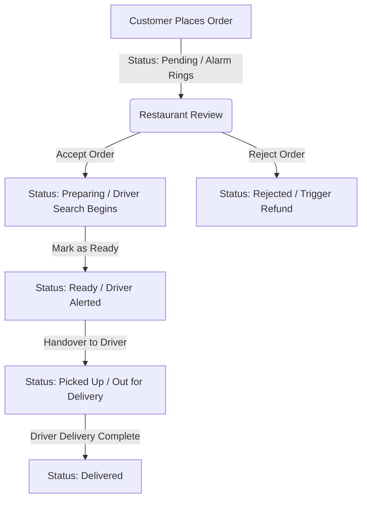

# Restaurant Order Management System — Restaurant Portal

## UI/UX Screen Specification & Wireframes

This document details the visual layouts, interactive components, screen fields, and user flows for the **Restaurant Portal (Web)** of the Restaurant Order Management System (ROMS).

---

## Table of Contents

1. [Global UI/UX Standards](#1-global-uiux-standards)
2. [Module 1 — Home & Analytics](#2-module-1--home--analytics)
3. [Module 2 — Food Item List](#3-module-2--food-item-list)
4. [Module 3 — Order Management](#4-module-3--order-management)
5. [Order Flow Logic & Real-Time States](#5-order-flow-logic--real-time-states)
6. [Status Management System](#6-status-management-system)

---

# 1. Global UI/UX Standards

### 1.1 Layout Structure

The Restaurant Portal is designed for tablet and desktop web interfaces, optimized for fast-paced kitchen environment readability.

```text
┌──────────────────────────────────────────────────────────────┐
│  TOPBAR: Branch Name & Status | Clock | Notifications | User │
├────────────┬─────────────────────────────────────────────────┤
│            │  BREADCRUMB: Dashboard > Current View           │
│  SIDEBAR   ├─────────────────────────────────────────────────┤
│            │                                                 │
│  • Home    │  MAIN CONTENT AREA                              │
│  • Menu    │                                                 │
│  • Orders  │  ┌─────────────────────────────────────────┐   │
│            │  │  Live Counts / Status Funnel Banner     │   │
│            │  ├─────────────────────────────────────────┤   │
│            │  │  Primary Workspace (Grid/Queue Cards)   │   │
│            │  │                                          │   │
│            │  └─────────────────────────────────────────┘   │
│            │                                                 │
└────────────┴─────────────────────────────────────────────────┘
```

### 1.2 Design Tokens

| Token | Hex Value | Usage |
|---|---|---|
| Primary | `#2563EB` | Active states, default CTA buttons |
| Success | `#16A34A` | Accept actions, Delivered status, active menu items |
| Warning | `#F59E0B` | Pending/Preparing states, warning alerts |
| Danger | `#DC2626` | Reject/Cancel actions, inactive menu items |
| Surface | `#FFFFFF` | Form cards, order detail modals, dropdown menus |
| Background| `#F8FAFC` | Main viewport layout background |

### 1.3 Modern Restaurant SaaS UX

- **Audio Alerts**: Critical incoming events (such as a new customer order) must trigger a repetitive chime to alert staff until acknowledged.
- **Zero-Refresh UI**: The order queue updates instantly via live WebSocket connections without requiring manual page reload.
- **High Contrast Typography**: Large, bold typefaces (Inter/Roboto) designed to be readable from 5–10 feet away in active kitchen environments.

---

# 2. Module 1 — Home & Analytics

## 2.1 Overview & Flow

The Branch Dashboard is the landing page. It provides the branch manager with an overview of today’s financial performance, live orders processing funnel, and sales distributions.

### User Flow
1. Staff logs in and lands on the **Dashboard**.
2. Staff reviews today's total sales, active order queue count, and cancelled orders counts.
3. Staff monitors the live state funnel to identify delays in preparation.
4. Chart displays showing peak ordering hours helps managers plan staffing shifts.

---

## 2.2 UI/UX Layout Description

- **Header Section**: Branch name identifier, live digital clock, notifications tray, and user profile avatar.
- **KPI Metrics Grid**: Three large visual metrics displaying Sales, Total Orders count, and Cancelled/Rejected counts.
- **Live Order Status Funnel**: A visual pipeline banner displaying quantity counts for `Pending`, `Preparing`, and `Ready` states.
- **Visual Charts Row**:
  - **Left Chart (60% width)**: Horizontal or vertical bar graph illustrating peak order hours.
  - **Right List (40% width)**: Ranked list of the branch's top selling food items with order counts.

---

## 2.3 Screen Preview

```text
┌─────────────────────────────────────────────────────────────┐
│  🍽 MG Road Branch       12:45 PM | 26 May     🔔(2)  👤 ▼  │
├────────────┬────────────────────────────────────────────────┤
│            │  Dashboard                                     │
│  ▶ Home    │────────────────────────────────────────────────│
│  ○ Menu    │ ┌────────────┐ ┌────────────┐ ┌────────────┐   │
│  ○ Orders  │ │ 💰 Sales   │ │ 📦 Orders  │ │ ❌ Cancelled │   │
│            │ │ ₹45,200    │ │ 124        │ │ 3            │   │
│            │ │ ▲ 12%      │ │ ▲ 5%       │ │ ▼ 2%         │   │
│            │ └────────────┘ └────────────┘ └────────────┘   │
│            │────────────────────────────────────────────────│
│            │  Live Order Summary                            │
│            │  [ Pending: 4 ] ➔ [ Preparing: 12 ] ➔ [ Ready: 2]│
│            │────────────────────────────────────────────────│
│            │ ┌──────────────────────┐ ┌───────────────────┐ │
│            │ │ Peak Hours (Today)   │ │ Top Selling Items │ │
│            │ │ 12PM ▇▇▇▇▇▇ 60       │ │ 1. Chicken Pizza  │ │
│            │ │  1PM ▇▇▇▇ 40         │ │ 2. Garlic Bread   │ │
│            │ │  2PM ▇▇ 20           │ │ 3. Coke 300ml     │ │
│            │ └──────────────────────┘ └───────────────────┘ │
└────────────┴────────────────────────────────────────────────┘
```

---

## 2.4 Screen Fields & Actions

### Metric Cards
- **Today's Sales**: Large read-only currency text.
- **Today's Orders**: Large read-only counter.
- **Cancelled Orders**: Large read-only counter.

### Live Order Summary Banner
- **Pending Counter**: Displays order quantity awaiting acceptance. Clicking routes to the Incoming Orders queue.
- **Preparing Counter**: Displays order quantity in the kitchen. Clicking routes to the Preparing queue.
- **Ready Counter**: Displays order quantity packed and awaiting dispatch. Clicking routes to the Ready queue.

---

# 3. Module 2 — Food Item List

## 3.1 Overview & Flow

This module allows managers and kitchen staff to manage menu item availability at the branch level in real time.

### User Flow
1. User navigates to the **Menu Availability** page.
2. User browses list or filters by category (e.g., Pizza, Sides).
3. If an ingredient runs out, the user toggles the switch next to the food item.
4. The item is instantly marked out of stock, preventing new orders on customer-facing apps.

---

## 3.2 UI/UX Layout Description

- **Filter Bar**: Search input box for item name, plus dropdowns for category types and stock status.
- **Data Table**: Columns showing item image, name, category, pricing, and the interactive stock toggle.
- **Status Indicator**: Green badge for "In Stock" and red badge for "Out of Stock".

---

## 3.3 Screen Preview

```text
┌─────────────────────────────────────────────────────────────┐
│  Menu Availability                                          │
├─────────────────────────────────────────────────────────────┤
│  🔍 Search Food Item... [Category: All ▼] [Status: All ▼]   │
├─────────────────────────────────────────────────────────────┤
│ Image │ Item Name       │ Category │ Price │ Availability   │
│-------│-----------------│----------│-------│----------------│
│ [Img] │ Chicken Pizza   │ Pizza    │ ₹350  │ [● Enabled]    │
│ [Img] │ Garlic Bread    │ Sides    │ ₹120  │ [○ Disabled]   │
│ [Img] │ Choco Lava Cake │ Desserts │ ₹99   │ [● Enabled]    │
├─────────────────────────────────────────────────────────────┤
│  Showing 1-15 of 80                        [<] [1] [2] [>]  │
└─────────────────────────────────────────────────────────────┘
```

---

## 3.4 Screen Fields & Actions

### Menu Items Table
- **Item Search**: Text search field.
- **Category Filter**: Dropdown menu.
- **Status Filter**: Dropdown menu (All | In Stock | Out of Stock).
- **Availability Toggle**: Red/Green toggle switch per food item to immediately edit availability.

---

# 4. Module 3 — Order Management

## 4.1 Overview & Flow

The operational command center. Staff monitors incoming requests, moves orders through preparation stages, and coordinates delivery hand-offs.

### User Flow
- **Acceptance**: New order received (alarm rings) → manager reviews details → clicks Accept. Order shifts to the Preparing tab, and the delivery driver dispatch search begins.
- **Kitchen Hand-off**: Food is finished preparing → kitchen staff clicks "Mark as Ready". The system notifies the assigned delivery agent.
- **Dispatch**: Agent arrives → staff verifies order matches → hands over order → order moves to Out for Delivery status.

---

## 4.2 UI/UX Layout Description

- **Tabbed Queue Views**: Top navigation tabs split orders by current stage: `Incoming`, `Preparing`, and `Ready`. Active count badges display on each tab label.
- **Incoming Orders Grid**: Visual layout displaying orders as cards. New order alerts feature pulsing indicators.
- **Order Card Detail Layout**: Cards contain Order ID, time elapsed timer, item quantities, and primary action buttons.
- **Order Detail Slide-out / Drawer**: A split layout displaying customer notes on the left, and a tracking timeline alongside delivery agent dispatch radar on the right.

---

## 4.3 Screen Previews

### 4.3.1 Active Orders Screen (Incoming Queue)
```text
┌─────────────────────────────────────────────────────────────┐
│  Orders         [Incoming (2)]  [Preparing (5)]  [Ready (1)]│
├─────────────────────────────────────────────────────────────┤
│  🔍 Search Order...                     Sort: [Oldest ▼]    │
├─────────────────────────────────────────────────────────────┤
│ ┌────────────────────────┐ ┌────────────────────────┐       │
│ │ 🚨 NEW                 │ │ 🚨 NEW                 │       │
│ │ #ORD-101               │ │ #ORD-102               │       │
│ │ 3 mins ago             │ │ 1 min ago              │       │
│ │ 2x Chicken Burger      │ │ 1x Veg Pizza           │       │
│ │ 1x Coke                │ │ 1x Garlic Bread        │       │
│ │ ₹450 | Card Paid       │ │ ₹320 | COD             │       │
│ │                        │ │                        │       │
│ │ [❌ Reject] [✅ Accept] │ │ [❌ Reject] [✅ Accept] │       │
│ └────────────────────────┘ └────────────────────────┘       │
└─────────────────────────────────────────────────────────────┘
```

### 4.3.2 Order Detail View (Split Layout)
```text
┌─────────────────────────────────────────────────────────────┐
│  < Back | Order #ORD-101               ● Preparing          │
├─────────────────────────────────────────────────────────────┤
│  Items (3)                     |  Order Lifecycle           │
│  2x Chicken Burger    ₹300     |  [✔] Accepted 12:05 PM     │
│  1x Coke              ₹150     |  [●] Preparing             │
│  Total: ₹450                   |  [ ] Ready for Pickup      │
│                                |                            │
│  Customer Details              |                            │
│  John Doe (9876543210)         |      [ Mark as Ready ]     │
│                                |                            │
│  Delivery Partner              |                            │
│  [🔍 Searching nearby agents...]                            │
└─────────────────────────────────────────────────────────────┘
```

---

## 4.4 Screen Fields & Actions

### Order Action Controls
- **Accept**: Changes status to Preparing. Triggers kitchen ticket.
- **Reject**: Triggers Reject Reason Modal popup.
- **Rejection Reason Dropdown**: Selection choices (Out of Stock | Kitchen Too Busy | Custom Note).
- **Mark as Ready**: Advances status to Ready.
- **Delivery Status Tracker**: Visual indicator displaying driver search state, driver name, phone, and distance updates.

---

# 5. Order Flow Logic & Real-Time States

The diagram below details the operational stages and triggers for the order lifecycle.



- **Real-Time Sound Loop**: Plays continuous audio ping on `Pending` status until either `Accept` or `Reject` is clicked.
- **WebSocket Push updates**: State changes instantly re-render order positions across the queue tables without interface lockouts.

---

# 6. Status Management System

The following color matrix and state rules dictate how statuses are styled and how they progress.

| State Status | visual Color | Next Allowed Screen Action | Allowed Target States |
|---|---|---|---|
| **Pending** | Orange/Yellow | Accept ✅ or Reject ❌ | `Preparing` or `Rejected` |
| **Preparing** | Blue | Click "Mark as Ready" | `Ready` |
| **Ready** | Green | Click "Handed Over" | `Picked Up` (Out for Delivery) |
| **Picked Up** | Purple | View Only (driver active) | `Delivered` |
| **Delivered** | Muted Gray | View Only (historical) | *None (Terminal state)* |
| **Rejected** | Red | View Only (refunded) | *None (Terminal state)* |
| **Cancelled** | Red | View Only (discarded) | *None (Terminal state)* |

***End of Document***
