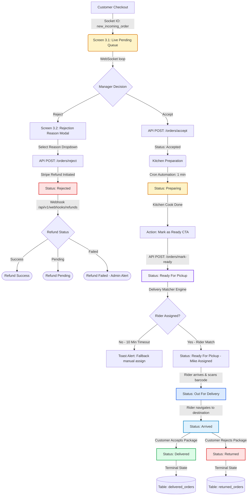

# DineOs — Restaurant Portal (Web)

## Product Requirement Document (PRD) + UI/UX Specification + Backend Handover Document

| Document Property | Value |
|---|---|
| **Product Name** | DineOs Restaurant Order Management System |
| **Portal / Client** | Restaurant Portal (Web Dashboard) |
| **Version** | 1.0.0 |
| **Status** | Approved for Execution |
| **Last Updated** | 2026-05-27 |
| **Audience** | Branch Managers, Frontend Web Engineers, Backend Engineers, UI/UX Designers, QA Engineers |

---

## Table of Contents
1. [Executive Summary & Global Portal Standards](#executive-summary--global-portal-standards)
2. [Module 1 — Home & Analytics](#module-1--home--analytics)
   - [Screen 1.1: Branch Dashboard (Home)](#screen-11-branch-dashboard-home)
3. [Module 2 — Menu Module](#module-2--menu-module)
   - [Screen 2.1: Menu Availability (List View)](#screen-21-menu-availability-list-view)
4. [Module 3 — Order Management Module](#module-3--order-management-module)
   - [Screen 3.1: Order Queue Screen (Live Pending Queue)](#screen-31-order-queue-screen-live-pending-queue)
   - [Screen 3.2: Rejection Reason Dialog (Reject Flow Modal)](#screen-32-rejection-reason-dialog-reject-flow-modal)
   - [Screen 3.3: Accepted Orders Queue Screen (Active Steppers)](#screen-33-accepted-orders-queue-screen-active-steppers)
   - [Screen 3.4: Order List Screen (Tabs: Accept, Reject, Delivered, Return)](#screen-34-order-list-screen-tabs-accept-reject-delivered-return)
5. [Module 4 — Order Review Module](#module-4--order-review-module)
   - [Screen 4.1: Reviews & Ratings Dashboard](#screen-41-reviews--ratings-dashboard)
6. [Module 5 — Profile Module](#module-5--profile-module)
   - [Screen 5.1: Branch Manager Profile Screen](#screen-51-branch-manager-profile-screen)
   - [Screen 5.2: Employee Details & Roster Screen](#screen-52-employee-details--roster-screen)

---

## Executive Summary & Global Portal Standards

### Project Goals
The **DineOs Restaurant Portal** is a web-based operational system designed specifically for branch management and kitchen operators. While the global Admin Portal defines pricing and catalogs, this portal executes localized shift controls, processes order workflows in real time, manages local inventory availability, and tracks customer feedback.

### Global Web UI/UX Standards
*   **Design Palette**:
    *   *Primary Accent*: `#2563EB` (Blue 600) — Main CTA, active sidebar items, visual headers.
    *   *Success Color*: `#16A34A` (Green 600) — Order approvals, final delivery, active menu items.
    *   *Warning Color*: `#F59E0B` (Amber 500) — Preparing states, driver search, pending refunds.
    *   *Danger Color*: `#DC2626` (Red 600) — Reject actions, cancellation alerts, stock-outs.
    *   *Backgrounds*: Slate 50 (`#F8FAFC`) canvas color, pure white (`#FFFFFF`) card components.
*   **Interaction Rules**:
    *   *Audible Pings*: Incoming pending orders trigger a looping alert sound until acted upon.
    *   *Optimistic States*: Availability toggles update instantly on screen, roll back on API error.
    *   *Kitchen Usability*: Typography is set to high contrast (minimum `16px` for text) to ensure legibility from wall-mounted screens in hot environments.

---

## Module 1 — Home & Analytics

### Screen 1.1: Branch Dashboard (Home)

#### 1. Overview
*   **Screen Purpose**: Serves as the operational control panel for the branch, presenting aggregated financial, volume, and service KPIs for daily shifts.
*   **Business Objective**: Enable branch managers to monitor live operational throughput, watch cancellation metrics, and capture top menu insights to prevent bottlenecks.
*   **User Workflow**: Log in ➔ View metrics ➔ Filter by date range ➔ Select day/week/month chart granularity.
*   **Main Functionality**: Global KPIs summary cards, live charts rendering, recent logs feed, top menu ranking.

#### 2. Screen Preview (Text Wireframe)
```text
┌────────────────────────────────────────────────────────────────────────┐
│ [🍽 DineOs]   Branch: MG Road Branch  | 12:45 PM           🔔 (3)  👤 ▼ │
├──────────────┬─────────────────────────────────────────────────────────┤
│ ▶ Dashboard  │  Branch Operations Analytics                            │
│ ○ Menu       │  📅 [ May 1 - May 27, 2026 ]      Period Granularity: [D|W|M]│
│ ○ Orders     │ ┌──────────────┐ ┌──────────────┐ ┌──────────────┐      │
│ ○ Reviews    │ │ 💰 Revenue   │ │ 📦 Orders    │ │ ❌ Rejections│      │
│ ○ Profile    │ │ ₹1,45,200    │ │ 342          │ │ 8 (2.3%)     │      │
│              │ └──────────────┘ └──────────────┘ └──────────────┘      │
│              │ ┌─────────────────────────────────────────────────────┐ │
│              │ │  Hourly Revenue & Order Volume Trends (Line Chart)  │ │
│              │ │  ₹ |       _/\_                                     │ │
│              │ │  0 |______/____\__________________________________  │ │
│              │ └─────────────────────────────────────────────────────┘ │
│              │ ┌──────────────────────────┐ ┌────────────────────────┐ │
│              │ │ Top Selling Items        │ │ Recent Orders          │ │
│              │ │ 1. Veg Pizza (124 units) │ │ #ORD-9801 - ₹420 (Del) │ │
│              │ │ 2. Garlic Bread (80 un)  │ │ #ORD-9800 - ₹120 (Rej) │ │
│              │ └──────────────────────────┘ └────────────────────────┘ │
└──────────────┴─────────────────────────────────────────────────────────┘
```

#### 3. UI/UX Layout Description
*   **Sidebar**: Left aligned, Blue 600 accent highlighting active "Dashboard" button. Collapsible for smaller screens.
*   **Header**: Location tracking dropdown indicator, real-time clock, WebSocket connection status pulse, and staff profile avatar with logout dropdown.
*   **Tables & Cards**: KPI blocks using shadow wrappers. Tables render item rankings and order summaries with clear borders.
*   **Filters**: Horizontal segment filters for date selectors and charts (Daily / Weekly / Monthly).
*   **Charts**: Interlocking line-chart representing revenue overlaying total orders count. Rendered via responsive canvas containers.
*   **Loading & Empty States**: Metric blocks display grey skeleton card sweep animations during fetch actions. Charts show "No data found for selected range" overlay if returns are empty.

#### 4. Screen Fields Table
| Field Name | Type | Required | Validation | Example | Notes |
|---|---|---|---|---|---|
| Date Filter Start | Date Selector | Yes | Must be <= today; Cannot exceed End Date | `2026-05-01` | Defaults to today |
| Date Filter End | Date Selector | Yes | Must be >= Start Date; Cannot exceed today | `2026-05-27` | Defaults to today |
| Chart Granularity | Radio Toggle | Yes | Value must be 'D' (Daily), 'W', or 'M' | `D` | Aggregates line chart ticks |

#### 5. Validations
*   **Date Threshold**: Range queries cannot exceed 90 calendar days on branch level to maintain UI caching speeds.
*   **Authentication Check**: Ensure the logged-in branch employee token contains the authorization parameter matching the selected `branch_id`.

#### 6. Dependencies
*   **Customer App checkout logs**: Drives revenue, order metrics, and sales values.
*   **WebSocket Engine**: Feeds dashboard cards to update metrics immediately on order completion.

#### 7. API Requirement Suggestions
*   **GET** `/api/v1/restaurant/analytics/kpis?branch_id=br_mg_road&start_date=2026-05-01&end_date=2026-05-27`
    *   *Response*: `{"status": "success", "data": {"revenue": 145200.00, "total_orders": 342, "rejected": 8, "returned": 2}}`
*   **GET** `/api/v1/restaurant/analytics/charts?branch_id=br_mg_road&granularity=D`
    *   *Response*: `{"status": "success", "chart_points": [{"label": "May 26", "revenue": 8200, "orders": 24}]}`

#### 8. Database Table Suggestions
No new analytics tables are created. Runs optimized aggregate queries over the orders database.

#### 9. Backend Development Notes
*   **Indexing Optimization**: Ensure database composite indexes are mapped on `customer_orders(branch_id, status, created_at)`.
*   **Data Aggregation caching**: Daily sales aggregates are written into a cron-managed cache table `daily_branch_metrics` to avoid parsing raw order rows repeatedly.

#### 10. Role & Permission Logic
*   **Branch Manager**: Allowed to view all operations metrics, exports, and financial history.
*   **Restaurant Staff**: Allowed only to view active counts (Orders, Active, Delivered) on the dashboard header, restricting access to revenue charts.

#### 11. UI Components Required
*   Date Picker, KPI Card, Reusable Chart Widget (Chart.js/Recharts integration), Sidebar Navigation, Table Row.

#### 12. Edge Cases
*   **Zero Sales Metrics**: Ensure divisions in calculations (e.g. return ratios) handle division-by-zero check variables to prevent frontend page crash.
*   **Network Loss**: Socket disconnect freezes metrics and changes header status indicator to a Red "Reconnecting" icon.

#### 13. Notifications & Toast Messages
*   *Warning Alert*: "Dashboard data disconnected. Retrying connection..."

#### 14. Real-Time Event Flow
*   On new order completion: `/analytics` namespace pushes event `daily_metric_refresh` containing latest numbers.

#### 15. Status Management System
*   *Not applicable to analytics screen directly.*

#### 16. Analytics Logic
$$\text{Rejection Rate \%} = \left( \frac{\text{Total Rejected Orders}}{\text{Total Orders Received}} \right) \times 100$$
$$\text{Return Rate \%} = \left( \frac{\text{Total Returned Orders}}{\text{Total Orders Received}} \right) \times 100$$

#### 17. Suggested Tech Notes
*   Use Next.js SSR for page landing framework. Implement swr/React Query caching libraries for REST endpoint metrics.

---

## Module 2 — Menu Module

### Screen 2.1: Menu Availability (List View)

#### 1. Overview
*   **Screen Purpose**: Provide immediate controls to toggle the availability state of menu items.
*   **Business Objective**: Prevent customer friction caused by ordering out-of-stock items, keeping branch menu maps synchronized with active kitchen inventory.
*   **User Workflow**: View list ➔ Search item ➔ Toggle availability switch.
*   **Main Functionality**: Paginated food catalog display, search/category filtering, dynamic switch toggle status.

#### 2. Screen Preview (Text Wireframe)
```text
┌────────────────────────────────────────────────────────────────────────┐
│ [🍽 DineOs]   Menu Availability Manager                                │
├──────────────┬─────────────────────────────────────────────────────────┤
│ ○ Dashboard  │  🔍 [ Search food item...   ]   Category: [ All Categories ▼ ]   Status: [ All Statuses ▼ ]│
│ ▶ Menu       │                                                         │
│ ○ Orders     │ ┌──────────┬─────────────────┬────────┬───────────┬──────────┐ │
│ ○ Reviews    │ │ Item ID  │ Food Name       │ Price  │ Status    │ Category │ │
│ ○ Profile    │ ├──────────┼─────────────────┼────────┼───────────┼──────────┤ │
│              │ │ food_101 │ Veg Pizza       │ ₹299   │ [o] On    │ Pizza    │ │
│              │ │ food_102 │ Garlic Bread    │ ₹120   │ [x] Off   │ Sides    │ │
│              │ └──────────┴─────────────────┴────────┴───────────┴──────────┘ │
│              │ Showing 1-10 of 84 items             [<] [1] [2] [3] [>]│
└──────────────┴─────────────────────────────────────────────────────────┘
```

#### 3. UI/UX Layout Description
*   **Main Grid**: Multi-column list with unique food ID, name, locked master prices, Green/Red availability status, and category labels.
*   **Search & Filters**: Persistent header bar containing search queries, a dropdown selection list to group items by category, and a dropdown selection list to filter by availability status (All, Available, Unavailable).
*   **Modals**: Confirmation modal displays if toggle is turned off: "Disable this item? This will instantly remove it from the Customer App."

#### 4. Screen Fields Table

##### Search & Filter Fields
| Field Name | Type | Required | Validation | Example | Notes |
|---|---|---|---|---|---|
| Search Query | Input Text | No | Max 100 characters, sanitizes inputs | `Pizza` | Filters list dynamically |
| Category Dropdown| Selector | No | Must exist in categories catalog | `Pizza` | Filter grouping |
| Status Dropdown | Selector | No | Must match 'All', 'Available', or 'Unavailable' | `Available` | Filters items by status |

##### Menu List Table
| Field Name | Type | Required | Validation | Example | Notes |
|---|---|---|---|---|---|
| Table Column: ID | Text | Read-only | Unique alphanumeric code | `food_101` | Unique food item identifier |
| Table Column: Name | Text | Read-only | Min 3 characters | `Veg Pizza` | Display name of the food item |
| Table Column: Price | Currency | Read-only | Positive decimal | `₹299` | Branch selling price |
| Table Column: Status | Toggle Switch | Yes | Boolean (true/false) | `true` | Changes availability state |
| Table Column: Category | Text | Read-only | Must exist in categories catalog | `Pizza` | Food item category label |

#### 5. Validations
*   **Optimistic UI Rollback**: If menu toggle status change API returns a network error, the toggle must slide back to its previous status and prompt warning toast.

#### 6. Dependencies
*   **Admin Portal Catalog**: Feeds the items master records, descriptions, and pricing structure.
*   **Customer App Menu View**: Synchronously pulls branch mapping data to refresh ordering menus.

#### 7. API Requirement Suggestions
*   **GET** `/api/v1/restaurant/menu?branch_id=br_mg_road&page=1&search=Veg&category=Pizza&status=Available`
    *   *Response*: `{"status": "success", "items": [{"id": "food_101", "name": "Veg Pizza", "category": "Pizza", "price": 299.00, "is_available": true}]}`
*   **POST** `/api/v1/restaurant/menu/toggle`
    *   *Payload*: `{"branch_id": "br_mg_road", "food_item_id": "food_101", "is_available": false}`
    *   *Response*: `{"status": "success", "updated_status": false}`

#### 8. Database Table Suggestions
```sql
CREATE TABLE branch_food_mapping (
    branch_id UUID REFERENCES branches(id) ON DELETE CASCADE,
    food_item_id UUID NOT NULL,
    is_available BOOLEAN DEFAULT TRUE,
    updated_at TIMESTAMP WITH TIME ZONE DEFAULT CURRENT_TIMESTAMP,
    PRIMARY KEY (branch_id, food_item_id)
);
```

#### 9. Backend Development Notes
*   **Cache Invalidation**: On availability update, trigger an invalidate command for the customer cache key `branch:br_mg_road:menu` to force immediate synchronization.

#### 10. Role & Permission Logic
*   **Branch Manager**: Allowed to toggle all food mappings.
*   **Restaurant Staff**: Allowed to toggle availability.

#### 11. UI Components Required
*   Toggle Switch, Table Row Card, Category Badge, Search Bar.

#### 12. Edge Cases
*   **Conflict Toggling**: Two operators toggle the same item simultaneously. Backend processes using optimistic locks, sending a sync update message to the slower client page.

#### 13. Notifications & Toast Messages
*   *Success Toast*: "Veg Pizza availability set to unavailable."
*   *Error Toast*: "Failed to synchronize menu changes. Check internet connection."

#### 14. Real-Time Event Flow
*   On toggle submit: Backend broadcasts socket event `menu_availability_changed` to `/customers` channels.

#### 15. Status Management System
| Status | Color | Description | Next Allowed Status |
|---|---|---|---|
| `Available` | Green | Active ordering item | `Unavailable` |
| `Unavailable`| Red | Hidden from checkout catalog | `Available` |

#### 16. Analytics Logic
*   Logs cumulative unavailable duration to determine high-cancellation or inventory deficit menu items.

#### 17. Suggested Tech Notes
*   Store mapping database records in Redis hash fields for sub-millisecond retrieval on customer app queries.

---

## Module 3 — Order Management Module

### Screen 3.1: Order Queue Screen (Live Pending Queue)

#### 1. Overview
*   **Screen Purpose**: Displays incoming real-time pending customer orders requiring immediate review.
*   **Business Objective**: Minimize operational processing latency (Target: Action within 2 minutes of checkout) to accelerate food delivery cycles.
*   **User Workflow**: New order sound pings ➔ View details ➔ Click "Accept" or "Reject".
*   **Main Functionality**: Live ticket feed, order countdown timer, primary action CTAs.

#### 2. Screen Preview (Text Wireframe)
```text
┌────────────────────────────────────────────────────────────────────────┐
│ [🍽 DineOs]   Live Pending Orders Queue                      📢 [ONLINE]│
├──────────────┬─────────────────────────────────────────────────────────┤
│ ○ Dashboard  │  Orders Waiting Action: (2 Pending)                      │
│ ○ Menu       │                                                         │
│ ▶ Orders     │ ┌──────────────────────────┐ ┌────────────────────────┐ │
│   - Queue    │ │ 🚨 #ORD-99018            │ │ 🚨 #ORD-99019            │ │
│   - List     │ │ Time Received: 12:44 PM  │ │ Time Received: 12:45 PM  │ │
│ ○ Reviews    │ │ Timer Remaining: 01:45   │ │ Timer Remaining: 02:00   │ │
│ ○ Profile    │ │ 1x Veg Margherita Pizza  │ │ 2x Spicy Chicken Burgers │ │
│              │ │ Subtotal: ₹284.76        │ │ Subtotal: ₹360.00        │ │
│              │ │ Tax: ₹14.24              │ │ Tax: ₹18.00              │ │
│              │ │ Total Bill: ₹299 | Prep. │ │ Total Bill: ₹378 | COD   │ │
│              │ ├──────────────────────────┤ ├────────────────────────┤ │
│              │ │ [❌ Reject]  [✅ Accept] │ │ [❌ Reject]  [✅ Accept] │ │
│              │ └──────────────────────────┘ └────────────────────────┘ │
└──────────────┴─────────────────────────────────────────────────────────┘
```

#### 3. UI/UX Layout Description
*   **Order Cards Grid**: Distinct card outlines for each order. Border changes to flashing Amber/Red when remaining response timer drops below 60 seconds.
*   **Action Row**: Prominent Red button `[Reject]` and Green button `[Accept]` at card footer.
*   **Alert Banner**: Full page overlay screen if browser volume permissions are disabled, prompting the operator: "Click here to enable sound notifications."

#### 4. Screen Fields Table
| Field Name | Type | Required | Validation | Example | Notes |
|---|---|---|---|---|---|
| Order Ticket: ID | Text (Read-only) | Yes | Unique order identifier format (`#ORD-XXXXX`) | `#ORD-99018` | Database key used to uniquely map the transaction. |
| Order Ticket: Time Received | DateTime (Read-only) | Yes | Valid timestamp | `12:44 PM` | Timestamp when order checkout was completed. |
| Order Ticket: Timer Remaining | Number (Countdown) | Yes | Computed dynamically: `(created_at + 5 mins) - current_time` | `01:45` | Time remaining in MM:SS before order triggers auto-rejection. |
| Order Ticket: Items List | Array of Objects | Yes | Must contain at least 1 food item | `1x Veg Margherita Pizza` | List of items, quantities, and user modifier choices. |
| Order Ticket: Subtotal | Currency (Read-only) | Yes | Positive decimal | `₹284.76` | Total price of all food items before tax. |
| Order Ticket: Tax Amount | Currency (Read-only) | Yes | Positive decimal | `₹14.24` | Computed tax amount applied to the order. |
| Order Ticket: Total Bill | Currency (Read-only) | Yes | Positive decimal | `₹299.00` | Final payable amount (Subtotal + Tax Amount). |
| Order Ticket: Payment Method | Badge (Read-only) | Yes | Value must be 'COD' or 'Online' | `Prepaid` (Online) | Specifies payment channel. |
| Action: Accept | Button | Yes | Requires active auth token | `[Accept]` | Sends POST to `/accept` endpoint immediately without prompting for cooking or preparation time; transitions status to `Accepted`. |
| Action: Reject | Button | Yes | Requires active auth token | `[Reject]` | Opens the Rejection Reason dialog modal to log cancellation. |

#### 5. Validations
*   **Shift Operation Lock**: Rejects/Accepts cannot be submitted if branch manager has marked the overall branch state as offline.
*   **Direct Order Acceptance**: Accepting an order must not prompt the operator for any cooking time or preparation time. The action executes immediately upon button click.

#### 6. Dependencies
*   **Customer Checkouts**: Generates the incoming order queues.
*   **Payment Gateway Status**: Verifies payment success flags before showing online pre-paid orders in queue.

#### 7. API Requirement Suggestions
*   **POST** `/api/v1/restaurant/orders/accept`
    *   *Payload*: `{"branch_id": "br_mg_road", "order_id": "ord_99018"}`
    *   *Response*: `{"status": "success", "new_status": "Accepted"}`
*   **POST** `/api/v1/restaurant/orders/reject`
    *   *Payload*: `{"branch_id": "br_mg_road", "order_id": "ord_99018", "reason_code": "out_of_stock", "notes": "No basil leaves left"}`
    *   *Response*: `{"status": "success", "new_status": "Rejected"}`

#### 8. Database Table Suggestions
```sql
CREATE TABLE branch_orders (
    id UUID PRIMARY KEY DEFAULT gen_random_uuid(),
    branch_id UUID REFERENCES branches(id),
    customer_id UUID NOT NULL,
    status VARCHAR(50) DEFAULT 'Pending',
    payment_method VARCHAR(20) CHECK (payment_method IN ('COD', 'Online')),
    payment_status VARCHAR(20) DEFAULT 'Pending',
    subtotal_amount DECIMAL(10,2) NOT NULL,
    tax_amount DECIMAL(10,2) NOT NULL DEFAULT 0.00,
    total_amount DECIMAL(10,2) NOT NULL,
    created_at TIMESTAMP WITH TIME ZONE DEFAULT CURRENT_TIMESTAMP,
    updated_at TIMESTAMP WITH TIME ZONE DEFAULT CURRENT_TIMESTAMP
);
```

#### 9. Backend Development Notes
*   **Auto-Accept Timer**: Runs a backend queue scheduler that triggers automated cancellation alerts if order remains un-handled in `Pending` state for > 5 minutes.

#### 10. Role & Permission Logic
*   **Branch Manager**: Allowed to accept and reject orders.
*   **Restaurant Staff**: Allowed only to view order lists, accept blocked by token authorization checker.

#### 11. UI Components Required
*   Order Ticket Card, Accept Button, Timer Display Badge.

#### 12. Edge Cases
*   **Network Droppage**: Operator loses connection, customer cancels order during dropout. WebSocket reconciles on recovery, removes deleted ticket from screen.

#### 13. Notifications & Toast Messages
*   *Success Push Alert*: "Order #ORD-99018 accepted successfully."
*   *Toast Warning*: "Warning: incoming order ticket is expiring in 30 seconds."

#### 14. Real-Time Event Flow
*   Incoming order emits event `new_incoming_order` to rooms matching `branch_br_mg_road`.

#### 15. Status Management System
| Status | Color | Description | Next Allowed Status |
|---|---|---|---|
| `Pending` | Yellow | New incoming ticket | `Accepted` or `Rejected` |

#### 16. Analytics Logic
*   Calculates average branch response times (Time Received to Time Accepted).

#### 17. Suggested Tech Notes
*   Use Socket.io namespaces configured with Redis adapter mapping to deliver message frames horizontally across auto-scaled node clusters.

---

### Screen 3.2: Rejection Reason Dialog (Reject Flow Modal)

#### 1. Overview
*   **Screen Purpose**: Captures explanations and logs details of order rejections.
*   **Business Objective**: Compile precise cancellation data to improve inventory operations and trigger automatic payment reversals.
*   **User Workflow**: Click "Reject" ➔ Select reason option ➔ Input detailed comment ➔ Confirm submit.
*   **Main Functionality**: Option selectors, note text area, dynamic payment refund flag display.

#### 2. Screen Preview (Text Wireframe)
```text
┌────────────────────────────────────────────────────────────────────────┐
│  Reject Order #ORD-99018                                           [X] │
├────────────────────────────────────────────────────────────────────────┤
│  Select Rejection Reason:                                              │
│  [ Out of Stock (select unavailable items next)                      ▼ ] │
│                                                                        │
│  Additional Notes (Mandatory for 'Other'):                             │
│  [ Kitchen has run out of mozzarella cheese block.                   ] │
│                                                                        │
│  ⚠️ Prepaid Order: Confirming rejection triggers an instant refund to   │
│  the customer payment method via Stripe (estimated 3-5 working days).  │
├────────────────────────────────────────────────────────────────────────┤
│                                          [ Cancel ]  [ CONFIRM REJECT ]│
└────────────────────────────────────────────────────────────────────────┘
```

#### 3. UI/UX Layout Description
*   **Overlay Structure**: Blur backdrop backdrop blocking main queue panel actions.
*   **Form**: Dropdown selector for cancellation reasons. Input text container has a character limit counter (0/250).
*   **Refund Pill Alert**: Dynamic text badge shown only for pre-paid order types. Displays: "Prepaid Order: Automated Refund Initiated."

#### 4. Screen Fields Table
| Field Name | Type | Required | Validation | Example | Notes |
|---|---|---|---|---|---|
| Reason Code | Dropdown | Yes | Must match one of system enum cancellation keys | `out_of_stock` | Saved to logs database |
| Reject Notes | Text Area | Yes* | Mandatory if reason is 'other'. Max 250 characters | `Out of cheese` | Strips invalid script tags |

#### 5. Validations
*   **Note Requirement**: If 'Other' option selected, the confirmation submit button remains inactive until at least 10 letters are entered in additional notes block.

#### 6. Dependencies
*   **Payment Gateway API Integration**: Rejection submissions automatically dispatch refund payloads to the gateway provider.

#### 7. API Requirement Suggestions
*   **POST** `/api/v1/restaurant/orders/refund-initiate`
    *   *Payload*: `{"order_id": "ord_99018", "refund_amount": 299.00}`
    *   *Response*: `{"status": "initiated", "refund_id": "rf_010291", "gateway_code": "stripe_200"}`

#### 8. Database Table Suggestions
```sql
CREATE TABLE rejected_orders (
    id UUID PRIMARY KEY DEFAULT gen_random_uuid(),
    order_id UUID UNIQUE REFERENCES branch_orders(id) ON DELETE CASCADE,
    reason_code VARCHAR(50) NOT NULL,
    notes TEXT,
    refund_status VARCHAR(50) DEFAULT 'Not Required', -- 'Pending', 'Success', 'Failed'
    refund_txn_id VARCHAR(100),
    rejected_at TIMESTAMP WITH TIME ZONE DEFAULT CURRENT_TIMESTAMP
);
```

#### 9. Backend Development Notes
*   **Database Transaction Locking**: Wrap database execution of order status updates and rejection insertions in single Transaction logic blocks to prevent orphaned status states.

#### 10. Role & Permission Logic
*   Restricted to **Branch Manager** authorization tokens. Restaurant Staff see disabled action trigger.

#### 11. UI Components Required
*   Modal Overlay Wrapper, Radio Input Field, Form Text Field.

#### 12. Edge Cases
*   **Refund API Failure**: Payment gateway times out during refund request processing. Backend marks order status as `Rejected` but flags refund tracking database entry as `Failed`, triggering alert flag on the admin dashboard queue.

#### 13. Notifications & Toast Messages
*   *Success Alert*: "Order rejected. Refund task created."
*   *Error Warning*: "Refund processing failed. Administrator notified."

#### 14. Real-Time Event Flow
*   On rejection confirmation, push event `order_cancelled` containing order ID and refund status to Customer Mobile App client namespaces.

#### 15. Status Management System
| Status | Color | Description | Next Allowed Status |
|---|---|---|---|
| `Rejected` | Red | Ticket cancelled, terminal | None |

#### 16. Analytics Logic
*   Rejection metrics are aggregated daily to track branch performance indexes and identify catalog items experiencing frequent stock-outs.

#### 17. Suggested Tech Notes
*   Implement event-driven worker tasks using BullMQ/Celery to retry failed gateway refunds in secondary background loops.

---

### Screen 3.3: Accepted Orders Queue Screen (Active Steppers)

#### 1. Overview
*   **Screen Purpose**: Displays order workflows through kitchen preparation, packaging, courier matching, and handover.
*   **Business Objective**: Optimize order lifecycle pacing. Highlight delays and manage courier handovers efficiently.
*   **User Workflow**: Accept order ➔ Kitchen starts cooking (Auto-Preparing) ➔ Mark order as "Ready for Pickup" ➔ Courier picks up order.
*   **Main Functionality**: Queue columns (Accepted, Preparing, Ready), Courier details card, "Mark Ready" trigger button.

#### 2. Screen Preview (Text Wireframe)
```text
┌────────────────────────────────────────────────────────────────────────┐
│ [🍽 DineOs]   Active Orders Workspace                                  │
├──────────────┬─────────────────────────────────────────────────────────┤
│ ○ Dashboard  │  [ Accepted Queue (1) ]  [ Preparing (2) ]  [ Ready (1) ]│
│ ○ Menu       ├─────────────────────────────────────────────────────────┤
│ ▶ Orders     │ ┌────────────────────────┐ ┌──────────────────────────┐ │
│   - Queue    │ │ #ORD-99018 (Preparing) │ │ #ORD-99017 (Ready)       │ │
│   - List     │ │ Time Elapsed: 04:20    │ │ Courier: Assigned        │ │
│ ○ Reviews    │ │ 1x Veg Pizza           │ │ Name: Mike (+91 999888)  │ │
│ ○ Profile    │ │ [ Mark as Ready ]      │ │ [ Waiting Courier... ]   │ │
│              │ └────────────────────────┘ └──────────────────────────┘ │
└──────────────┴─────────────────────────────────────────────────────────┘
```

#### 3. UI/UX Layout Description
*   **Columns Grid**: Three visual columns mapping order stages:
    *   *Accepted*: Immediate approvals waiting execution.
    *   *Preparing*: Active cooking, displaying elapsed time badge counts.
    *   *Ready*: Awaiting package handover to courier partners.
*   **Action CTAs**: Rose color borderless button changing state on preparer actions ("Mark as Ready").
*   **Courier Details Card**: Integrated detail drawer rendering delivery agent details (avatar picture, name, registration plate, phone, live tracking connection link).

#### 4. Screen Fields Table
| Field Name | Type | Required | Validation | Example | Notes |
|---|---|---|---|---|---|
| Tab / Column Selector | Segmented Control | Yes | Must be 'Accepted', 'Preparing', or 'Ready' | `Preparing` | Filters active tickets by status stage. |
| Order Card: ID | Text (Read-only) | Yes | Unique identifier format (`#ORD-XXXXX`) | `#ORD-99018` | Displays order serial reference key. |
| Order Card: Time Elapsed | Duration (Timer) | Yes | Computed dynamically: `current_time - accepted_at` | `04:20` | Tracks cooking duration elapsed in MM:SS. |
| Order Card: Items Summary | Array (Read-only) | Yes | Standard listing of food items | `1x Veg Pizza` | Brief catalog of dishes for fast kitchen readability. |
| Order Card: Status | Badge (Read-only) | Yes | Must be 'Accepted', 'Preparing', or 'Ready' | `Preparing` | Displays the current stage status of the order. |
| Order Card: Courier Match | Badge (Read-only) | Yes | 'Unassigned', 'Assigned', or 'Arrived' | `Assigned` | Live status tracking of matched dispatch riders. |
| Courier Card: Name | Text (Read-only) | Yes* | Alphabetical characters, only when matched | `Mike` | Assigned courier dispatch partner name. |
| Courier Card: Phone | Phone (Read-only) | Yes* | E.164 standard phone format | `+91 9998887776` | Courier phone details for quick customer contact. |
| Action: Mark as Ready | Button | Yes | Requires active authorization token | `[Mark as Ready]` | Sends POST to `/mark-ready` endpoint; transitions state to `Ready For Pickup`. |

#### 5. Validations
*   **Pre-Pickup Lock**: Manual status cannot be pushed past `Ready` status by restaurant. The handover status transition to `Out For Delivery` is controlled by the Delivery Partner app coordinates scan action.

#### 6. Dependencies
*   **Delivery Partner matching algorithm**: Feeds rider assignments, profile values, and connection markers to screen.

#### 7. API Requirement Suggestions
*   **POST** `/api/v1/restaurant/orders/mark-ready`
    *   *Payload*: `{"branch_id": "br_mg_road", "order_id": "ord_99018"}`
    *   *Response*: `{"status": "success", "new_status": "Ready For Pickup"}`

#### 8. Database Table Suggestions
Re-uses columns from the main `branch_orders` mapping schema. Status updates and transitions are recorded in the status audit log table:
```sql
CREATE TABLE order_status_history (
    id UUID PRIMARY KEY DEFAULT gen_random_uuid(),
    order_id UUID REFERENCES branch_orders(id) ON DELETE CASCADE,
    previous_status VARCHAR(50),
    new_status VARCHAR(50) NOT NULL,
    changed_by_id UUID, -- References employee details who triggered transition
    changed_at TIMESTAMP WITH TIME ZONE DEFAULT CURRENT_TIMESTAMP
);
```

#### 9. Backend Development Notes
*   **Cron-based Automations**: 1 minute after status moves to `Accepted`, background cron task automatically updates status to `Preparing` and schedules delivery request broadcast events.

#### 10. Role & Permission Logic
*   Both **Branch Managers** and **Restaurant Staff** possess permissions to transition orders along the preparation pipeline and mark packages ready.

#### 11. UI Components Required
*   Pipeline Columns Wrapper, Stepper Progress Indicator, Delivery Agent Summary Card.

#### 12. Edge Cases
*   **Delivery Partner Search Timeout**: No rider accepts order within 10 minutes. Status remains `Ready for Pickup`, triggers toast alert, and unlocks fallback manually-assign button options.

#### 13. Notifications & Toast Messages
*   *Push Notification*: "Delivery Partner Mike assigned to order #ORD-99018."
*   *Success Alert*: "Order #ORD-99018 marked ready for collection."

#### 14. Real-Time Event Flow
*   Backend publishes event `delivery_assigned` upon driver matching. The UI instantly updates status to include courier profile.

#### 15. Status Management System
| Status | Color | Description | Next Allowed Status |
|---|---|---|---|
| `Accepted` | Light Blue | Initialized order state | `Preparing` |
| `Preparing` | Amber | Active kitchen processing | `Ready For Pickup` |
| `Ready For Pickup`| Purple | Awaiting courier handover | `Out For Delivery` |
| `Out For Delivery`| Dark Blue | Rider carrying package to customer | `Arrived` |
| `Arrived` | Teal | Rider has arrived at delivery destination | `Delivered` or `Returned` |
| `Delivered` | Green | Order completed successfully | None |
| `Returned` | Orange-Red | Order returned by customer | None |

#### 16. Analytics Logic
*   Kitchen performance analytics calculate differences between `Accepted` and `Ready For Pickup` milestones.

#### 17. Suggested Tech Notes
*   Socket payloads are structured in light JSON structures, passing only IDs and statuses to reduce memory consumption on high concurrent web pages.

---

### Screen 3.4: Order List Screen (Tabs: Accept, Reject, Delivered, Return)

#### 1. Overview
*   **Screen Purpose**: A single repository page for all orders (active and historical) processed at the branch level, categorized by tab selection.
*   **Business Objective**: Enable operators to audit financials, verify cash transactions, track stripe/razorpay refunds, and review customer return reasons in a consolidated workspace.
*   **User Workflow**: Select `- List` from sidebar ➔ Click target Tab (Accept / Reject / Delivered / Return) ➔ Use filters/search ➔ Select row to inspect details via drawer.
*   **Main Functionality**: Tabbed queue selector, CSV report exporter, alphanumeric search bar, payment mode dropdown filter, detailed order drawer widget.

#### 2. Screen Layout
The screen is composed of two visual zones stacked vertically:

*   **Zone 1 — Persistent Screen Shell & Tab Navigation (Always Visible)**: A sidebar for navigation, and a persistent top filtering and search panel containing search inputs and a payment mode selector. This header remains fixed as the user transitions between tabs.
*   **Zone 2 — Internal Tabbed Content Panel**: A tab bar immediately below the persistent search panel with four tabs:
    *   *Accept*: Lists active orders currently in Accepted, Preparing, Ready For Pickup, Out For Delivery, or Arrived status.
    *   *Reject*: Lists cancelled orders with refund details.
    *   *Delivered*: Lists successfully completed deliveries.
    *   *Return*: Lists orders rejected/returned by the customer.

Each tab renders its own dedicated data table grid layout.

#### 3. Screen Preview (Full Composite View — Accept Tab Active)
```text
┌────────────────────────────────────────────────────────────────────────┐
│ [🍽 DineOs]   Order List Ledger                                        │
├──────────────┬─────────────────────────────────────────────────────────┤
│ ○ Dashboard  │  [ Accept (5) ]  [ Reject (2) ]  [ Delivered ]  [ Return ]│
│ ○ Menu       ├─────────────────────────────────────────────────────────┤
│ ▶ Orders     │  🔍 [ Search Order ID...   ]   Filter: [ Payment Mode ▼ ] │
│   - Queue    ├──────────┬──────────────┬──────────────┬────────────────┬────────┐
│   - List     │ Order ID │ Timestamp    │ Total Value  │ Status/Payment │ Action │
│ ○ Reviews    ├──────────┼──────────────┼──────────────┼────────────────┼────────┤
│ ○ Profile    │ #99018   │ 12:46 PM     │ ₹299.00      │ Preparing (Onl)│ [View] │
│              │ #99016   │ 12:30 PM     │ ₹420.00      │ Accepted (COD) │ [View] │
│              │ └────────┴──────────────┴──────────────┴────────────────┴────────┘ │
│              │ Showing 1-20 of 5 entries             [<] [1] [>]       │
└──────────────┴─────────────────────────────────────────────────────────┘
```

---

### SECTION A: Persistent Screen Shell & Tab Navigation (Persistent — Always Visible)

This zone remains fixed regardless of which tab is active. It contains the search input, payment mode filter, and CSV export action.

#### 1. Persistent Screen Shell Fields Table
| Field Name | Type | Required | Validation | Example | Notes |
|---|---|---|---|---|---|
| Search Box | Input Text | No | Alphanumeric validation limits | `99018` | Filters the selected tab rows by matching Order ID |
| Payment Mode Filter | Selector | No | Must match 'COD', 'Online', or 'All' | `Online` | Filters records by payment method |
| Export Button | Button | No | Requires active list scope | `[CSV]` | Exports the currently filtered order records to a CSV file |

---

### SECTION B: Internal Tab Bar Controller

The tab bar sits below the persistent header card. The active tab displays an underline highlight (primary color `#2563EB`) beneath its label, with dynamic badge counts indicating matching order volume.

#### 1. Tab Bar Behavior
| Property | Specification |
|---|---|
| Default Active Tab | `Accept` |
| Active Tab Indicator | Bottom border underline, `2px solid #2563EB` |
| Inactive Tab Style | Neutral gray text, no underline |
| Badge Counts | Dynamic count shown in parentheses next to active tabs with pending items |
| URL State Persistence | Tab state must be persisted in the URL query parameter (e.g., `?tab=reject`) |

---

### SECTION C: Tab Content Viewports

Swaps the data table grid based on the active tab selection. Clicking the `[View]` button in the Action column (or clicking the order ID link) in any tab opens a slide-out detailed drawer from the right.

---

#### Tab 1: Accept
Displays active orders currently in progress.

##### 1. Accept Tab Preview
```text
┌──────────┬──────────────┬──────────────┬────────────────┬────────┐
│ Order ID │ Timestamp    │ Total Value  │ Status/Payment │ Action │
├──────────┼──────────────┼──────────────┼────────────────┼────────┤
│ #99018   │ 12:46 PM     │ ₹299.00      │ Preparing (Onl)│ [View] │
│ #99016   │ 12:30 PM     │ ₹420.00      │ Accepted (COD) │ [View] │
└──────────┴──────────────┴──────────────┴────────────────┴────────┘
```

##### 2. Accept Tab Fields Table
| Field Name | Type | Required | Validation | Example | Notes |
|---|---|---|---|---|---|
| Table Column: Order ID | Text Link | Yes | Unique reference format | `#99018` | Clickable link opens details drawer |
| Table Column: Timestamp | DateTime (Read-only) | Yes | Valid timestamp | `12:46 PM` | Order creation timestamp |
| Table Column: Total Value | Currency (Read-only) | Yes | Positive decimal | `₹299.00` | Inclusive of tax |
| Table Column: Status/Payment | Badge (Read-only) | Yes | Active status + method | `Preparing (Online)` | Valid states: Accepted, Preparing, Ready For Pickup, Out For Delivery, Arrived |
| Row Action: View | Button / Link | Yes | Triggers detailed view | `[View]` | Button opens detailed slide-out drawer from the right |

---

#### Tab 2: Reject
Displays cancelled orders with refund statuses.

##### 1. Reject Tab Preview
```text
┌──────────┬──────────────┬──────────────┬─────────────────┬───────────────┬────────┐
│ Order ID │ Timestamp    │ Total Value  │ Rejection Code  │ Refund Status │ Action │
├──────────┼──────────────┼──────────────┼─────────────────┼───────────────┼────────┤
│ #99015   │ 11:20 AM     │ ₹180.00      │ out_of_stock    │ Refunded      │ [View] │
│ #99011   │ 10:15 AM     │ ₹320.00      │ customer_cancel │ Refund Pending│ [View] │
└──────────┴──────────────┴──────────────┴─────────────────┴───────────────┴────────┘
```

##### 2. Reject Tab Fields Table
| Field Name | Type | Required | Validation | Example | Notes |
|---|---|---|---|---|---|
| Table Column: Order ID | Text Link | Yes | Unique reference format | `#99015` | Clickable link opens details drawer |
| Table Column: Timestamp | DateTime (Read-only) | Yes | Valid timestamp | `11:20 AM` | Order checkout timestamp |
| Table Column: Total Value | Currency (Read-only) | Yes | Positive decimal | `₹180.00` | Order total |
| Table Column: Rejection Code | Badge (Read-only) | Yes | Valid system reason enum | `out_of_stock` | Reason code selected in Screen 3.2 |
| Table Column: Refund Status | Badge (Read-only) | Yes | Refund status indicator | `Refunded` | States: Not Required (for COD), Refund Pending, Refunded, Refund Failed |
| Row Action: View | Button / Link | Yes | Triggers detailed view | `[View]` | Button opens detailed slide-out drawer from the right |

---

#### Tab 3: Delivered
Displays completed historical orders.

##### 1. Delivered Tab Preview
```text
┌──────────┬──────────────┬──────────────┬─────────────────┬──────────────┬────────┐
│ Order ID │ Timestamp    │ Total Value  │ Delivered Time  │ Status       │ Action │
├──────────┼──────────────┼──────────────┼─────────────────┼──────────────┼────────┤
│ #99014   │ 11:05 AM     │ ₹450.00      │ 11:35 AM        │ Delivered    │ [View] │
│ #99012   │ 10:00 AM     │ ₹220.00      │ 10:30 AM        │ Delivered    │ [View] │
└──────────┴──────────────┴──────────────┴─────────────────┴──────────────┴────────┘
```

##### 2. Delivered Tab Fields Table
| Field Name | Type | Required | Validation | Example | Notes |
|---|---|---|---|---|---|
| Table Column: Order ID | Text Link | Yes | Unique reference format | `#99014` | Clickable link opens details drawer |
| Table Column: Timestamp | DateTime (Read-only) | Yes | Valid timestamp | `11:05 AM` | Checkout timestamp |
| Table Column: Total Value | Currency (Read-only) | Yes | Positive decimal | `₹450.00` | Order total |
| Table Column: Delivered Time | DateTime (Read-only) | Yes | Valid timestamp | `11:35 AM` | Time when delivered to customer |
| Table Column: Status | Badge (Read-only) | Yes | Value must be 'Delivered' | `Delivered` | Order completion status |
| Row Action: View | Button / Link | Yes | Triggers detailed view | `[View]` | Button opens detailed slide-out drawer from the right |

---

#### Tab 4: Return
Displays customer returned/rejected orders.

##### 1. Return Tab Preview
```text
┌──────────┬──────────────┬──────────────┬─────────────────┬───────────────┬────────┐
│ Order ID │ Timestamp    │ Total Value  │ Return Reason   │ Refund Status │ Action │
├──────────┼──────────────┼──────────────┼─────────────────┼───────────────┼────────┤
│ #99013   │ 10:45 AM     │ ₹299.00      │ damaged_items   │ Refunded      │ [View] │
└──────────┴──────────────┴──────────────┴─────────────────┴───────────────┴────────┘
```

##### 2. Return Tab Fields Table
| Field Name | Type | Required | Validation | Example | Notes |
|---|---|---|---|---|---|
| Table Column: Order ID | Text Link | Yes | Unique reference format | `#99013` | Clickable link opens details drawer |
| Table Column: Timestamp | DateTime (Read-only) | Yes | Valid timestamp | `10:45 AM` | Checkout timestamp |
| Table Column: Total Value | Currency (Read-only) | Yes | Positive decimal | `₹299.00` | Order total |
| Table Column: Return Reason | Text (Read-only) | Yes | Reason given by customer | `damaged_items` | Customer return code |
| Table Column: Refund Status | Badge (Read-only) | Yes | Refund status indicator | `Refunded` | States: Pending, Refunded, Refund Failed |
| Row Action: View | Button / Link | Yes | Triggers detailed view | `[View]` | Button opens detailed slide-out drawer from the right |

---

#### Detailed Order Slide-out Drawer (Activated on Row Click or View Action)
Row selection or click on the `[View]` button on any tab triggers a slide-out drawer containing detailed order information.

##### 1. Slide-out Drawer Fields Table
| Field Name | Type | Required | Validation | Example | Notes |
|---|---|---|---|---|---|
| Drawer Title | Text (Read-only) | Yes | Format: `Order #{ID} Details` | `Order #99018 Details` | Header title of the drawer |
| Order Status | Badge (Read-only) | Yes | Color-coded status badge | `Preparing` | Displays current active stage state |
| Customer Name | Text (Read-only) | Yes | Min 2 characters | `Amit Kumar` | Customer display name |
| Customer Phone | Phone (Read-only) | Yes | Valid E.164 phone standard | `+91 9876543210` | Customer contact mobile number |
| Customer Address | Text (Read-only) | Yes* | Min 10 characters | `123, Main Street, Bangalore` | Pinned delivery location (hidden for Takeaway/Dine-in orders) |
| Item Table: Name | Text (Read-only) | Yes | Min 3 characters | `Veg Pizza` | Name of ordered item |
| Item Table: Price | Currency (Read-only) | Yes | Positive decimal | `₹299.00` | Unit selling price of item |
| Item Table: Qty | Number (Read-only) | Yes | Integer >= 1 | `1` | Ordered quantity |
| Item Table: Subtotal | Currency (Read-only) | Yes | Positive decimal | `₹299.00` | Subtotal amount for the item line |
| Subtotal | Currency (Read-only) | Yes | Positive decimal | `₹284.76` | Total price before tax and delivery fees |
| Tax Amount | Currency (Read-only) | Yes | Positive decimal | `₹14.24` | Computed SGST/CGST tax |
| Total Bill | Currency (Read-only) | Yes | Positive decimal | `₹299.00` | Grand total payable (Subtotal + Tax) |
| Payment Method | Badge (Read-only) | Yes | COD or Prepaid | `Prepaid` | Mode of payment |
| Payment Status | Badge (Read-only) | Yes | Paid, Pending, Refunded, or Failed | `Paid` | Payment status details |
| Delivery Agent | Text (Read-only) | Yes* | Mapped courier name | `Mike` | Courier agent name (shown only when assigned) |
| Agent Contact | Phone (Read-only) | Yes* | E.164 standard format | `+91 9998887776` | Contact details of assigned courier |
| Close Drawer Button | Button | Yes | Dismisses drawer overlay | `[X]` | Pinned to top-right to close detailed view |

---

#### 5. Validations
*   **Export Range Limit**: Block CSV generation requests that capture more than 30 consecutive calendar days of records.
*   **Read-Only Integrity**: Completed terminal entries (Reject, Delivered, Return) are write-locked; modifications or editing are disabled.

#### 6. Dependencies
*   **Payment Gateway Webhooks**: Stripe/Razorpay notifications drive the refund status changes on the Reject/Return tabs.
*   **Delivery Partner Telemetry**: Courier handover, navigation, and location coordinates trigger state transitions.

#### 7. API Requirement Suggestions
*   **GET** `/api/v1/restaurant/orders/list?branch_id=br_mg_road&tab=reject&page=1`
    *   *Response*: `{"status": "success", "orders": [{"id": "ord_99018", "created_at": "2026-05-27T12:46:00Z", "total": 299.00, "status": "Rejected", "payment_status": "Refunded"}]}`

#### 8. Database Table Suggestions
Suggests creating/maintaining these schemas for archival order statistics:
```sql
CREATE TABLE delivered_orders (
    id UUID PRIMARY KEY DEFAULT gen_random_uuid(),
    order_id UUID UNIQUE REFERENCES branch_orders(id) ON DELETE CASCADE,
    delivered_at TIMESTAMP WITH TIME ZONE DEFAULT CURRENT_TIMESTAMP,
    delivery_rating INT CHECK (delivery_rating BETWEEN 1 AND 5),
    notes TEXT
);

CREATE TABLE returned_orders (
    id UUID PRIMARY KEY DEFAULT gen_random_uuid(),
    order_id UUID UNIQUE REFERENCES branch_orders(id) ON DELETE CASCADE,
    return_reason VARCHAR(100) NOT NULL,
    return_description TEXT,
    returned_at TIMESTAMP WITH TIME ZONE DEFAULT CURRENT_TIMESTAMP,
    refund_status VARCHAR(50) DEFAULT 'Pending'
);
```

#### 9. Backend Development Notes
*   **Inventory Reconciliation**: For returned orders, program background actions to adjust kitchen ingredient stocks if non-perishable packaged items are restocked (e.g. packaged drinks).
*   **Database Transaction Locking**: Wrap database execution of order status updates and rejection/return insertions in single Transaction logic blocks to prevent orphaned status states.

#### 10. Role & Permission Logic
*   **Branch Manager**: Allowed to view all logs, initiate custom refund escalations, and trigger CSV exports.
*   **Restaurant Staff**: Allowed only to view lists; CSV exports and refund actions are blocked.

#### 11. UI Components Required
*   Slide-out Drawer Widget, Data Table, Paginated Footer, Status Badge.

#### 12. Edge Cases
*   **Late Status Sync**: Courier confirms delivery offline. The system reconciles the missing status log asynchronously once the courier's device reconnects, sliding the ticket into this queue.
*   **False Return Declarations**: Dispute resolution channels are initialized by the manager if the customer disputes a driver's return declaration.

#### 13. Notifications & Toast Messages
*   *Toast Success*: "Order list records verified."
*   *Error Push Notification*: "Delivery Partner marked order #ORD-99012 as Returned."

#### 14. Real-Time Event Flow
*   WebSocket channel broadcasts order completion triggers to keep the active kitchen dashboard queue state updated.

#### 15. Status Management System
| Status | Color | Description | Next Allowed Status |
|---|---|---|---|
| `Accepted` | Light Blue | Initialized order state | `Preparing` |
| `Preparing` | Amber | Active kitchen processing | `Ready For Pickup` |
| `Ready For Pickup`| Purple | Awaiting courier handover | `Out For Delivery` |
| `Out For Delivery`| Dark Blue | Rider carrying package to customer | `Arrived` |
| `Arrived` | Teal | Rider has arrived at delivery destination | `Delivered` or `Returned` |
| `Delivered` | Green | Order completed successfully | None |
| `Returned` | Orange-Red | Order returned by customer | None |

#### 16. Analytics Logic
*   Aggregates total gross checkout pricing fields to update daily branch revenue totals.
*   Return metrics are aggregated monthly to measure branch losses and assess quality control of delivery routing.

#### 17. Suggested Tech Notes
*   Render detailed view layouts on client side using server data payloads fetched dynamically on list element clicks.
*   Implement database triggers to notify managers if more than 3 returned order statuses are logged within a single shift.

---

## Module 4 — Order Review Module

### Screen 4.1: Reviews & Ratings Dashboard

#### 1. Overview
*   **Screen Purpose**: Display ratings, comments, and reviews left by customers for their orders.
*   **Business Objective**: Monitor food quality, evaluate delivery performance, and track customer satisfaction trends.
*   **User Workflow**: Click "Reviews" ➔ Filter by rating (e.g. 1-Star, 5-Star) ➔ View comment details ➔ Click order reference link to inspect items.
*   **Main Functionality**: Cumulative rating display widget, individual rating card feeds, order drawer reference buttons.

#### 2. Screen Preview (Text Wireframe)
```text
┌────────────────────────────────────────────────────────────────────────┐
│ [🍽 DineOs]   Customer Reviews & Ratings Dashboard                     │
├──────────────┬─────────────────────────────────────────────────────────┤
│ ○ Dashboard  │  Average Rating: ⭐ 4.6 / 5.0 (120 total reviews)        │
│ ○ Menu       │  Filter Ratings: [ All Ratings ▼ ]  Sort: [ Newest ▼ ]  │
│ ○ Orders     │─────────────────────────────────────────────────────────┤
│ ▶ Reviews    │ ┌─────────────────────────────────────────────────────┐ │
│ ○ Profile    │ │ ⭐⭐⭐⭐☆  | Order Reference: #ORD-99016                │ │
│              │ │ Date: 2026-05-27 | Customer: Amit Kumar             │ │
│              │ │ Comments: The Margherita pizza was fresh and delicious│ │
│              │ │ but the delivery was slightly delayed.              │ │
│              │ │ [ View Linked Order ]                               │ │
│              │ └─────────────────────────────────────────────────────┘ │
└──────────────┴─────────────────────────────────────────────────────────┘
```

#### 3. UI/UX Layout Description
*   **Summary Block**: Top bar displaying average rating numbers with dynamic yellow star graphics.
*   **Card Layout Feed**: Individual review listings with:
    *   Left side: Star count display and review date.
    *   Right side: Customer name, linked order ID link button, and comment text.
*   **Order Details Drawer**: Clicking the "View Linked Order" button opens a slide-out drawer detailing the order items (e.g., Margherita Pizza, Coke).

#### 4. Screen Fields Table

##### Search & Filter Fields
| Field Name | Type | Required | Validation | Example | Notes |
|---|---|---|---|---|---|
| Rating Filter | Selector | No | Must be 1 to 5, or 'All' | `1` | Filters reviews display by star rating count. |
| Sort Order | Dropdown | Yes | Value must be 'Newest' or 'Oldest' | `Newest` | Sorts reviews timeline chronologically. |

##### Reviews List Table
| Field Name | Type | Required | Validation | Example | Notes |
|---|---|---|---|---|---|
| Table Column: Rating Stars | Star Rating Indicator | Yes | 1 to 5 stars | `⭐⭐⭐⭐☆` | Displays the score given by the customer. |
| Table Column: Order Reference | Text Link (Read-only) | Yes | Valid Order ID reference key | `#ORD-99016` | Displays linked order number. |
| Table Column: Date | Date (Read-only) | Yes | Valid date format | `2026-05-27` | Date when the customer submitted the review. |
| Table Column: Customer Name | Text (Read-only) | Yes | Alphabetical characters or 'Anonymous' | `Amit Kumar` | Customer name (masked as Anonymous if customer opted so). |
| Table Column: Comment Text | Text (Read-only) | No | Max 500 characters, sanitizes inputs | `The Margherita pizza was fresh and delicious` | Detailed feedback text written by the customer. |
| Row Action: View Linked Order | Button | Yes | Requires active auth token | `[View Linked Order]` | Opens details drawer showing order itemization. |

#### 5. Validations
*   **Review Length Limits**: Customer app comment strings are truncated to 500 characters on screen to prevent layout breakage.

#### 6. Dependencies
*   **Customer App review submissions**: Provides the dashboard data feed.

#### 7. API Requirement Suggestions
*   **GET** `/api/v1/restaurant/reviews?branch_id=br_mg_road&rating=4&sort=desc`
    *   *Response*: `{"status": "success", "reviews": [{"id": "rev_01", "rating": 4, "comment": "Good", "order_id": "ord_99016"}]}`

#### 8. Database Table Suggestions
```sql
CREATE TABLE order_reviews (
    id UUID PRIMARY KEY DEFAULT gen_random_uuid(),
    order_id UUID UNIQUE REFERENCES branch_orders(id) ON DELETE CASCADE,
    customer_id UUID NOT NULL,
    rating INT CHECK (rating BETWEEN 1 AND 5),
    comment TEXT,
    created_at TIMESTAMP WITH TIME ZONE DEFAULT CURRENT_TIMESTAMP
);
```

#### 9. Backend Development Notes
*   **Audit Flags**: Automatically flag reviews containing profanity or vulgar terms for administrative review, blocking them from the public dashboard.

#### 10. Role & Permission Logic
*   Read-only access for branch employees and managers. Responses to reviews are managed at the Admin level.

#### 11. UI Components Required
*   Rating Star Indicator, Review Card, Filter Selection Tag.

#### 12. Edge Cases
*   **Anonymous Reviews**: If a customer opts to review anonymously, mask their name on the list as `Anonymous Customer`.

#### 13. Notifications & Toast Messages
*   *Toast Notification*: "Reviews timeline updated."

#### 14. Real-Time Event Flow
*   Review submissions send a dashboard notification trigger: "New 5-star review received for order #ORD-99016."

#### 15. Status Management System
*   *Not applicable to reviews dashboard.*

#### 16. Analytics Logic
*   Calculates moving averages of ratings over weekly and monthly periods to evaluate customer satisfaction trends.

#### 17. Suggested Tech Notes
*   Create a text search index on the `order_reviews(comment)` column to support quick keyword searches in the review history.

---

## Module 5 — Profile Module

### Screen 5.1: Branch Manager Profile Screen

#### 1. Overview
*   **Screen Purpose**: Display profile data, mapped roles, and operational configurations for the Branch Manager.
*   **Business Objective**: Ensure access accountability, manage security settings, and confirm branch association details.
*   **User Workflow**: Click "Profile" ➔ Select "Branch Manager Details" tab ➔ View properties or initiate password updates.
*   **Main Functionality**: Read-only profile overview grid, profile image upload, credential reset triggers.

#### 2. Screen Preview (Text Wireframe)
```text
┌────────────────────────────────────────────────────────────────────────┐
│ [🍽 DineOs]   Branch Manager Profile Profile                           │
├──────────────┬─────────────────────────────────────────────────────────┤
│ ○ Dashboard  │  ┌───────────────────────┐                              │
│ ○ Menu       │  │ Mapped Profile Photo  │   Name: Amit Kumar           │
│ ○ Orders     │  │       [Image]         │   Email: amit@dineos.com     │
│ ○ Reviews    │  │                       │   Mobile: +91 9876543210     │
│ ▶ Profile    │  │ [ Upload New Image ]  │   Branch: MG Road Branch     │
│              │  └───────────────────────┘   Role: Branch Manager       │
│              │                                                         │
│              │  [ CHANGE SYSTEM PASSWORD ]      [ UPDATE PHONE NUMBER ]│
└──────────────┴─────────────────────────────────────────────────────────┘
```

#### 3. UI/UX Layout Description
*   **Profile Detail Card**: Balanced grid block. Left: Avatar placeholder with upload button trigger. Right: Contact details list.
*   **Actions Row**: Multi-button footer layout featuring `[Change Password]` and `[Update Profile]` actions.
*   **Password Reset Modal**: Center overlay window with secure password fields (current, new, and confirm).

#### 4. Screen Fields Table

##### Profile Detail Card Fields
| Field Name | Type | Required | Validation | Example | Notes |
|---|---|---|---|---|---|
| Profile Photo | Image | No | Standard image upload validation (PNG, JPG, max 2MB) | `profile.jpg` | Thumbnail image representing employee avatar. |
| Manager Name | Text (Read-only) | Yes | Combined first and last name | `Amit Kumar` | Display name of the manager. |
| Contact Email | Text (Read-only) | Yes | Valid unique email format | `amit@dineos.com` | Email used for authentication credentials. |
| Mobile Number | Input Text | Yes | Exactly 10 digits | `+91 9876543210` | Registered contact mobile phone number. |
| Assigned Branch | Text (Read-only) | Yes | Valid branch location | `MG Road Branch` | Mapped physical restaurant branch name. |
| Mapped Role | Text (Read-only) | Yes | Value must be 'Branch Manager' | `Branch Manager` | Assigned authorization system role. |
| Action: Upload Photo | Button | No | Triggers file picker overlay | `[Upload New Image]` | Uploads a new avatar file. |

##### Profile Update Actions
| Field Name | Type | Required | Validation | Example | Notes |
|---|---|---|---|---|---|
| Action: Change Password | Button | Yes | Opens password reset modal | `[CHANGE SYSTEM PASSWORD]` | Opens dialog to update authentication credentials. |
| Action: Update Phone | Button | Yes | Saves profile mobile number | `[UPDATE PHONE NUMBER]` | Dispatches update request to profile API endpoint. |

##### Password Reset Modal Fields
| Field Name | Type | Required | Validation | Example | Notes |
|---|---|---|---|---|---|
| Current Password | Password | Yes | Min 8 chars, verified on submission | `********` | Checked against existing database password hash. |
| New Password | Password | Yes | Min 8 chars, strong complexity validation | `********` | Cannot match current password. |
| Confirm Password | Password | Yes | Must match New Password exactly | `********` | Confirms spelling of the target new password. |

#### 5. Validations
*   **Password Complexity Rules**: New passwords require a minimum of 8 characters, including 1 uppercase letter, 1 lowercase letter, 1 number, and 1 special character.

#### 6. Dependencies
*   **System Authentication Service**: Handles session verification, password resets, and JWT validation.

#### 7. API Requirement Suggestions
*   **GET** `/api/v1/restaurant/profile/manager`
    *   *Response*: `{"name": "Amit Kumar", "email": "amit@dineos.com", "branch": "MG Road"}`
*   **POST** `/api/v1/restaurant/profile/change-password`
    *   *Payload*: `{"current_pass": "old_pass", "new_pass": "new_pass"}`
    *   *Response*: `{"status": "success", "message": "Password updated"}`

#### 8. Database Table Suggestions
Re-uses records from employee credentials schemas managed in the main database tables.

#### 9. Backend Development Notes
*   **Token Expirations**: When a manager resets their password, invalidate all active JSON Web Tokens associated with their account to force re-authentication across active devices.

#### 10. Role & Permission Logic
*   Only the logged-in **Branch Manager** is authorized to view or edit their profile details.

#### 11. UI Components Required
*   Profile Overview Block, Secure Input Dialog, Image Cropper Modal.

#### 12. Edge Cases
*   **Session Expiration**: Token expires during profile update. Redirect user to login and display message: "Session expired. Please log in to complete your changes."

#### 13. Notifications & Toast Messages
*   *Success Toast*: "Password updated successfully."
*   *Error Alert*: "Incorrect current password. Please try again."

#### 14. Real-Time Event Flow
*   *Not applicable to profile updates.*

#### 15. Status Management System
*   *Not applicable to profile screen.*

#### 16. Analytics Logic
*   *Not applicable to profile screen.*

#### 17. Suggested Tech Notes
*   Hash passwords using bcrypt with a work factor of 12 before writing changes to the database.

---

### Screen 5.2: Employee Details & Roster Screen

#### 1. Overview
*   **Screen Purpose**: List staff members assigned to the branch and manage their operational details.
*   **Business Objective**: Maintain branch staff rosters, verify contact details, and coordinate shift timings.
*   **User Workflow**: Navigate to Profile ➔ Select "Employee Roster" tab ➔ Browse list ➔ Edit or add new entries.
*   **Main Functionality**: Alphanumeric search bar, interactive roster listing table, inline profile edit controls.

#### 2. Screen Preview (Text Wireframe)
```text
┌────────────────────────────────────────────────────────────────────────┐
│ [🍽 DineOs]   Branch Employee Roster & Shifts                          │
├──────────────┬─────────────────────────────────────────────────────────┤
│ ○ Dashboard  │  🔍 [ Search by name...    ]             [+ Onboard Staff]│
│ ○ Menu       ├─────────────────────────────────────────────────────────┤
│ ○ Orders     │ Staff Name    │ Mobile Number  │ Role        │ Shift    │
│ ○ Reviews    ├───────────────┼────────────────┼─────────────┼──────────┤
│ ▶ Profile    │ Jane Smith    │ +91 9988776655 │ Chef        │ Morning  │
│              │ Bob Martin    │ +91 9988776644 │ Helper      │ Evening  │
│              │ └─────────────┴────────────────┴─────────────┴──────────┘ │
│              │ Showing 1-2 of 2 staff members                          │
└──────────────┴─────────────────────────────────────────────────────────┘
```

#### 3. UI/UX Layout Description
*   **Roster Grid**: Clean table layout listing employee profiles with columns for Name, Phone, Role, and Shift.
*   **Form Drawer**: Slide-out panel containing fields to edit or onboard staff members.
*   **Active Shift Indicators**: Badge displays indicating which shift is currently active based on real-time server hours.

#### 4. Screen Fields Table
| Field Name | Type | Required | Validation | Example | Notes |
|---|---|---|---|---|---|
| Employee Name | Input Text | Yes | Min 3, max 100 characters | `Jane Smith` | Alphabetic only |
| Phone Number | Phone Input| Yes | E.164 standard formatting (10 digits) | `9988776655` | Unique index key |
| Role Title | Dropdown | Yes | Must match one of system enum roles | `Chef` | Permissions check |
| Shift Timing | Dropdown | Yes | Morning, Evening, or Night | `Morning` | Coordinates rosters |

#### 5. Validations
*   **Duplicate Numbers check**: Onboarding forms block submissions and display inline alerts if the inputted mobile number already exists in system records.

#### 6. Dependencies
*   **Employee Database mapping**: Coordinates logins and validates branch permissions.

#### 7. API Requirement Suggestions
*   **GET** `/api/v1/restaurant/employees?branch_id=br_mg_road`
    *   *Response*: `{"status": "success", "employees": [{"name": "Jane Smith", "phone": "9988776655", "role": "Chef"}]}`
*   **POST** `/api/v1/restaurant/employees/create`
    *   *Payload*: `{"branch_id": "br_mg_road", "name": "Jane Smith", "phone": "9988776655", "role": "Chef", "shift": "Morning"}`
    *   *Response*: `{"status": "success", "employee_id": "emp_0129"}`

#### 8. Database Table Suggestions
```sql
CREATE TABLE employee_details (
    id UUID PRIMARY KEY DEFAULT gen_random_uuid(),
    branch_id UUID REFERENCES branches(id) ON DELETE CASCADE,
    name VARCHAR(100) NOT NULL,
    email VARCHAR(100) UNIQUE NOT NULL,
    phone VARCHAR(20) UNIQUE NOT NULL,
    password_hash VARCHAR(255) NOT NULL,
    role VARCHAR(50) CHECK (role IN ('Manager', 'Chef', 'Helper', 'Delivery')),
    shift_timing VARCHAR(20) CHECK (shift_timing IN ('Morning', 'Evening', 'Night')),
    status VARCHAR(20) DEFAULT 'Active' CHECK (status IN ('Active', 'Inactive')),
    date_of_joining DATE DEFAULT CURRENT_DATE,
    created_at TIMESTAMP WITH TIME ZONE DEFAULT CURRENT_TIMESTAMP
);
```

#### 9. Backend Development Notes
*   **Access Token Management**: Staff updates push notifications to authentication loops to ensure credentials match assigned branches.

#### 10. Role & Permission Logic
*   Only **Branch Managers** can create, edit, or delete staff records. Staff accounts have read-only view permissions.

#### 11. UI Components Required
*   Roster Table, Onboarding Slide-out Form, Shift Tag.

#### 12. Edge Cases
*   **Role Transitions**: Staff member is reassigned to a different branch. Backend deletes mapping rows for the current branch and initializes a new mapping row under the target branch ID.

#### 13. Notifications & Toast Messages
*   *Success Toast*: "Employee record saved successfully."
*   *Error Warning*: "Mobile number already mapped to an active account."

#### 14. Real-Time Event Flow
*   Updates to staff rosters trigger an immediate cache invalidation for the branch roster query key.

#### 15. Status Management System
*   *Not applicable to employee roster management.*

#### 16. Analytics Logic
*   Logs cumulative shift allocations to coordinate labor capacity with transaction volumes on peak hourly schedules.

#### 17. Suggested Tech Notes
*   Store roster queries in index caches to keep screen loads fast during busy shift handovers.

## 18. Order Lifecycle & Operations Flowchart

Below is the complete state-machine diagram mapping the customer order lifecycle from checkout to terminal delivery or return status:




***End of Handover Document***
